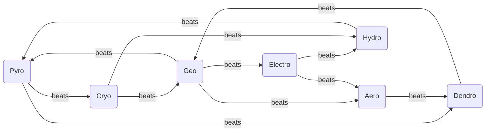
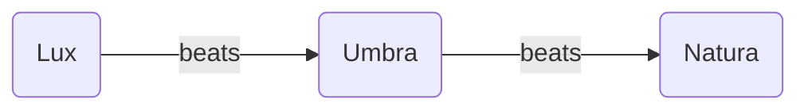

# Magic Tomes

**Weapon catalog for magic – not a list of learnable spells.** Every entry is an equippable tome with Rank, Might, Hit, Critical, Range, Weight, MP cost and Cost, exactly like a physical weapon in [Weapons](Weapons.md). Magic is element-bound: a Pyromancer wields Pyro tomes and nothing else. The Elementalist unlocks a second Natura element, the Arcanist a third – and the second element is not free: **the Elementalist's second element must be one that the first element loses to** (a Pyro Sage may add Hydro or Geo, not Cryo). The player closes his own weakness instead of stacking advantages. Because Electro loses only to Geo and Cryo only to Pyro, an Electromancer's second element is always Geo and a Cryomancer's always Pyro – this is deliberate, not a gap: the two offensive elements trade the choice for their extra win. The other five elements have a choice. The Arcanist's third element is unrestricted.

The **Rank** column uses the same F–S scale as physical weapons; rank rules are in the [Progression System](../Progression-System.md#weapon-rank), and which tome tier a rank opens is in [Magic Tome Availability](../Progression-System.md#magic-tome-availability). Siege tomes have a minimum range of 2 or more, expressed through the Range column alone (e.g. `3–10`), the same convention as artillery.

Every element carries **one Bronze-tier tome at rank F** – the Citizen's tome, found in Ch 05 –, a **damage line** of three escalating tomes across the tier range, **one or two utility tomes** that express the role the [Magic System](../mechanics/Magic-System.md#die-9-elemente) assigns that element, and **exactly one siege tome**. The names escalate in intensity rather than by suffix – Kindling, Ember, Flame, Inferno, not Pyro, Pyro+, Pyro++.

The seven Natura elements beat one another in the cycle below – that is the mages' weapon triangle. Above it sits the Magic Triangle of Natura, Lux and Umbra. Rules for both in [Magic System](../mechanics/Magic-System.md).

## Reading the tables

**A tome has no Uses.** A mage spends MP on every attack where a non-mage spends durability – the rule is in [Magic System](../mechanics/Magic-System.md#duales-mp-system). A tome is therefore bought once and never breaks, which is why tomes sit at the upper end of the gold band their tier allows in the [Balancing Guide](../Balancing-Guide.md#item-cost-guidelines): the gold is the entry price, the MP is the running cost.

**MP Cost is the real price.** The ladder is built against the passive regeneration a mage earns per round (same section). An E-rank tome is sustainable from the first promotion – it can be fired every round and the mage still gains MP. A C-rank tome needs a middling Mag stat to fire every round. An A-rank tome is sustainable only at high Mag, and below that the mage skips a round. A siege tome costs more than two rounds of regeneration at any Mag a unit realistically reaches, which is what gives it an artillery cadence: it fires, then it waits. That is a decision, not a side effect.

**Might, Hit, Weight and Cost** follow the tier ladder in the [Balancing Guide](../Balancing-Guide.md#weapon-tier-progression) and the magic ranges in [Base Stats Framework](../Balancing-Guide.md#base-stats-framework). Three ranks – D, C and B – share the Steel tier, so a damage line steps *through* the tier instead of repeating one value at three ranks. A tome that does something besides damage pays for it in Might and sits on the floor of the magic Might range; a tome that does nothing but its effect carries no Might, Hit or Critical and shows `–`, the same convention as a healing staff in [Weapons](Weapons.md#staves).

**The +5 Hit on every Aero, Hydro and Dendro tome** is the profile compensation from the [Balancing Guide](../Balancing-Guide.md#natura-profile-compensation), already applied in the tables below – it is not restated per entry. **Electro carries +5 Critical across its damage line**: it is the burst element, and burst in numbers means crit.

**The rank-F tome** is the E tome put through the Bronze rules of the [tier table](../Balancing-Guide.md#weapon-tier-progression), exactly as a Bronze Sword is derived from an Iron Sword: 0.6× Might (3), +5 Hit, Critical 0 – on Electro too, the one tome of that element that cannot crit –, Weight one lower. A tome has no Uses, so the Bronze 15 does not apply; the running cost is MP, and since the tables set no MP rule for a tier below E, the F tome takes the E tome's MP cost and says so here. Tomes are priced off the gold band rather than the Might formula, so the Bronze 0.4× is applied to the E tome's price (0.4 × 600 = 240). Only a Citizen ever holds rank F ([Progression System → Weapon Rank](../Progression-System.md#weapon-rank)), and a Citizen holding one follows the mage MP rules while it is equipped ([Growth Modifiers](../mechanics/Growth-Modifiers.md#core-rules)).

**Siege tomes** are Rank A, one per element, and buy their range with Weight, Hit, MP and the inability to answer anything standing next to them. They are the late-game piece, not an upgrade to the damage line.

**Rank S is deliberately empty.** Legendary tomes are story items and are not designed here. Their absence is an open gap, not a statement that none exist.

**Effects that are not damage** – healing, shields, buffs and debuffs, poison and regeneration ticks, the drain share of an Umbra tome – take their numbers from [Magic Effect Values](../Balancing-Guide.md#magic-effect-values) in the Balancing Guide, where each value lives exactly once. The tables below state the rule and link the value.

---

## Natura Magic

Twelve edges over seven elements – twelve wins, twelve losses. Every element loses to at least one other, and the elements that lose to two are the ones whose Elementalist gets a choice.

| Element | beats | loses to | Begründung |
| ------- | ----- | -------- | ---------- |
| **Pyro**    | Cryo, Dendro        | Hydro, Geo    | Pyro > Cryo: fire melts ice. Pyro > Dendro: fire burns plants. |
| **Aero**    | Dendro              | Geo, Electro  | Aero > Dendro: storms uproot trees. |
| **Electro** | Hydro, Aero         | Geo           | Electro > Hydro: electricity conducts through water. Electro > Aero: the lightning rules the storm. |
| **Hydro**   | Pyro                | Electro, Cryo | Hydro > Pyro: water extinguishes fire. |
| **Cryo**    | Hydro, Geo          | Pyro          | Cryo > Hydro: ice freezes water. Cryo > Geo: frost wedging – ice in the cracks breaks the rock. |
| **Geo**     | Electro, Aero, Pyro | Dendro, Cryo  | Geo > Electro: earth grounds the lightning. Geo > Aero: earth blocks the wind. Geo > Pyro: earth and sand smother the fire. |
| **Dendro**  | Geo                 | Pyro, Aero    | Dendro > Geo: roots break rock. |

### Element profiles

The wheel is not symmetric, and that is the design: **Geo is the duelist element** (3 wins / 2 losses), **Pyro is balanced** (2/2), **Electro and Cryo are offensive** (2/1 – one extra win, bought with a forced second element), and **Aero, Hydro and Dendro are support and control elements** (1/2) whose value lies in reactions, terrain and utility rather than in the matchup table. Tome tuning compensates the 1/2 profile so that none of the three is a trap pick at the Base class fork – the compensation value is in the [Balancing Guide](../Balancing-Guide.md#natura-profile-compensation).

### Pyro

| Name | Rank | Might | Hit  | Critical | Range | Weight | MP Cost | Cost | Description |
| ---- | ---- | ----- | ---- | -------- | ----- | ------ | ------- | ---- | ----------- |
| **Kindling**   | F | 3  | 95 | 0 | 2    | 2  | 3  | 240   | The Citizen's tome, found in Ch 05. Barely a flame – but it applies Pyro, and that is what it is for. |
| **Ember**      | E | 5  | 90 | 0 | 2    | 3  | 3  | 600   | The every-round attack: light, cheap, and the mage still gains MP on the turn he uses it. |
| **Cinder Burst** | D | 5  | 85 | 0 | 2    | 4  | 4  | 1,500 | Strikes the target tile and the four tiles around it; pays for the area in Might. |
| **Flame**      | C | 8  | 85 | 0 | 2    | 5  | 5  | 1,700 | The mid-game workhorse – full damage at standard magic range. |
| **Wildfire**   | B | –  | –  | – | 2    | 4  | 6  | 1,800 | Deals no damage; sets the target tile and its neighbours burning as area denial, per the terrain rules in [Magic System](../mechanics/Magic-System.md#geländeeffekte). |
| **Inferno**    | A | 10 | 80 | 5 | 2    | 7  | 7  | 5,500 | Heavy single-target damage; affordable every round only at high Mag. |
| **Firestorm**  | A | 12 | 70 | 0 | 3–10 | 14 | 14 | 6,000 | Siege. Reaches across the map and can never be counterattacked, but cannot fire at anything within two tiles. |

### Aero

| Name | Rank | Might | Hit  | Critical | Range | Weight | MP Cost | Cost | Description |
| ---- | ---- | ----- | ---- | -------- | ----- | ------ | ------- | ---- | ----------- |
| **Breeze**   | F | 3  | 100 | 0 | 2    | 2  | 3  | 240   | The Citizen's tome, found in Ch 05. Cannot miss and cannot kill; it teaches what Aero does to an element already on the target. |
| **Gust**     | E | 5  | 95 | 0 | 2    | 3  | 3  | 600   | The every-round attack; the most accurate Iron-tier tome in the game. |
| **Updraft**  | D | –  | –  | – | 1–2  | 2  | 4  | 1,500 | Deals no damage; lifts one ally and sets him down on any free tile within range, ignoring terrain cost. |
| **Gale**     | C | 8  | 90 | 0 | 2    | 5  | 5  | 1,700 | The mid-game workhorse – full damage at standard magic range. |
| **Vortex**   | B | 5  | 90 | 0 | 2    | 5  | 6  | 1,800 | Drags every enemy adjacent to the target one tile toward it, breaking a formation before the melee reaches it. |
| **Tempest**  | A | 10 | 85 | 5 | 2    | 7  | 7  | 5,500 | Heavy single-target damage; affordable every round only at high Mag. |
| **Cyclone**  | A | 12 | 75 | 0 | 3–10 | 14 | 14 | 6,000 | Siege. Reaches across the map and can never be counterattacked, but cannot fire at anything within two tiles. |

### Electro

| Name | Rank | Might | Hit  | Critical | Range | Weight | MP Cost | Cost | Description |
| ---- | ---- | ----- | ---- | -------- | ----- | ------ | ------- | ---- | ----------- |
| **Static**       | F | 3  | 95 | 0  | 2    | 2  | 3  | 240   | The Citizen's tome, found in Ch 05. The one Electro tome without Critical – Bronze carries none, so a Citizen learns the element before the burst. |
| **Spark**        | E | 5  | 90 | 5  | 2    | 3  | 3  | 600   | The every-round attack, and the only Iron-tier tome that can crit. |
| **Jolt**         | D | 5  | 85 | 5  | 2    | 3  | 4  | 1,500 | The struck enemy cannot counterattack this round – safe chip damage against something that hits back harder than it takes. |
| **Bolt**         | C | 8  | 85 | 5  | 2    | 5  | 5  | 1,700 | The mid-game workhorse – full damage at standard magic range. |
| **Arc**          | B | 7  | 85 | 5  | 2    | 6  | 7  | 1,800 | The strike leaps from the target to a second enemy within two tiles of it and hits that one for the same Might. |
| **Thunder**      | A | 10 | 80 | 10 | 2    | 7  | 7  | 5,500 | Heavy single-target damage with the highest Critical of any tome. |
| **Thunderstorm** | A | 12 | 70 | 0  | 3–10 | 14 | 14 | 6,000 | Siege. Reaches across the map and can never be counterattacked, but cannot fire at anything within two tiles. |

### Hydro

| Name | Rank | Might | Hit  | Critical | Range | Weight | MP Cost | Cost | Description |
| ---- | ---- | ----- | ---- | -------- | ----- | ------ | ------- | ---- | ----------- |
| **Drizzle**    | F | 3  | 100 | 0 | 2    | 2  | 3  | 240   | The Citizen's tome, found in Ch 05. Wets the target more than it hurts it – which is the setup every Hydro reaction begins with. |
| **Ripple**     | E | 5  | 95 | 0 | 2    | 3  | 3  | 600   | The every-round attack: light, cheap and highly accurate. |
| **Wellspring** | D | –  | –  | – | 1–2  | 2  | 5  | 1,500 | Deals no damage; restores HP to one ally in range. Value per [Magic Effect Values](../Balancing-Guide.md#magic-effect-values). |
| **Torrent**    | C | 8  | 90 | 0 | 2    | 5  | 5  | 1,700 | The mid-game workhorse – full damage at standard magic range. |
| **Floodwater** | B | –  | –  | – | 2    | 4  | 6  | 1,800 | Deals no damage; floods the target tile and its neighbours so that crossing them costs double, per the terrain rules in [Magic System](../mechanics/Magic-System.md#geländeeffekte). |
| **Deluge**     | A | 10 | 85 | 5 | 2    | 7  | 7  | 5,500 | Heavy single-target damage; affordable every round only at high Mag. |
| **Maelstrom**  | A | 12 | 75 | 0 | 3–10 | 14 | 14 | 6,000 | Siege. Reaches across the map and can never be counterattacked, but cannot fire at anything within two tiles. |

### Cryo

| Name | Rank | Might | Hit  | Critical | Range | Weight | MP Cost | Cost | Description |
| ---- | ---- | ----- | ---- | -------- | ----- | ------ | ------- | ---- | ----------- |
| **Chill**        | F | 3  | 95 | 0 | 2    | 2  | 3  | 240   | The Citizen's tome, found in Ch 05. A cold breath, no more – enough to put Cryo on a target for someone else to finish. |
| **Frost**        | E | 5  | 90 | 0 | 2    | 3  | 3  | 600   | The every-round attack: light, cheap, sustainable from the first promotion. |
| **Numbing Cold** | D | 5  | 85 | 0 | 2    | 3  | 5  | 1,500 | The struck enemy's Movement is halved on its next turn – the cheap way to keep a charge from arriving on schedule. |
| **Icefall**      | C | 8  | 85 | 0 | 2    | 5  | 5  | 1,700 | The mid-game workhorse – full damage at standard magic range. |
| **Icebridge**    | B | –  | –  | – | 2    | 3  | 5  | 1,800 | Deals no damage; freezes water tiles in range into ground that units can cross, per the terrain rules in [Magic System](../mechanics/Magic-System.md#geländeeffekte). |
| **Glacier**      | A | 10 | 80 | 5 | 2    | 7  | 7  | 5,500 | Heavy single-target damage; affordable every round only at high Mag. |
| **Blizzard**     | A | 12 | 70 | 0 | 3–10 | 14 | 14 | 6,000 | Siege. Reaches across the map and can never be counterattacked, but cannot fire at anything within two tiles. |

### Geo

| Name | Rank | Might | Hit  | Critical | Range | Weight | MP Cost | Cost | Description |
| ---- | ---- | ----- | ---- | -------- | ----- | ------ | ------- | ---- | ----------- |
| **Pebble**     | F | 3  | 95 | 0 | 2    | 2  | 3  | 240   | The Citizen's tome, found in Ch 05. A thrown stone by any other name; it applies Geo and nothing else. |
| **Stone**      | E | 5  | 90 | 0 | 2    | 3  | 3  | 600   | The every-round attack: light, cheap, sustainable from the first promotion. |
| **Stoneskin**  | D | –  | –  | – | 1–2  | 2  | 5  | 1,500 | Deals no damage; grants one ally a shield that absorbs damage until it is spent. Value per [Magic Effect Values](../Balancing-Guide.md#magic-effect-values). |
| **Boulder**    | C | 8  | 85 | 0 | 2    | 5  | 5  | 1,700 | The mid-game workhorse – full damage at standard magic range. |
| **Bulwark**    | B | –  | –  | – | 2    | 5  | 7  | 1,800 | Deals no damage; raises an impassable rock pillar on a free tile in range as permanent cover, per the terrain rules in [Magic System](../mechanics/Magic-System.md#geländeeffekte). |
| **Landslide**  | A | 10 | 80 | 5 | 2    | 7  | 7  | 5,500 | Heavy single-target damage; affordable every round only at high Mag. |
| **Earthquake** | A | 12 | 70 | 0 | 3–10 | 14 | 14 | 6,000 | Siege. Reaches across the map and can never be counterattacked, but cannot fire at anything within two tiles. |

### Dendro

| Name | Rank | Might | Hit  | Critical | Range | Weight | MP Cost | Cost | Description |
| ---- | ---- | ----- | ---- | -------- | ----- | ------ | ------- | ---- | ----------- |
| **Sprout**       | F | 3  | 100 | 0 | 2    | 2  | 3  | 240   | The Citizen's tome, found in Ch 05. Too soft to be a thorn yet; it lands every time and leaves Dendro behind. |
| **Thorn**        | E | 5  | 95 | 0 | 2    | 3  | 3  | 600   | The every-round attack: light, cheap and highly accurate. |
| **Rootsnare**    | D | 5  | 90 | 0 | 2    | 3  | 5  | 1,500 | The struck enemy cannot move on its next turn; it may still attack from where it stands. |
| **Bramble**      | C | 8  | 90 | 0 | 2    | 5  | 5  | 1,700 | The mid-game workhorse – full damage at standard magic range. |
| **Creeping Rot** | B | 5  | 90 | 0 | 2    | 4  | 6  | 1,800 | Poisons the target: it loses HP at the start of each of its own turns. Value per [Magic Effect Values](../Balancing-Guide.md#magic-effect-values). |
| **Bloom**        | B | –  | –  | – | 2    | 3  | 7  | 1,800 | Deals no damage; allies in range recover HP at the start of each round. Value per [Magic Effect Values](../Balancing-Guide.md#magic-effect-values). |
| **Overgrowth**   | A | 10 | 85 | 5 | 2    | 7  | 7  | 5,500 | Heavy single-target damage; affordable every round only at high Mag. |
| **Blight**       | A | 12 | 75 | 0 | 3–10 | 14 | 14 | 6,000 | Siege. Reaches across the map and can never be counterattacked, but cannot fire at anything within two tiles. |

## Magic Triangle

Umbra beats Natura, Lux beats Umbra, and **Lux and Natura are neutral** to each other. Lux is the counter to Umbra and would carry too many weaknesses if it also lost to all seven Natura elements.

### Lux

| Name | Rank | Might | Hit  | Critical | Range | Weight | MP Cost | Cost | Description |
| ---- | ---- | ----- | ---- | -------- | ----- | ------ | ------- | ---- | ----------- |
| **Glimmer**         | F | 3  | 95 | 0 | 2    | 2  | 3  | 240   | The Citizen's tome, found in Ch 05. The first light the Knights ever hold; it applies Lux and shows what Lux does to Umbra. |
| **Gleam**           | E | 5  | 90 | 0 | 2    | 3  | 3  | 600   | The every-round attack: light, cheap, sustainable from the first promotion. |
| **Healing Light**   | D | –  | –  | – | 1–2  | 2  | 5  | 1,500 | Deals no damage; restores HP to one ally in range. Value per [Magic Effect Values](../Balancing-Guide.md#magic-effect-values). |
| **Radiance**        | C | 8  | 85 | 0 | 2    | 5  | 5  | 1,700 | The mid-game workhorse – full damage at standard magic range. |
| **Cleansing Light** | B | –  | –  | – | 1–2  | 3  | 6  | 1,800 | Deals no damage; removes curses and debuffs from allies in range – the answer to an Umbra caster. |
| **Blessing**        | B | –  | –  | – | 1–2  | 3  | 7  | 1,800 | Deals no damage; raises one ally's Strength, Magic and Defense until the end of the next round. Value per [Magic Effect Values](../Balancing-Guide.md#magic-effect-values). |
| **Brilliance**      | A | 10 | 80 | 5 | 2    | 7  | 7  | 5,500 | Heavy single-target damage; affordable every round only at high Mag. |
| **Sunfall**         | A | 12 | 70 | 0 | 3–10 | 14 | 14 | 6,000 | Siege. Reaches across the map and can never be counterattacked, but cannot fire at anything within two tiles. |

Umbra alone gives HP back. **Siphon** and **Devour** return part of the damage they deal to the caster, and that is the element's signature: an Umbra mage sustains himself by attacking, where every other element has to be healed by someone else. The price is paid in Might – both drain tomes hit softer than the damage line at their rank.

### Umbra

| Name | Rank | Might | Hit  | Critical | Range | Weight | MP Cost | Cost | Description |
| ---- | ---- | ----- | ---- | -------- | ----- | ------ | ------- | ---- | ----------- |
| **Dusk**      | F | 3  | 95 | 0 | 2    | 2  | 3  | 240   | The Citizen's tome, found in Ch 05. Applies Umbra and drains nothing – the drain is bought with rank, not handed to a Citizen. |
| **Shade**     | E | 5  | 90 | 0 | 2    | 3  | 3  | 600   | The every-round attack: light, cheap, sustainable from the first promotion. |
| **Siphon**    | D | 5  | 85 | 0 | 2    | 3  | 5  | 1,500 | Restores HP to the caster equal to a share of the damage dealt. Value per [Magic Effect Values](../Balancing-Guide.md#magic-effect-values). |
| **Gloom**     | C | 8  | 85 | 0 | 2    | 5  | 5  | 1,700 | The mid-game workhorse – full damage at standard magic range. |
| **Hex**       | B | 5  | 85 | 0 | 2    | 4  | 6  | 1,800 | Lowers the target's Defense and Resistance until the end of the next round, opening it for the rest of the team. Value per [Magic Effect Values](../Balancing-Guide.md#magic-effect-values). |
| **Abyss**     | A | 10 | 80 | 5 | 2    | 7  | 7  | 5,500 | Heavy single-target damage; affordable every round only at high Mag. |
| **Devour**    | A | 8  | 80 | 0 | 2    | 8  | 10 | 5,500 | The greater drain: less damage than Abyss and far more MP, and the caster keeps a share of what it deals. Value per [Magic Effect Values](../Balancing-Guide.md#magic-effect-values). |
| **Nightfall** | A | 12 | 70 | 0 | 3–10 | 14 | 14 | 6,000 | Siege. Reaches across the map and can never be counterattacked, but cannot fire at anything within two tiles. |
