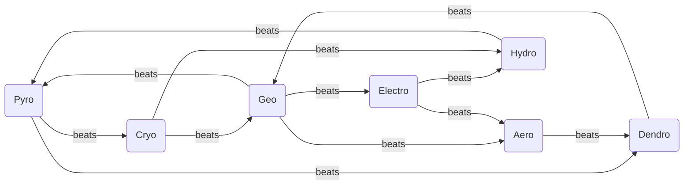
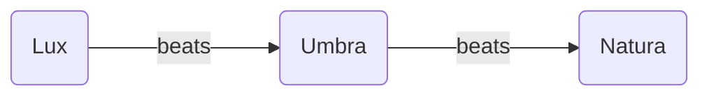

# Magic Tomes

**Weapon catalog for magic – not a list of learnable spells.** Every entry is an equippable tome with Rank, Might, Hit, Critical, Range, Weight, MP cost and Cost, exactly like a physical weapon in [Weapons](Weapons.md). Magic is element-bound: a Pyromancer wields Pyro tomes and nothing else. The Elementalist unlocks a second Natura element, the Arcanist a third – and the second element is not free: **the Elementalist's second element must be one that the first element loses to** (a Pyro Sage may add Hydro or Geo, not Cryo). The player closes his own weakness instead of stacking advantages. Because Electro loses only to Geo and Cryo only to Pyro, an Electromancer's second element is always Geo and a Cryomancer's always Pyro – this is deliberate, not a gap: the two offensive elements trade the choice for their extra win. The other five elements have a choice. The Arcanist's third element is unrestricted.

The **Rank** column uses the same F–S scale as physical weapons; rank rules are in the [Progression System](../Progression-System.md#weapon-rank). Siege tomes have a minimum range of 2 or more, expressed through the Range column alone (e.g. `3–10`), the same convention as artillery.

The seven Natura elements beat one another in the cycle below – that is the mages' weapon triangle. Above it sits the Magic Triangle of Natura, Lux and Umbra. Rules for both in [Magic System](../mechanics/Magic-System.md).

---

## Natura Magic

Twelve edges over seven elements – twelve wins, twelve losses. Every element loses to at least one other, and the elements that lose to two are the ones whose Elementalist gets a choice.

| Element | beats | loses to | Begründung |
| ------- | ----- | -------- | ---------- |
| **Pyro**    | Cryo, Dendro        | Hydro, Geo    | Pyro > Cryo: fire melts ice. Pyro > Dendro: fire burns plants. |
| **Aero**    | Dendro              | Geo, Electro  | Aero > Dendro: storms uproot trees. |
| **Electro** | Hydro, Aero         | Geo           | Electro > Hydro: electricity conducts through water. Electro > Aero: the lightning rules the storm. |
| **Hydro**   | Pyro                | Electro, Cryo | Hydro > Pyro: water extinguishes fire. |
| **Cryo**    | Hydro, Geo          | Pyro          | Cryo > Hydro: ice freezes water. Cryo > Geo: frost wedging – ice in the cracks breaks the rock. |
| **Geo**     | Electro, Aero, Pyro | Dendro, Cryo  | Geo > Electro: earth grounds the lightning. Geo > Aero: earth blocks the wind. Geo > Pyro: earth and sand smother the fire. |
| **Dendro**  | Geo                 | Pyro, Aero    | Dendro > Geo: roots break rock. |

### Element profiles

The wheel is not symmetric, and that is the design: **Geo is the duelist element** (3 wins / 2 losses), **Pyro is balanced** (2/2), **Electro and Cryo are offensive** (2/1 – one extra win, bought with a forced second element), and **Aero, Hydro and Dendro are support and control elements** (1/2) whose value lies in reactions, terrain and utility rather than in the matchup table. Tome tuning compensates the 1/2 profile so that none of the three is a trap pick at the Base class fork – the compensation value is in the [Balancing Guide](../Balancing-Guide.md#natura-profile-compensation).

### Pyro

| Name | Rank | Might | Hit  | Critical | Range | Weight | MP Cost | Cost | Description |
| ---- | ---- | ----- | ---- | -------- | ----- | ------ | ------- | ---- | ----------- |
|      |      |       |      |          |       |        |         |      |             |
|      |      |       |      |          |       |        |         |      |             |
|      |      |       |      |          |       |        |         |      |             |
|      |      |       |      |          |       |        |         |      |             |

### Aero

| Name | Rank | Might | Hit  | Critical | Range | Weight | MP Cost | Cost | Description |
| ---- | ---- | ----- | ---- | -------- | ----- | ------ | ------- | ---- | ----------- |
|      |      |       |      |          |       |        |         |      |             |
|      |      |       |      |          |       |        |         |      |             |
|      |      |       |      |          |       |        |         |      |             |
|      |      |       |      |          |       |        |         |      |             |

### Electro

| Name | Rank | Might | Hit  | Critical | Range | Weight | MP Cost | Cost | Description |
| ---- | ---- | ----- | ---- | -------- | ----- | ------ | ------- | ---- | ----------- |
|      |      |       |      |          |       |        |         |      |             |
|      |      |       |      |          |       |        |         |      |             |
|      |      |       |      |          |       |        |         |      |             |
|      |      |       |      |          |       |        |         |      |             |

### Hydro

| Name | Rank | Might | Hit  | Critical | Range | Weight | MP Cost | Cost | Description |
| ---- | ---- | ----- | ---- | -------- | ----- | ------ | ------- | ---- | ----------- |
|      |      |       |      |          |       |        |         |      |             |
|      |      |       |      |          |       |        |         |      |             |
|      |      |       |      |          |       |        |         |      |             |
|      |      |       |      |          |       |        |         |      |             |

### Cryo

| Name | Rank | Might | Hit  | Critical | Range | Weight | MP Cost | Cost | Description |
| ---- | ---- | ----- | ---- | -------- | ----- | ------ | ------- | ---- | ----------- |
|      |      |       |      |          |       |        |         |      |             |
|      |      |       |      |          |       |        |         |      |             |
|      |      |       |      |          |       |        |         |      |             |
|      |      |       |      |          |       |        |         |      |             |

### Geo

| Name | Rank | Might | Hit  | Critical | Range | Weight | MP Cost | Cost | Description |
| ---- | ---- | ----- | ---- | -------- | ----- | ------ | ------- | ---- | ----------- |
|      |      |       |      |          |       |        |         |      |             |
|      |      |       |      |          |       |        |         |      |             |
|      |      |       |      |          |       |        |         |      |             |
|      |      |       |      |          |       |        |         |      |             |

### Dendro

| Name | Rank | Might | Hit  | Critical | Range | Weight | MP Cost | Cost | Description |
| ---- | ---- | ----- | ---- | -------- | ----- | ------ | ------- | ---- | ----------- |
|      |      |       |      |          |       |        |         |      |             |
|      |      |       |      |          |       |        |         |      |             |
|      |      |       |      |          |       |        |         |      |             |
|      |      |       |      |          |       |        |         |      |             |

## Magic Triangle

Umbra beats Natura, Lux beats Umbra, and **Lux and Natura are neutral** to each other. Lux is the counter to Umbra and would carry too many weaknesses if it also lost to all seven Natura elements.

### Lux

| Name | Rank | Might | Hit  | Critical | Range | Weight | MP Cost | Cost | Description |
| ---- | ---- | ----- | ---- | -------- | ----- | ------ | ------- | ---- | ----------- |
|      |      |       |      |          |       |        |         |      |             |
|      |      |       |      |          |       |        |         |      |             |
|      |      |       |      |          |       |        |         |      |             |
|      |      |       |      |          |       |        |         |      |             |

### Umbra

| Name | Rank | Might | Hit  | Critical | Range | Weight | MP Cost | Cost | Description |
| ---- | ---- | ----- | ---- | -------- | ----- | ------ | ------- | ---- | ----------- |
|      |      |       |      |          |       |        |         |      |             |
|      |      |       |      |          |       |        |         |      |             |
|      |      |       |      |          |       |        |         |      |             |
|      |      |       |      |          |       |        |         |      |             |
