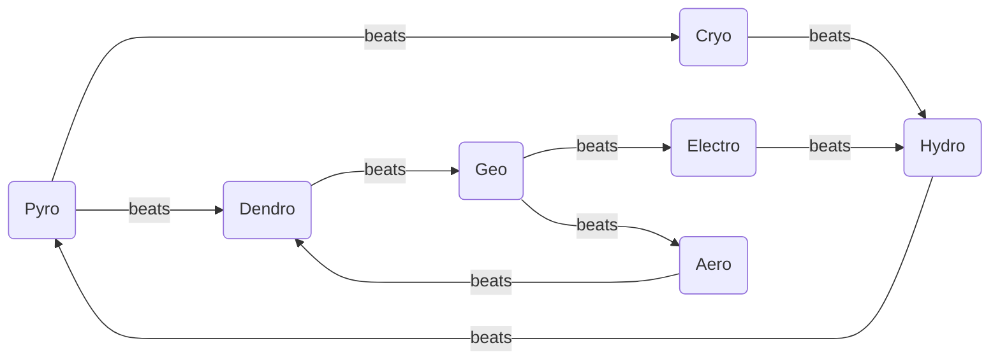
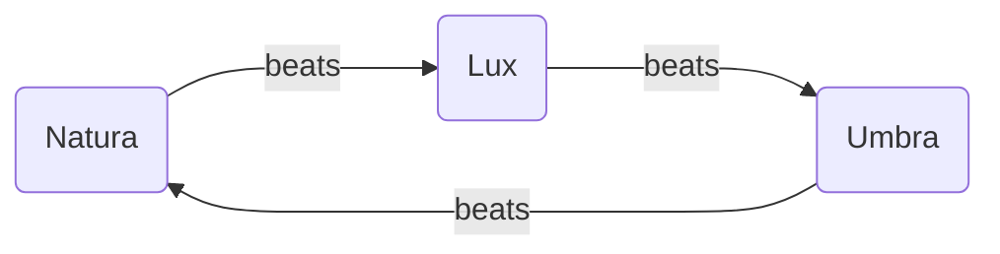

# Magic Tomes

**Waffenkatalog für Magie – keine Liste erlernbarer Zauber.** Jeder Eintrag ist ein ausrüstbares Tome mit Might, Hit, Critical, Range, Weight und MP-Kosten, genau wie eine physische Waffe in [Weapons](Weapons.md). Magie ist elementgebunden: Ein Pyromancer führt Pyro-Tomes und sonst nichts; Elementalist und Arcanist schalten ein zweites bzw. drittes Natura-Element frei.

Die sieben Natura-Elemente schlagen einander im Beat-Cycle unten – das ist das Waffendreieck der Magier. Regeln dazu in [Magic System](../mechanics/Magic-System.md).

---

## Natura Magic

### Pyro

| Name | Might | Hit  | Critical | Range | Weight | MP Cost | Description |
| ---- | ----- | ---- | -------- | ----- | ------ | ------- | ----------- |
|      |       |      |          |       |        |         |             |
|      |       |      |          |       |        |         |             |
|      |       |      |          |       |        |         |             |
|      |       |      |          |       |        |         |             |

### Aero

| Name | Might | Hit  | Critical | Range | Weight | MP Cost | Description |
| ---- | ----- | ---- | -------- | ----- | ------ | ------- | ----------- |
|      |       |      |          |       |        |         |             |
|      |       |      |          |       |        |         |             |
|      |       |      |          |       |        |         |             |
|      |       |      |          |       |        |         |             |

### Electro

| Name | Might | Hit  | Critical | Range | Weight | MP Cost | Description |
| ---- | ----- | ---- | -------- | ----- | ------ | ------- | ----------- |
|      |       |      |          |       |        |         |             |
|      |       |      |          |       |        |         |             |
|      |       |      |          |       |        |         |             |
|      |       |      |          |       |        |         |             |

### Hydro

| Name | Might | Hit  | Critical | Range | Weight | MP Cost | Description |
| ---- | ----- | ---- | -------- | ----- | ------ | ------- | ----------- |
|      |       |      |          |       |        |         |             |
|      |       |      |          |       |        |         |             |
|      |       |      |          |       |        |         |             |
|      |       |      |          |       |        |         |             |

### Cryo

| Name | Might | Hit  | Critical | Range | Weight | MP Cost | Description |
| ---- | ----- | ---- | -------- | ----- | ------ | ------- | ----------- |
|      |       |      |          |       |        |         |             |
|      |       |      |          |       |        |         |             |
|      |       |      |          |       |        |         |             |
|      |       |      |          |       |        |         |             |

### Geo

| Name | Might | Hit  | Critical | Range | Weight | MP Cost | Description |
| ---- | ----- | ---- | -------- | ----- | ------ | ------- | ----------- |
|      |       |      |          |       |        |         |             |
|      |       |      |          |       |        |         |             |
|      |       |      |          |       |        |         |             |
|      |       |      |          |       |        |         |             |

### Dendro

| Name | Might | Hit  | Critical | Range | Weight | MP Cost | Description |
| ---- | ----- | ---- | -------- | ----- | ------ | ------- | ----------- |
|      |       |      |          |       |        |         |             |
|      |       |      |          |       |        |         |             |
|      |       |      |          |       |        |         |             |
|      |       |      |          |       |        |         |             |

## Magic Triangle

### Lux

| Name | Might | Hit  | Critical | Range | Weight | MP Cost | Description |
| ---- | ----- | ---- | -------- | ----- | ------ | ------- | ----------- |
|      |       |      |          |       |        |         |             |
|      |       |      |          |       |        |         |             |
|      |       |      |          |       |        |         |             |
|      |       |      |          |       |        |         |             |

### Umbra

| Name | Might | Hit  | Critical | Range | Weight | MP Cost | Description |
| ---- | ----- | ---- | -------- | ----- | ------ | ------- | ----------- |
|      |       |      |          |       |        |         |             |
|      |       |      |          |       |        |         |             |
|      |       |      |          |       |        |         |             |
|      |       |      |          |       |        |         |             |