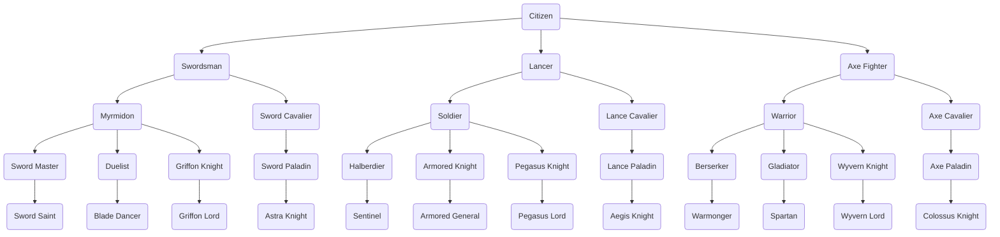
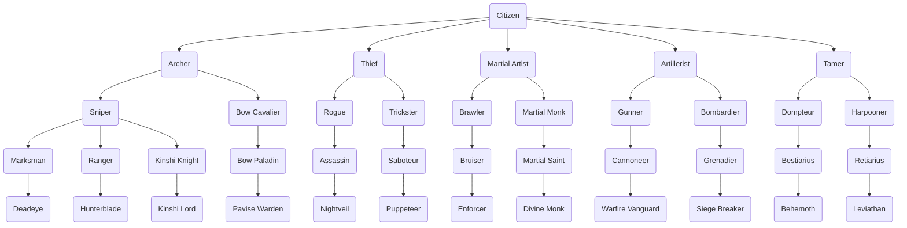
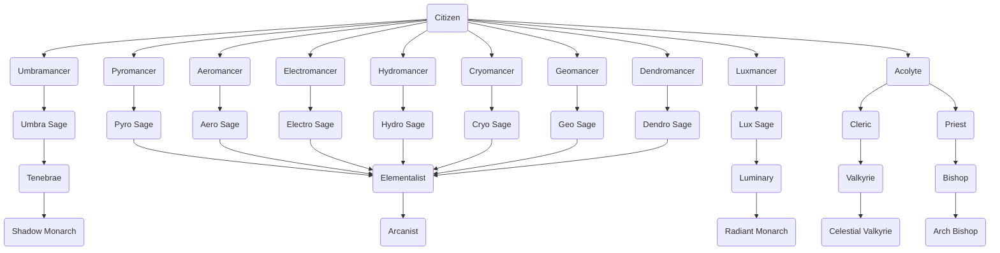

# Unit Classes

The class tree – **the authority on which class promotes into which.** Five tiers: Citizen → Base → Intermediate → Advanced → Master. There is no separate Unique tier: a Unique is a **Master class plus a Lord Kit**. When Dardan or Hasan promote into any Master class they carry that class's *Lord Title* (the name in the *Lord Title* column) and receive their kit's abilities on top of the class. The kit is story-unlocked, not bought. Every Lord Title is cosmetic, with a single exception: **Avatar** (the title on Arcanist) replaces the Arcanist's three chosen Natura elements with four fixed ones – see the note under the Master table. Promotions are permanent; there is no reclassing.

The *Weapon Types* column says which weapons a class may wield and is therefore the source for the weapon ranks on every character sheet; the first type listed is the class's main type, every further type is secondary and caps one rank lower (see [Progression System → Weapon Rank](../Progression-System.md#weapon-rank)). *Staff* is a weapon type, not an ability – healers wield it like any other weapon. The *Move Type* column (Infantry, Cavalry, Flying, Armored) is the key that effective weapons ([Balancing Guide](../Balancing-Guide.md#special-weapon-types)) and the Movement rules (still on the [mechanics backlog](../mechanics/README.md#backlog--not-yet-documented)) refer to. Tier gates in the [Progression System](../Progression-System.md), tier stat modifiers and per-line class growth modifiers in the [Balancing Guide](../Balancing-Guide.md#-class-balancing).

Every class carries **one Class Ability**, granted the moment the unit enters the class, and **one Mastery Ability**, learned later while the unit stays in it (see the [sample ability timeline](../Progression-System.md#sample-ability-timeline-dardan)). Both are kept forever – a promotion never takes an ability away, it only changes what fits inside the class's Capacity. What each ability does, and what it costs in Capacity, is in [Abilities](Abilities.md); the combat arts a class teaches are in [Combat Arts](Combat-Arts.md). A name in these tables without an entry in those two files does not exist.

---

## Class Hierarchy

## Base Classes

| Name           | Move Type | Weapon Types | Class Abilities                | Mastery Ability | Promotes to              |
| -------------- | --------- | ------------ | ------------------------------ | --------------- | ------------------------ |
| Swordsman      | Infantry  | Sword        | Speed +2                       | Swap            | Myrmidon, Sword Cavalier |
| Lancer         | Infantry  | Lance        | Defense +2                     | Shove           | Soldier, Lance Cavalier  |
| Axe Fighter    | Infantry  | Axe          | Strength +2                    | Shove           | Warrior, Axe Cavalier    |
| Archer         | Infantry  | Bow          | Hit Rate +10                   | Reposition      | Sniper, Bow Cavalier     |
| Thief          | Infantry  | Knife        | Dexterity +2, Steal, Lock Pick | Swap            | Rogue, Trickster         |
| Martial Artist | Infantry  | Gauntlet     | Avoid +10                      | Reposition      | Brawler, Martial Monk    |
| Artillerist    | Infantry  | Artillery    | Hit Rate +10                   | Knockback       | Gunner, Bombardier       |
| Tamer          | Infantry  | Chain        | Strength +2                    | Ensnare         | Dompteur, Harpooner      |
| Acolyte        | Infantry  | Staff        | MP +10                         | Draw Back       | Cleric, Priest           |
| Pyromancer     | Infantry  | Pyro         | MP +10                         | Mystic Pull     | Pyro Sage                |
| Aeromancer     | Infantry  | Aero         | MP +10                         | Mystic Pull     | Aero Sage                |
| Electromancer  | Infantry  | Electro      | MP +10                         | Mystic Pull     | Electro Sage             |
| Hydromancer    | Infantry  | Hydro        | MP +10                         | Mystic Pull     | Hydro Sage               |
| Cryomancer     | Infantry  | Cryo         | MP +10                         | Mystic Pull     | Cryo Sage                |
| Geomancer      | Infantry  | Geo          | MP +10                         | Mystic Pull     | Geo Sage                 |
| Dendromancer   | Infantry  | Dendro       | MP +10                         | Mystic Pull     | Dendro Sage              |
| Luxmancer      | Infantry  | Lux          | MP +10                         | Mystic Pull     | Lux Sage                 |
| Umbramancer    | Infantry  | Umbra        | MP +10                         | Mystic Pull     | Umbra Sage               |

## Intermediate Classes

| Name           | Move Type | Weapon Types           | Class Abilities | Mastery Ability | Promotes to                                |
| -------------- | --------- | ---------------------- | --------------- | --------------- | ------------------------------------------ |
| Myrmidon       | Infantry  | Sword                  | Vantage         | Wrath           | Sword Master, Duelist, Griffon Knight      |
| Sword Cavalier | Cavalry   | Sword                  | Canto           | Momentum        | Sword Paladin                              |
| Soldier        | Infantry  | Lance                  | Hold Fast       | Brace           | Halberdier, Armored Knight, Pegasus Knight |
| Lance Cavalier | Cavalry   | Lance                  | Canto           | Unhorse         | Lance Paladin                              |
| Warrior        | Infantry  | Axe                    | Cleave          | Sunder          | Berserker, Gladiator, Wyvern Knight        |
| Axe Cavalier   | Cavalry   | Axe                    | Canto           | Trample         | Axe Paladin                                |
| Sniper         | Infantry  | Bow                    | Pinpoint        | Overwatch       | Marksman, Ranger, Kinshi Knight            |
| Bow Cavalier   | Cavalry   | Bow                    | Canto           | Harrying Fire   | Bow Paladin                                |
| Rogue          | Infantry  | Knife                  | Shadowstep      | Flanker         | Assassin                                   |
| Trickster      | Infantry  | Knife, Chain           | Sleight of Hand | Misdirection    | Saboteur                                   |
| Brawler        | Infantry  | Gauntlet, Chain        | Grapple         | Counterpunch    | Bruiser                                    |
| Martial Monk   | Infantry  | Gauntlet, Battle Staff | Inner Peace     | Wide Guard      | Martial Saint                              |
| Gunner         | Infantry  | Artillery              | Braced Shot     | Crack Shot      | Cannoneer                                  |
| Bombardier     | Infantry  | Artillery              | Scatter Shot    | Demolition      | Grenadier                                  |
| Dompteur       | Infantry  | Chain                  | Leash           | Bring Down      | Bestiarius                                 |
| Harpooner      | Infantry  | Chain, Lance           | Harpoon         | Receive Charge  | Retiarius                                  |
| Cleric         | Infantry  | Staff, Sword           | Live to Serve   | Miracle         | Valkyrie                                   |
| Priest         | Infantry  | Staff, Lux             | Consecration    | Intercession    | Bishop                                     |
| Pyro Sage      | Infantry  | Pyro                   | Conflagration   | Backdraft       | Elementalist                               |
| Aero Sage      | Infantry  | Aero                   | Updraft         | Wind Walk       | Elementalist                               |
| Electro Sage   | Infantry  | Electro                | Conduction      | Overcharge      | Elementalist                               |
| Hydro Sage     | Infantry  | Hydro                  | Mending Rain    | Undertow        | Elementalist                               |
| Cryo Sage      | Infantry  | Cryo                   | Cold Snap       | Shatter         | Elementalist                               |
| Geo Sage       | Infantry  | Geo                    | Stonewright     | Crystallize     | Elementalist                               |
| Dendro Sage    | Infantry  | Dendro                 | Entangle        | Verdant Grasp   | Elementalist                               |
| Lux Sage       | Infantry  | Lux                    | Beacon          | Aureole         | Luminary                                   |
| Umbra Sage     | Infantry  | Umbra                  | Blight          | Siphon          | Tenebrae                                   |

## Advanced Classes

| Name           | Move Type | Weapon Types                  | Class Abilities  | Mastery Ability | Promotes to      |
| -------------- | --------- | ----------------------------- | ---------------- | --------------- | ---------------- |
| Sword Master   | Infantry  | Sword                         | Sol              | Swordfaire      | Sword Saint      |
| Duelist        | Infantry  | Sword, Knife                  | Duel             | Riposte         | Blade Dancer     |
| Sword Paladin  | Cavalry   | Sword                         | Canto            | Lancebreaker    | Astra Knight     |
| Griffon Knight | Flying    | Sword                         | Canto            | Talons          | Griffon Lord     |
| Halberdier     | Infantry  | Lance                         | Pierce           | Lancefaire      | Sentinel         |
| Armored Knight | Armored   | Lance, Axe                    | Ironhide         | Ward            | Armored General  |
| Lance Paladin  | Cavalry   | Lance                         | Canto            | Interpose       | Aegis Knight     |
| Pegasus Knight | Flying    | Lance                         | Canto            | Uplift          | Pegasus Lord     |
| Berserker      | Infantry  | Axe                           | Bloodlust        | Axefaire        | Warmonger        |
| Gladiator      | Infantry  | Axe, Chain                    | Pit Fighter      | Disarm          | Spartan          |
| Axe Paladin    | Cavalry   | Axe                           | Canto            | Breakthrough    | Colossus Knight  |
| Wyvern Knight  | Flying    | Axe                           | Canto            | Dragon's Dive   | Wyvern Lord      |
| Marksman       | Infantry  | Bow                           | Point Blank      | Bowfaire        | Deadeye          |
| Ranger         | Infantry  | Bow, Knife                    | Pathfinder       | Hunter's Mark   | Hunterblade      |
| Bow Paladin    | Cavalry   | Bow                           | Canto            | Covering Fire   | Pavise Warden    |
| Kinshi Knight  | Flying    | Bow                           | Canto            | Skyfall         | Kinshi Lord      |
| Assassin       | Infantry  | Knife                         | Vanish           | Lethality       | Nightveil        |
| Saboteur       | Infantry  | Knife, Chain                  | Disarray         | Cut the Strings | Puppeteer        |
| Bruiser        | Infantry  | Gauntlet, Chain               | Stagger          | Second Wind     | Enforcer         |
| Martial Saint  | Infantry  | Gauntlet, Battle Staff, Staff | Chi Transfer     | Pressure Point  | Divine Monk      |
| Cannoneer      | Infantry  | Artillery                     | Counter-Battery  | Piercing Shot   | Warfire Vanguard |
| Grenadier      | Infantry  | Artillery                     | Incendiary       | Smoke Screen    | Siege Breaker    |
| Bestiarius     | Infantry  | Chain                         | Beast Call       | Hurl            | Behemoth         |
| Retiarius      | Infantry  | Chain, Lance                  | Cast Net         | Breakwater      | Leviathan        |
| Valkyrie       | Cavalry   | Staff, Sword                  | Canto            | Grace           | Celestial Valkyrie |
| Bishop         | Infantry  | Staff, Lux                    | Sanctify         | Blessing        | Arch Bishop      |
| Elementalist   | Infantry  | Natura Magic (2 Types)        | Resonance        | Cascade         | Arcanist         |
| Luminary       | Infantry  | Lux, Staff                    | Radiance         | Revelation      | Radiant Monarch  |
| Tenebrae       | Infantry  | Umbra, Sword                  | Umbral Edge      | Shadowmeld      | Shadow Monarch   |

## Master Classes

Master is the terminal tier. The *Lord Title* column is the name the class carries when Dardan or Hasan hold it – see *Special Classes* below for the Lord Kit that comes with it.

| Name               | Move Type | Weapon Types                  | Class Abilities  | Mastery Ability | Lord Title          | Promotes to |
| ------------------ | --------- | ----------------------------- | ---------------- | --------------- | ------------------- | ----------- |
| Sword Saint        | Infantry  | Sword                         | Aether           | Foresight       | Aetherblade         | -           |
| Blade Dancer       | Infantry  | Sword, Knife                  | Whirl            | Encore          | Vortex Reaver       | -           |
| Astra Knight       | Cavalry   | Sword                         | Canto            | Astra           | Starforged          | -           |
| Griffon Lord       | Flying    | Sword                         | Canto            | Stoop           | Grypharion          | -           |
| Sentinel           | Infantry  | Lance                         | Wall of Spears   | Impale          | Dragoon of Zoah     | -           |
| Armored General    | Armored   | Lance, Axe                    | Unbreakable      | Bulwark         | Imperator           | -           |
| Aegis Knight       | Cavalry   | Lance                         | Canto            | Sworn Shield    | Oathguard           | -           |
| Pegasus Lord       | Flying    | Lance                         | Canto            | Wings of Mercy  | Elyssar             | -           |
| Warmonger          | Infantry  | Axe                           | Rend             | Last Roar       | Ravager             | -           |
| Spartan            | Infantry  | Axe, Chain                    | Shield Brother   | Unyielding      | Wolf of Sparta      | -           |
| Colossus Knight    | Cavalry   | Axe                           | Canto            | Juggernaut      | Titanheart          | -           |
| Wyvern Lord        | Flying    | Axe                           | Canto            | Drakebreath     | Drakoryn            | -           |
| Deadeye            | Infantry  | Bow                           | Killshot         | Heartseeker     | Vigilant Outlaw     | -           |
| Hunterblade        | Infantry  | Bow, Sword                    | Twin Draw        | Run Down        | Dreadslayer         | -           |
| Pavise Warden      | Cavalry   | Bow                           | Canto            | Pavise          | Ironbulwark         | -           |
| Kinshi Lord        | Flying    | Bow                           | Canto            | Wind's Blessing | Zephyros            | -           |
| Nightveil          | Infantry  | Knife                         | Unseen           | Deathmark       | Nocturnal           | -           |
| Puppeteer          | Infantry  | Knife, Chain                  | Tripwire         | Pull the Strings | Whisperer of Varnel | -           |
| Enforcer           | Infantry  | Gauntlet, Chain               | Chokehold        | Retribution     | Punisher            | -           |
| Divine Monk        | Infantry  | Gauntlet, Battle Staff, Staff | Open Palm        | Stillness       | Enlightened One     | -           |
| Warfire Vanguard   | Infantry  | Artillery                     | Barrage          | Scorched Earth  | Hellfire Bastion    | -           |
| Siege Breaker      | Infantry  | Artillery                     | Wallbreaker      | Bastion         | Living Fortress     | -           |
| Behemoth           | Infantry  | Chain                         | Apex Predator    | Snatch          | Legiana             | -           |
| Leviathan          | Infantry  | Chain, Lance                  | Wake             | Deep Water      | Lagiacrus           | -           |
| Celestial Valkyrie | Cavalry   | Staff, Sword                  | Canto            | Second Breath   | Valkyros            | -           |
| Arch Bishop        | Infantry  | Staff, Lux                    | Sanctuary        | Litany          | Voice of Aurevia    | -           |
| Arcanist           | Infantry  | Natura Magic (3 Types)        | Convergence      | Trinity         | Avatar*             | -           |
| Radiant Monarch    | Infantry  | Lux, Staff                    | Corona           | Aurelian Ward   | Aurelius            | -           |
| Shadow Monarch     | Infantry  | Umbra, Sword                  | Umbral Dominion  | Harvest         | Ashborn             | -           |

\* **Avatar is the one Lord Title with an effect on the class itself.** When Dardan or Hasan hold the Arcanist class, the title replaces the Arcanist's three chosen Natura elements with the four fixed elements **Pyro, Aero, Hydro, Geo**. The Elementalist and Arcanist element rules in [Magic Tomes](Magic-Tomes.md) do not apply to the Avatar. This is a title rule, not a class change – the Arcanist's *Weapon Types* stay as listed. All other Lord Titles are cosmetic.

## Special Classes

Citizen is the starting class of the eight Vigilant Knights and the only class that holds weapon rank F. It holds that rank in **every weapon type**, but not from the first chapter: Sword, Lance, Axe, Bow and Staff from Ch 01; Knife, Gauntlet, Battle Staff, Chain and Artillery from the weapon delivery in Ch 04; the nine elements from the tomes found in Ch 05 – so that every Knight has held every type before the base class is chosen at the end of Ch 06. The staging and the Citizen's MP regime by equipped weapon are in [Growth Modifiers](../mechanics/Growth-Modifiers.md#core-rules); Citizen carries a class growth modifier of 0 in every stat. A **Lord Kit is not a class**: when Dardan or Hasan promote into any Master class, they carry that class's Lord Title and receive the kit's abilities on top of the Master class. Move Type and Weapon Types are those of the Master class; the kit is unlocked by story events, not by a seal (see [Progression System](../Progression-System.md#class-tiers--requirements)).

| Name             | Move Type       | Weapon Types            | Class Abilities                    | Mastery Ability | Promotes to    |
| ---------------- | --------------- | ----------------------- | ---------------------------------- | --------------- | -------------- |
| Citizen          | Infantry        | All types (staged: Ch 01 / 04 / 05, see above) | Adaptability, Discipline, Aptitude | Bellum's Will   | Any base class |
| Lord Kit: Dardan | as Master class | as Master class         | **The Nexus** – Exchange (Ch 08), Heartpulse (Ch 21), Earthbound (Ch 44), Lifeline (chapter open), unlocked by chapter and outside Capacity, rules in [The Nexus](../mechanics/The-Nexus.md); Nexus Mastery (Part 08, trigger open), Bond of Souls (Lv 54) – see [ability timeline](../Progression-System.md#sample-ability-timeline-dardan) | -               | -              |
| Lord Kit: Hasan  | as Master class | as Master class         | *not yet defined*                  | -               | -              |