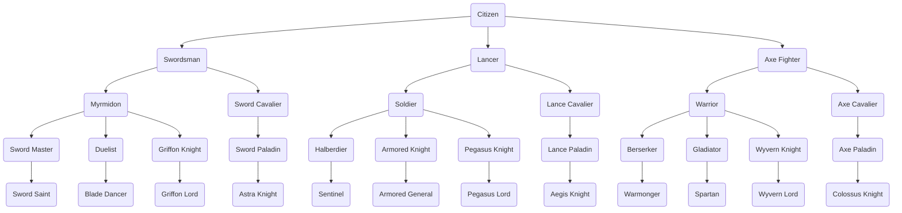
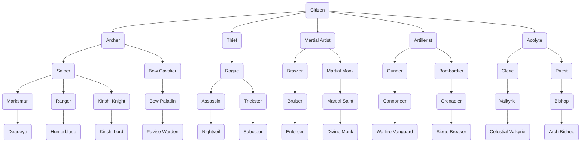
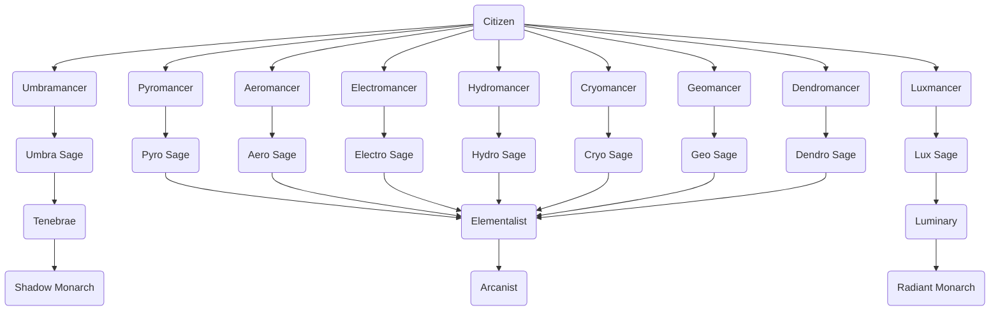

# Unit Classes

The class tree – **the authority on which class promotes into which.** Five tiers: Citizen → Base → Intermediate → Advanced → Master. There is no separate Unique tier: a Unique is a **Master class plus a Lord Kit**. When Dardan or Hasan promote into any Master class they carry that class's *Lord Title* (the name in the *Lord Title* column) and receive their kit's abilities on top of the class. The kit is story-unlocked, not bought. Every Lord Title is cosmetic, with a single exception: **Avatar** (the title on Arcanist) replaces the Arcanist's three chosen Natura elements with four fixed ones – see the note under the Master table. Promotions are permanent; there is no reclassing.

The *Weapon Types* column says which weapons a class may wield and is therefore the source for the weapon ranks on every character sheet; the first type listed is the class's main type, every further type is secondary and caps one rank lower (see [Progression System → Weapon Rank](../Progression-System.md#weapon-rank)). *Staff* is a weapon type, not an ability – healers wield it like any other weapon. The *Move Type* column (Infantry, Cavalry, Flying, Armored) is the key that effective weapons ([Balancing Guide](../Balancing-Guide.md#special-weapon-types)) and the Movement rules (still on the [mechanics backlog](../mechanics/README.md#backlog--not-yet-documented)) refer to. Tier gates in the [Progression System](../Progression-System.md), tier stat modifiers in the [Balancing Guide](../Balancing-Guide.md#-class-balancing).

---

## Class Hierarchy

## Base Classes

| Name           | Move Type | Weapon Types | Class Abilities                | Mastery Ability | Promotes to              |
| -------------- | --------- | ------------ | ------------------------------ | --------------- | ------------------------ |
| Swordsman      | Infantry  | Sword        | Speed +2                       | Swap            | Myrmidon, Sword Cavalier |
| Lancer         | Infantry  | Lance        | Defense +2                     | Shove           | Soldier, Lance Cavalier  |
| Axe Fighter    | Infantry  | Axe          | Strength +2                    | Shove           | Warrior, Axe Cavalier    |
| Archer         | Infantry  | Bow          | Hit Rate +10                   | Reposition      | Sniper, Bow Cavalier     |
| Thief          | Infantry  | Knife        | Dexterity +2, Steal, Lock Pick | Swap            | Rogue                    |
| Martial Artist | Infantry  | Gauntlet     | Avoid +10                      | Reposition      | Brawler, Martial Monk    |
| Artillerist    | Infantry  | Artillery    | Hit Rate +10                   | Knockback       | Gunner, Bombardier       |
| Acolyte        | Infantry  | Staff        | MP +10                         | Draw Back       | Cleric, Priest           |
| Pyromancer     | Infantry  | Pyro         | MP +10                         | Mystic Pull     | Pyro Sage                |
| Aeromancer     | Infantry  | Aero         | MP +10                         | Mystic Pull     | Aero Sage                |
| Electromancer  | Infantry  | Electro      | MP +10                         | Mystic Pull     | Electro Sage             |
| Hydromancer    | Infantry  | Hydro        | MP +10                         | Mystic Pull     | Hydro Sage               |
| Cryomancer     | Infantry  | Cryo         | MP +10                         | Mystic Pull     | Cryo Sage                |
| Geomancer      | Infantry  | Geo          | MP +10                         | Mystic Pull     | Geo Sage                 |
| Dendromancer   | Infantry  | Dendro       | MP +10                         | Mystic Pull     | Dendro Sage              |
| Luxmancer      | Infantry  | Lux          | MP +10                         | Mystic Pull     | Lux Sage                 |
| Umbramancer    | Infantry  | Umbra        | MP +10                         | Mystic Pull     | Umbra Sage               |

## Intermediate Classes

| Name           | Move Type | Weapon Types           | Class Abilities | Mastery Ability | Promotes to                                |
| -------------- | --------- | ---------------------- | --------------- | --------------- | ------------------------------------------ |
| Myrmidon       | Infantry  | Sword                  |                 |                 | Sword Master, Duelist, Griffon Knight      |
| Sword Cavalier | Cavalry   | Sword                  | Canto           |                 | Sword Paladin                              |
| Soldier        | Infantry  | Lance                  |                 |                 | Halberdier, Armored Knight, Pegasus Knight |
| Lance Cavalier | Cavalry   | Lance                  | Canto           |                 | Lance Paladin                              |
| Warrior        | Infantry  | Axe                    |                 |                 | Berserker, Gladiator, Wyvern Knight        |
| Axe Cavalier   | Cavalry   | Axe                    | Canto           |                 | Axe Paladin                                |
| Sniper         | Infantry  | Bow                    |                 |                 | Marksman, Ranger, Kinshi Knight            |
| Bow Cavalier   | Cavalry   | Bow                    | Canto           |                 | Bow Paladin                                |
| Rogue          | Infantry  | Knife                  |                 |                 | Assassin, Trickster                        |
| Brawler        | Infantry  | Gauntlet, Chain        |                 |                 | Bruiser                                    |
| Martial Monk   | Infantry  | Gauntlet, Battle Staff |                 |                 | Martial Saint                              |
| Gunner         | Infantry  | Artillery              |                 |                 | Cannoneer                                  |
| Bombardier     | Infantry  | Artillery              |                 |                 | Grenadier                                  |
| Cleric         | Infantry  | Staff, Sword           |                 |                 | Valkyrie                                   |
| Priest         | Infantry  | Staff, Lux             |                 |                 | Bishop                                     |
| Pyro Sage      | Infantry  | Pyro                   |                 |                 | Elementalist                               |
| Aero Sage      | Infantry  | Aero                   |                 |                 | Elementalist                               |
| Electro Sage   | Infantry  | Electro                |                 |                 | Elementalist                               |
| Hydro Sage     | Infantry  | Hydro                  |                 |                 | Elementalist                               |
| Cryo Sage      | Infantry  | Cryo                   |                 |                 | Elementalist                               |
| Geo Sage       | Infantry  | Geo                    |                 |                 | Elementalist                               |
| Dendro Sage    | Infantry  | Dendro                 |                 |                 | Elementalist                               |
| Lux Sage       | Infantry  | Lux                    |                 |                 | Luminary                                   |
| Umbra Sage     | Infantry  | Umbra                  |                 |                 | Tenebrae                                   |

## Advanced Classes

| Name           | Move Type | Weapon Types                  | Class Abilities | Mastery Ability | Promotes to      |
| -------------- | --------- | ----------------------------- | --------------- | --------------- | ---------------- |
| Sword Master   | Infantry  | Sword                         |                 |                 | Sword Saint      |
| Duelist        | Infantry  | Sword, Knife                  |                 |                 | Blade Dancer     |
| Sword Paladin  | Cavalry   | Sword                         | Canto           |                 | Astra Knight     |
| Griffon Knight | Flying    | Sword                         | Canto           |                 | Griffon Lord     |
| Halberdier     | Infantry  | Lance                         |                 |                 | Sentinel         |
| Armored Knight | Armored   | Lance, Axe                    |                 |                 | Armored General  |
| Lance Paladin  | Cavalry   | Lance                         | Canto           |                 | Aegis Knight     |
| Pegasus Knight | Flying    | Lance                         | Canto           |                 | Pegasus Lord     |
| Berserker      | Infantry  | Axe                           |                 |                 | Warmonger        |
| Gladiator      | Infantry  | Axe, Chain                    |                 |                 | Spartan          |
| Axe Paladin    | Cavalry   | Axe                           | Canto           |                 | Colossus Knight  |
| Wyvern Knight  | Flying    | Axe                           | Canto           |                 | Wyvern Lord      |
| Marksman       | Infantry  | Bow                           |                 |                 | Deadeye          |
| Ranger         | Infantry  | Bow, Knife                    |                 |                 | Hunterblade      |
| Bow Paladin    | Cavalry   | Bow                           | Canto           |                 | Pavise Warden    |
| Kinshi Knight  | Flying    | Bow                           | Canto           |                 | Kinshi Lord      |
| Assassin       | Infantry  | Knife                         |                 |                 | Nightveil        |
| Trickster      | Infantry  | Knife, Chain                  |                 |                 | Saboteur         |
| Bruiser        | Infantry  | Gauntlet, Chain               |                 |                 | Enforcer         |
| Martial Saint  | Infantry  | Gauntlet, Battle Staff, Staff |                 |                 | Divine Monk      |
| Cannoneer      | Infantry  | Artillery                     |                 |                 | Warfire Vanguard |
| Grenadier      | Infantry  | Artillery                     |                 |                 | Siege Breaker    |
| Valkyrie       | Cavalry   | Staff, Sword                  |                 |                 | Celestial Valkyrie |
| Bishop         | Infantry  | Staff, Lux                    |                 |                 | Arch Bishop      |
| Elementalist   | Infantry  | Natura Magic (2 Types)        |                 |                 | Arcanist         |
| Luminary       | Infantry  | Lux, Staff                    |                 |                 | Radiant Monarch  |
| Tenebrae       | Infantry  | Umbra, Sword                  |                 |                 | Shadow Monarch   |

## Master Classes

Master is the terminal tier. The *Lord Title* column is the name the class carries when Dardan or Hasan hold it – see *Special Classes* below for the Lord Kit that comes with it.

| Name               | Move Type | Weapon Types                  | Class Abilities | Mastery Ability | Lord Title          | Promotes to |
| ------------------ | --------- | ----------------------------- | --------------- | --------------- | ------------------- | ----------- |
| Sword Saint        | Infantry  | Sword                         |                 |                 | Aetherblade         | -           |
| Blade Dancer       | Infantry  | Sword, Knife                  |                 |                 | Vortex Reaver       | -           |
| Astra Knight       | Cavalry   | Sword                         | Canto           |                 | Starforged          | -           |
| Griffon Lord       | Flying    | Sword                         | Canto           |                 | Grypharion          | -           |
| Sentinel           | Infantry  | Lance                         |                 |                 | Dragoon of Zoah     | -           |
| Armored General    | Armored   | Lance, Axe                    |                 |                 | Imperator           | -           |
| Aegis Knight       | Cavalry   | Lance                         | Canto           |                 | Oathguard           | -           |
| Pegasus Lord       | Flying    | Lance                         | Canto           |                 | Elyssar             | -           |
| Warmonger          | Infantry  | Axe                           |                 |                 | Ravager             | -           |
| Spartan            | Infantry  | Axe, Chain                    |                 |                 | Wolf of Sparta      | -           |
| Colossus Knight    | Cavalry   | Axe                           | Canto           |                 | Titanheart          | -           |
| Wyvern Lord        | Flying    | Axe                           | Canto           |                 | Drakoryn            | -           |
| Deadeye            | Infantry  | Bow                           |                 |                 | Vigilant Outlaw     | -           |
| Hunterblade        | Infantry  | Bow, Sword                    |                 |                 | Dreadslayer         | -           |
| Pavise Warden      | Cavalry   | Bow                           | Canto           |                 | Ironbulwark         | -           |
| Kinshi Lord        | Flying    | Bow                           | Canto           |                 | Zephyros            | -           |
| Nightveil          | Infantry  | Knife                         |                 |                 | Nocturnal           | -           |
| Saboteur           | Infantry  | Knife, Chain                  |                 |                 | Whisperer of Varnel | -           |
| Enforcer           | Infantry  | Gauntlet, Chain               |                 |                 | Punisher            | -           |
| Divine Monk        | Infantry  | Gauntlet, Battle Staff, Staff |                 |                 | Enlightened One     | -           |
| Warfire Vanguard   | Infantry  | Artillery                     |                 |                 | Hellfire Bastion    | -           |
| Siege Breaker      | Infantry  | Artillery                     |                 |                 | Living Fortress     | -           |
| Celestial Valkyrie | Cavalry   | Staff, Sword                  |                 |                 | Valkyros            | -           |
| Arch Bishop        | Infantry  | Staff, Lux                    |                 |                 | Voice of Aurevia    | -           |
| Arcanist           | Infantry  | Natura Magic (3 Types)        |                 |                 | Avatar*             | -           |
| Radiant Monarch    | Infantry  | Lux, Staff                    |                 |                 | Aurelius            | -           |
| Shadow Monarch     | Infantry  | Umbra, Sword                  |                 |                 | Ashborn             | -           |

\* **Avatar is the one Lord Title with an effect on the class itself.** When Dardan or Hasan hold the Arcanist class, the title replaces the Arcanist's three chosen Natura elements with the four fixed elements **Pyro, Aero, Hydro, Geo**. The Elementalist and Arcanist element rules in [Magic Tomes](Magic-Tomes.md) do not apply to the Avatar. This is a title rule, not a class change – the Arcanist's *Weapon Types* stay as listed. All other Lord Titles are cosmetic.

## Special Classes

Citizen is the starting class of the eight Vigilant Knights and the only class that holds weapon rank F. A **Lord Kit is not a class**: when Dardan or Hasan promote into any Master class, they carry that class's Lord Title and receive the kit's abilities on top of the Master class. Move Type and Weapon Types are those of the Master class; the kit is unlocked by story events, not by a seal (see [Progression System](../Progression-System.md#class-tiers--requirements)).

| Name             | Move Type       | Weapon Types            | Class Abilities                    | Mastery Ability | Promotes to    |
| ---------------- | --------------- | ----------------------- | ---------------------------------- | --------------- | -------------- |
| Citizen          | Infantry        | Sword, Lance, Axe, Bow  | Adaptability, Discipline, Aptitude | Bellum's Will   | Any base class |
| Lord Kit: Dardan | as Master class | as Master class         | Nexus Mastery (Lv 45), Bond of Souls (Lv 54) – see [ability timeline](../Progression-System.md#sample-ability-timeline-dardan) | -               | -              |
| Lord Kit: Hasan  | as Master class | as Master class         | *not yet defined*                  | -               | -              |