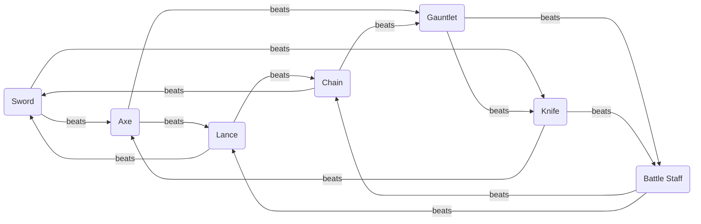
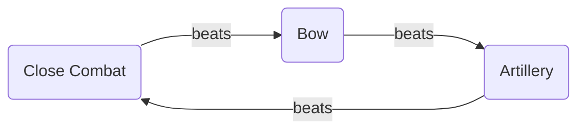

# Weapons

Catalog of all physical weapons. Two triangles order them: the inner **Close Combat** wheel (Sword, Lance, Axe, Knife, Gauntlet, Chain, Battle Staff), in which every type beats exactly two others and loses to exactly two, and the outer **Weapon Triangle** (Close Combat → Bow → Artillery). **Staves** – the healing tool of Acolytes, Clerics and Priests – are a weapon type of their own and stand outside both triangles. Magical weapons are listed separately in [Magic Tomes](Magic-Tomes.md).

Every entry is equippable, has durability (*Uses*) and a **Rank** on the F–S scale (F, E, D, C, B, A, S) that a unit must hold in that weapon type before it can equip the weapon. How ranks are gained and where each class tier caps is in the [Progression System](../Progression-System.md#weapon-rank); the numerical ranges per tier and the rank caps are in the [Balancing Guide](../Balancing-Guide.md#-weapon-balancing).

---

## Tiers, Ranks and Variants

Four tiers carry every weapon type – **Bronze → Iron → Steel → Silver** – with **Legendary** above them. The multipliers that derive one tier from the next are in the [Balancing Guide](../Balancing-Guide.md#weapon-tier-progression), the variant modifiers (killer, brave, effective, reach, magic) in [Variant Rules](../Balancing-Guide.md#variant-rules), and every price follows the [cost multiplier by rank](../Balancing-Guide.md#cost-multiplier-by-weapon-rank). Nothing in the tables below is invented – each row is its type's Iron line put through those rules.

Tier and rank are two different axes. A tier says what the weapon is made of; a rank says what it takes to hold it. The specialist variants cost rank rather than material, which is what fills the C and B ranks that no tier occupies:

| Rank | Opened by | What it buys |
|------|-----------|--------------|
| **F** | Citizen | Bronze |
| **E** | Base | Iron |
| **D** | Base | Steel · the Iron-grade reach weapons (Javelin, Hand Axe) |
| **C** | Intermediate | Effective weapons · magic weapons |
| **B** | Intermediate | Killer weapons · the Steel-grade reach weapons |
| **A** | Advanced | Silver · Brave weapons |
| **S** | Master | Legendary · the highest utility staves |

This mirrors the rank-to-tier mapping already used for tomes in the [Progression System](../Progression-System.md#magic-tome-availability), and it lines up with the [weapon availability timeline](../Progression-System.md#-weapon-progression-timeline): Steel reaches the shops in Ch 09, by which point every unit has taken a base class (Ch 06) and can hold rank D; Silver reaches them in Ch 25, the chapter the Advanced tier and its A cap open. Every promotion therefore hands the player a new *kind* of weapon, not merely a larger number.

**Secondary weapon types cap one rank lower**, so a hybrid reaches each of these rows one tier later in its off-hand – a Cleric's Sword stops at C, a Duelist's Knife at B. That is the price of breadth, per the [Progression System](../Progression-System.md#weapon-rank). Two types are *always* secondary in every class that carries them – Chain and Battle Staff – and their Silver entries are therefore Master-tier weapons in practice; the C-rank variants are those types' real workhorses.

**Critical is bought, not inherited.** Every weapon here sits at 0 Critical, with two exceptions: the Knife line, whose native 10 is the type's identity, and the Killer variants at 30. A player reading a battle forecast should be able to say where a crit chance came from.

**Legendary weapons have no entries yet.** They are story items; their names and their origin are a narrative decision, not a systems one. The tables below are complete from Bronze to Silver and **deliberately open at Legendary** until those weapons are written.

---

## Close Combat

Fourteen edges, seven types – each beats two and loses to two. The advantage and disadvantage values are in the [Balancing Guide](../Balancing-Guide.md#weapon-triangle-bonuses).

| Weapon | beats | loses to | Begründung |
| ------------ | -------------------- | -------------------- | ---------- |
| Sword        | Axe, Knife           | Lance, Chain         | Sword > Axe: the sword cuts before the axe can swing back. Sword > Knife: the sword outreaches the knife. |
| Lance        | Sword, Chain         | Axe, Battle Staff    | Lance > Sword: the lance outreaches the sword. Lance > Chain: the lance's point pins the chain wielder before the chain can build its swing. |
| Axe          | Lance, Gauntlet      | Sword, Knife         | Axe > Lance: the axe hacks through the lance shaft. Axe > Gauntlet: a fist cannot block an axe head. |
| Knife        | Battle Staff, Axe    | Sword, Gauntlet      | Knife > Battle Staff: the knife slips inside the staff's reach, where the long shaft cannot swing. Knife > Axe: the knife gets inside the slow, heavy swing. |
| Gauntlet     | Knife, Battle Staff  | Axe, Chain           | Gauntlet > Knife: the armored fist turns the knife's short blade aside. Gauntlet > Battle Staff: the grappler seizes the staff. |
| Chain        | Gauntlet, Sword      | Lance, Battle Staff  | Chain > Gauntlet: the chain entangles the fist before the grappler can close. Chain > Sword: the chain entangles the blade. |
| Battle Staff | Chain, Lance         | Knife, Gauntlet      | Battle Staff > Chain: the rigid shaft catches the swung chain and pins it. Battle Staff > Lance: the staff parries and pushes the pike aside at close range. |

### Swords

The light, accurate, low-Might type. A sword rarely wins on damage; it wins because its wielder still doubles, still dodges and still hits at 85 when the axe next to him is at 65. Swords have no throwing variant – their answer to a 2-range attacker is the magic **Rune Sword**, which pays for the reach in Might and only earns its keep on a unit with Magic.

| Name | Rank | Might | Hit  | Critical | Range | Weight | Uses | Cost | Description |
| ---- | ---- | ----- | ---- | -------- | ----- | ------ | ---- | ---- | ----------- |
| Bronze Sword | F | 3  | 95 | 0  | 1   | 4 | 15 | 20  | Cheap and forgiving; what a Citizen is handed and what the first chapters are fought with. |
| Iron Sword   | E | 5  | 90 | 0  | 1   | 5 | 25 | 50  | The baseline every other sword is measured against – nothing it does badly, nothing it does well. |
| Steel Sword  | D | 8  | 85 | 0  | 1   | 7 | 35 | 150 | The mid-game standard, for the point where enemy Defense starts eating an Iron Sword whole. |
| Armorslayer  | C | 8  | 85 | 0  | 1   | 9 | 25 | 250 | **Effective vs Armored.** Opens an Armored Knight that nothing else in the sword line can scratch; dead weight against everything else. |
| Rune Sword   | C | 5  | 75 | 0  | 1–2 | 7 | 25 | 250 | **Magic · Reach.** Lets a Cleric or a Tenebrae answer at 2 range off Magic instead of Strength. |
| Killer Sword | B | 5  | 80 | 30 | 1   | 8 | 35 | 350 | Trades half the Silver's Might for the chance to end a duel in one exchange. |
| Silver Sword | A | 10 | 80 | 0  | 1   | 8 | 50 | 500 | The best plain sword in the shops – saved for the fight that decides the chapter. |
| Brave Sword  | A | 5  | 80 | 0  | 1   | 9 | 20 | 500 | **2× attacks.** Shreds unarmoured swarms and bounces off anything with real Defense. |

### Lances

The balanced type: more Might than a sword, more accuracy than an axe, and the only close-combat line outside the Chain with a proper throwing weapon at every stage. A Lancer who carries a **Javelin** is never helpless against an archer, which is why lance units hold the front.

| Name | Rank | Might | Hit  | Critical | Range | Weight | Uses | Cost | Description |
| ---- | ---- | ----- | ---- | -------- | ----- | ------ | ---- | ---- | ----------- |
| Bronze Lance | F | 4  | 90 | 0  | 1   | 7  | 15 | 28  | The militia spear – long enough to hold a line, cheap enough to lose. |
| Iron Lance   | E | 7  | 85 | 0  | 1   | 8  | 25 | 70  | The workhorse of the front rank. |
| Javelin      | D | 4  | 75 | 0  | 1–2 | 8  | 20 | 210 | The base-tier answer to bows and magic: weak, inaccurate, and the only thing that lets a Lancer strike back at 2 range. |
| Steel Lance  | D | 11 | 80 | 0  | 1   | 10 | 35 | 210 | Mid-game standard; heavy enough that a slow unit stops doubling with it. |
| Horseslayer  | C | 11 | 80 | 0  | 1   | 12 | 25 | 350 | **Effective vs Cavalry.** Kept in the convoy until a Paladin wing shows up, then it decides the map. |
| Steel Javelin| B | 8  | 70 | 0  | 1–2 | 10 | 25 | 490 | A thrown weapon that still hurts – the price is an accuracy that misses one throw in three. |
| Killer Lance | B | 9  | 75 | 30 | 1   | 11 | 35 | 490 | For the unit whose Dexterity is high enough to turn 30 Critical into a reliable opening. |
| Silver Lance | A | 14 | 75 | 0  | 1   | 11 | 50 | 700 | The heaviest reliable strike in the close-combat wheel outside the axe line. |
| Brave Lance  | A | 7  | 75 | 0  | 1   | 12 | 20 | 700 | **2× attacks.** Two spear thrusts at Iron strength – the answer to numbers, not to armour. |

### Axes

The heavy type: the highest Might on the wheel and the worst accuracy anywhere except artillery. An axe unit that connects removes a target; an axe unit that misses has spent a turn. The **Hand Axe** keeps the line honest at 2 range, the **Hammer** is the army's anti-armour tool.

| Name | Rank | Might | Hit  | Critical | Range | Weight | Uses | Cost | Description |
| ---- | ---- | ----- | ---- | -------- | ----- | ------ | ---- | ---- | ----------- |
| Bronze Axe    | F | 5  | 80 | 0  | 1   | 10 | 15 | 36  | A woodcutter's axe – hits harder than any other Bronze weapon and misses more often than all of them. |
| Iron Axe      | E | 9  | 75 | 0  | 1   | 11 | 25 | 90  | The early-game answer to anything the sword line cannot cut through. |
| Hand Axe      | D | 6  | 65 | 0  | 1–2 | 11 | 20 | 270 | Thrown, and about as accurate as that sounds; it exists so an Axe Fighter can answer at 2 range at all. |
| Steel Axe     | D | 14 | 70 | 0  | 1   | 13 | 35 | 270 | Mid-game standard, and heavy enough that almost nobody doubles with it. |
| Hammer        | C | 14 | 70 | 0  | 1   | 15 | 25 | 450 | **Effective vs Armored.** The siege tool of the infantry line – one swing through a general's plate. |
| Steel Hand Axe| B | 11 | 60 | 0  | 1–2 | 13 | 25 | 630 | Real damage at 2 range, bought with the worst accuracy of any close-combat weapon. |
| Killer Axe    | B | 13 | 65 | 30 | 1   | 14 | 35 | 630 | High Might and 30 Critical on a weapon that hits two swings in three – the gamble the Berserker is built for. |
| Silver Axe    | A | 18 | 65 | 0  | 1   | 14 | 50 | 900 | The single hardest blow the catalog holds below Legendary. |
| Brave Axe     | A | 9  | 65 | 0  | 1   | 15 | 20 | 900 | **2× attacks.** Two Iron-strength swings that each have to land first. |

### Knives

The lightest type and the only one with native Critical. A knife almost never beats Defense on Might – it beats it by striking twice, by critting, and by belonging to units whose Speed was never in question. **Throwing Knives** are built on the Steel and Silver lines rather than Iron and Steel, because the Reach modifier on an Iron Knife would leave 1 Might, below the Bronze Knife.

| Name | Rank | Might | Hit  | Critical | Range | Weight | Uses | Cost | Description |
| ---- | ---- | ----- | ---- | -------- | ----- | ------ | ---- | ---- | ----------- |
| Bronze Knife         | F | 2 | 100 | 0  | 1   | 1 | 15 | 16  | A belt knife. It will not kill anything on its own, and it will never miss. |
| Iron Knife           | E | 4 | 95  | 10 | 1   | 2 | 25 | 40  | Weightless enough that its wielder doubles almost everything on the field. |
| Steel Knife          | D | 6 | 90  | 10 | 1   | 4 | 35 | 120 | The Thief's upgrade – still light, finally able to hurt an armed opponent. |
| Throwing Knife       | D | 3 | 80  | 10 | 1–2 | 4 | 25 | 120 | Chip damage at 2 range, and a way to finish a wounded enemy without stepping into his reach. |
| Killer Knife         | B | 3 | 85  | 30 | 1   | 5 | 35 | 280 | The Assassin's weapon: two strikes, each at 30 Critical before Dexterity is counted. |
| Heavy Throwing Knife | B | 5 | 75  | 10 | 1–2 | 5 | 35 | 280 | A weighted blade for the Rogue who needs the 2-range option to actually threaten something. |
| Silver Knife         | A | 8 | 85  | 10 | 1   | 5 | 50 | 400 | High accuracy, high crit, low Might – damage by volume, which is the whole type in one line. |

### Gauntlets

**Flurry.** Every gauntlet strikes **twice per attack**, on both phases. This is the Brave property, native to the type rather than bought as a variant, and the type is priced for it: gauntlets carry the lowest Might on the wheel, and the Brave rule's -10 Hit is already applied in the Hit column of every entry below (see [Variant Rules](../Balancing-Guide.md#variant-rules)). Because Defense is subtracted from *each* strike, a gauntlet is brutal against unarmoured targets and nearly useless against plate – which is exactly what the **Crushing Gauntlet** exists to fix.

The type also has no ranged option at all. That is deliberate: the Martial Artist answers 2-range attackers with Avoid +10 until Intermediate, where the Brawler gains the Chain and the Martial Monk the Reach Staff.

| Name | Rank | Might | Hit  | Critical | Range | Weight | Uses | Cost | Description |
| ---- | ---- | ----- | ---- | -------- | ----- | ------ | ---- | ---- | ----------- |
| Bronze Gauntlet   | F | 2  | 90 | 0 | 1 | 2  | 15 | 12  | Wrapped fists. Two taps a turn, and enough to teach a player what doubling does. |
| Iron Gauntlet     | E | 3  | 85 | 0 | 1 | 3  | 25 | 30  | The cheapest damage per turn in the catalog, as long as nothing in front of you wears armour. |
| Steel Gauntlet    | D | 5  | 80 | 0 | 1 | 5  | 35 | 90  | Ten Might a turn against a soft target; five against a good one. |
| Ki Gauntlet       | C | 5  | 80 | 0 | 1 | 5  | 25 | 150 | **Magic.** The monk's weapon – strikes twice off Magic and is answered by Resistance, which most armour does not have. |
| Crushing Gauntlet | B | 12 | 85 | 0 | 1 | 10 | 35 | 210 | **Single strike.** Gives up Flurry and puts both blows into one: the same damage against no Defense, far more against a wall. |
| Silver Gauntlet   | A | 6  | 75 | 0 | 1 | 6  | 50 | 300 | Twelve Might a turn on a weapon light enough that the wielder still doubles on top of it. |

### Battle Staves

**Guard.** A Battle Staff carries a defensive trait on the wielder's side: while it is equipped, every attack against the wielder from range 1 suffers a Hit penalty. Attacks from range 2 or more – bows, artillery, tomes – ignore it. The physical reading is the rule itself: a staff parries a blow it can see coming and does nothing against an arrow. The penalty is shown in the battle forecast like any other Hit modifier, applies on both phases, and works for enemies who wield a Battle Staff exactly as it does for the player. Its size is in the [Balancing Guide](../Balancing-Guide.md#battle-staff-guard).

Low Might, the best accuracy on the wheel, and a defensive property: the Battle Staff is a holding weapon, not a killing one. It is a secondary type in every class that carries it (Martial Monk, Martial Saint, Divine Monk), so the Silver entry is reachable only at Master.

| Name | Rank | Might | Hit  | Critical | Range | Weight | Uses | Cost | Description |
| ---- | ---- | ----- | ---- | -------- | ----- | ------ | ---- | ---- | ----------- |
| Bronze Battle Staff | F | 3  | 100 | 0 | 1   | 6  | 15 | 20  | A training pole. It will not kill, it will not miss, and nothing standing next to it hits properly either. |
| Iron Battle Staff   | E | 5  | 95  | 0 | 1   | 7  | 25 | 50  | The monk's baseline – for holding a corridor rather than clearing one. |
| Steel Battle Staff  | D | 8  | 90  | 0 | 1   | 9  | 35 | 150 | Enough Might to threaten, still accurate enough to be the safest melee weapon in the game. |
| Reach Staff         | C | 5  | 80  | 0 | 1–2 | 9  | 25 | 250 | **Reach.** The monk line's only answer at 2 range; keep Guard, lose the accuracy that defines the type. |
| Unseating Staff     | C | 8  | 90  | 0 | 1   | 11 | 25 | 250 | **Effective vs Cavalry.** A long shaft braced against a charge – it takes the rider off the horse. |
| Silver Battle Staff | A | 10 | 85  | 0 | 1   | 10 | 50 | 500 | The finished form: real damage on a weapon that still makes its wielder hard to hit. |

### Chains

The reach type. Every chain strikes at **1–2 range natively**, with no Might or Hit penalty for it – which is the type's entire argument, since everyone else pays for that reach. It buys the privilege elsewhere: middling numbers across the board, no killer and no brave variant, and the status of a secondary weapon type in every class that carries it (Brawler, Gladiator, Trickster, Bruiser, Spartan, Saboteur, Enforcer). That cap means a chain user reaches C at Intermediate and A only at Master, so the two effective chains below are the type's real mid-game, not the Silver.

| Name | Rank | Might | Hit  | Critical | Range | Weight | Uses | Cost | Description |
| ---- | ---- | ----- | ---- | -------- | ----- | ------ | ---- | ---- | ----------- |
| Bronze Chain | F | 4  | 85 | 0 | 1–2 | 7  | 15 | 24  | A weighted length of chain – already able to do the one thing the type is for. |
| Iron Chain   | E | 6  | 80 | 0 | 1–2 | 8  | 25 | 60  | Strikes at 1 and 2 with no compromise; the Brawler's cover against archers. |
| Steel Chain  | D | 9  | 75 | 0 | 1–2 | 10 | 35 | 180 | Full mid-game damage at both ranges, which is more than any javelin manages. |
| Snare Chain  | C | 9  | 75 | 0 | 1–2 | 12 | 25 | 300 | **Effective vs Flying.** Reaches up and pulls a wyvern out of its approach. |
| Flail Chain  | C | 9  | 75 | 0 | 1–2 | 12 | 25 | 300 | **Effective vs Armored.** A weighted head that does not care what the plate is made of. |
| Silver Chain | A | 12 | 70 | 0 | 1–2 | 11 | 50 | 600 | Master-tier in practice: the only chain that competes with a Silver Lance on Might. |

## Weapon Triangle

Artillery has a **minimum range of 2 or more** – it cannot fire at an adjacent tile. This is expressed through the Range column alone (e.g. `3–10`), and the same convention applies to siege tomes in [Magic Tomes](Magic-Tomes.md).

### Bows

Range 2–3, and **no counterattack at range 1**: a bow unit that is reached has already lost the exchange. Everything in the line is built around never being reached – which is why the **Longbow** exists, and why the Brave Bow is the type's answer to an enemy that closed anyway.

| Name | Rank | Might | Hit  | Critical | Range | Weight | Uses | Cost | Description |
| ---- | ---- | ----- | ---- | -------- | ----- | ------ | ---- | ---- | ----------- |
| Bronze Bow    | F | 4  | 90 | 0  | 2–3 | 5  | 15 | 24  | A hunting bow – safe chip damage while a new player learns what range means. |
| Iron Bow      | E | 6  | 85 | 0  | 2–3 | 6  | 25 | 60  | The Archer's baseline; kills wounded enemies without ever being hit back. |
| Steel Bow     | D | 9  | 80 | 0  | 2–3 | 8  | 35 | 180 | Mid-game standard, heavy enough that the archer stops outrunning his own escort. |
| Skypiercer Bow| C | 9  | 80 | 0  | 2–3 | 10 | 25 | 300 | **Effective vs Flying.** The reason a Wyvern wing never crosses open ground in front of a Sniper. |
| Killer Bow    | B | 7  | 75 | 30 | 2–3 | 9  | 35 | 420 | Turns an archer from an attrition tool into a threat that can remove a target outright. |
| Longbow       | B | 6  | 70 | 0  | 2–4 | 8  | 25 | 420 | **Reach.** One tile further than anything can answer from – the price is accuracy and damage. |
| Silver Bow    | A | 12 | 75 | 0  | 2–3 | 9  | 50 | 600 | Full damage at a range where most of the map cannot reply. |
| Brave Bow     | A | 6  | 75 | 0  | 2–3 | 10 | 20 | 600 | **2× attacks.** Two Iron-strength shots a turn, for the archer who has to finish things before they arrive. |

### Artillery

Heavy, expensive, short on durability, and blind up close: every piece has a **minimum range of 3**, so anything that reaches an artillerist takes no return fire at all. In exchange it outranges the entire catalog and carries the triangle advantage against every close-combat weapon on the field.

| Name | Rank | Might | Hit  | Critical | Range | Weight | Uses | Cost | Description |
| ---- | ---- | ----- | ---- | -------- | ----- | ------ | ---- | ---- | ----------- |
| Bronze Cannon    | F | 4  | 80 | 0 | 3–6  | 14 | 15 | 28  | A light field piece – short-ranged for artillery, and the only one a green crew can serve. |
| Iron Cannon      | E | 7  | 75 | 0 | 3–8  | 15 | 25 | 70  | Standard ordnance: reaches most of a map from a position nothing can charge in one turn. |
| Steel Cannon     | D | 11 | 70 | 0 | 3–10 | 17 | 35 | 210 | The mid-game siege piece; sets up once and rules the half of the map it can see. |
| Breaching Cannon | C | 11 | 70 | 0 | 3–10 | 19 | 25 | 350 | **Effective vs Armored.** Built for gates and generals, and nearly immobile while it waits for one. |
| Siege Mortar     | B | 8  | 60 | 0 | 4–12 | 17 | 25 | 490 | **Reach.** The longest reach in the game, a minimum range of 4, and the accuracy of a weapon that never sees its target. |
| Silver Cannon    | A | 14 | 65 | 0 | 3–10 | 18 | 50 | 700 | Endgame ordnance – removes a unit per turn from a tile the enemy has to walk three turns to reach. |

## Staves

Staff is a weapon type **outside both triangles** – it neither gains nor suffers a triangle bonus. Staves are Mag-based, have Uses and are rank-gated like every other weapon; the Staff rank appears in a unit's weapon proficiencies next to its other types. Pure healing staves have no Might and no Hit; the columns stay so that offensive or status staves can be listed in the same table. Healing with a staff grants experience – see [Progression System](../Progression-System.md#weapon-rank). By design, a healer in the Acolyte class cannot attack at all until promotion at Lv 15, when Cleric adds the Sword and Priest adds Lux.

**How much a staff heals is set by its Rank**, not by the entry: `Heal = Mag + Rank Bonus`, halved bonus for ranged and multi-target staves, in the [Balancing Guide](../Balancing-Guide.md#magic-effect-values). That makes the Rank column the whole difference between an Acolyte and an Arch Bishop – the same Heal staff restores more in better hands, and the utility that decides a battle sits behind gates an Acolyte cannot reach. Rank S in Staff exists only for the Arch Bishop and the Celestial Valkyrie; Luminary, Radiant Monarch, Martial Saint and Divine Monk carry Staff as a secondary type and cap one rank lower.

There is deliberately **no revival staff.** Loss is permanent in this game, and a staff that undid it would undo the weight every other rule is built to carry.

| Name | Rank | Might | Hit  | Range | Weight | Uses | Cost | Description |
| ---- | ---- | ----- | ---- | ----- | ------ | ---- | ---- | ----------- |
| Heal    | E | - | - | 1   | 3 | 30 | 60   | The first staff an Acolyte carries: one adjacent ally, one wound undone, and the reason a healer levels at all. |
| Mend    | D | - | - | 1   | 4 | 25 | 180  | The same act with a better tool – enough to pull a front-line unit back out of one-shot range. |
| Physic  | C | - | - | 1–5 | 5 | 20 | 300  | Heals at a distance for half the amount: the staff that lets a healer stay behind the line instead of inside it. |
| Recover | B | - | - | 1   | 6 | 20 | 420  | The strongest single heal in the catalog, and it demands the healer stand next to the wounded unit to use it. |
| Restore | B | - | - | 1–2 | 5 | 15 | 420  | Clears status effects from one ally. *Depends on the [Status Effects](../mechanics/README.md#backlog--not-yet-documented) mechanic, which is not yet specified.* |
| Rescue  | A | - | - | 1–5 | 7 | 10 | 600  | Pulls an ally out of a closing trap to the caster's side – a rescue that costs no movement but the healer's turn. |
| Fortify | A | - | - | 1–3 | 8 | 10 | 600  | Heals every ally in range for half the amount; the answer to a turn that went wrong everywhere at once. |
| Warp    | S | - | - | 1–5 | 8 | 5  | 1200 | Places one ally on any tile within range. Five uses in a campaign, and each one can decide a map – the Arch Bishop's reason to exist. |
