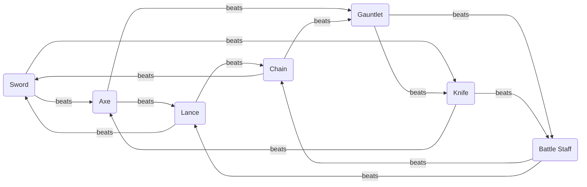
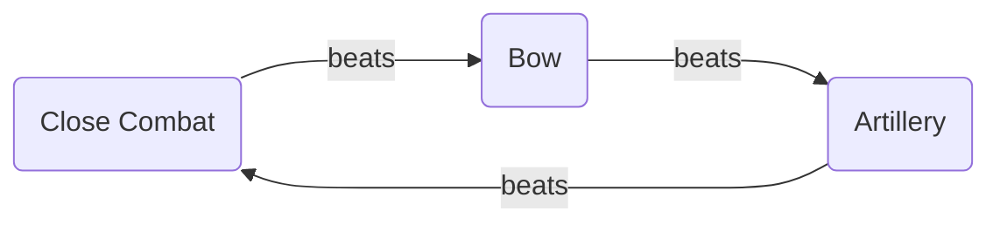

# Weapons

Catalog of all physical weapons. Two triangles order them: the inner **Close Combat** wheel (Sword, Lance, Axe, Knife, Gauntlet, Chain, Battle Staff), in which every type beats exactly two others and loses to exactly two, and the outer **Weapon Triangle** (Close Combat → Bow → Artillery). **Staves** – the healing tool of Acolytes, Clerics and Priests – are a weapon type of their own and stand outside both triangles. Magical weapons are listed separately in [Magic Tomes](Magic-Tomes.md).

Every entry is equippable, has durability (*Uses*) and a **Rank** on the F–S scale (F, E, D, C, B, A, S) that a unit must hold in that weapon type before it can equip the weapon. How ranks are gained and where each class tier caps is in the [Progression System](../Progression-System.md#weapon-rank); the numerical ranges per tier and the rank caps are in the [Balancing Guide](../Balancing-Guide.md#-weapon-balancing).

---

## Close Combat

Fourteen edges, seven types – each beats two and loses to two. The advantage and disadvantage values are in the [Balancing Guide](../Balancing-Guide.md#weapon-triangle-bonuses).

| Weapon | beats | loses to | Begründung |
| ------------ | -------------------- | -------------------- | ---------- |
| Sword        | Axe, Knife           | Lance, Chain         | Sword > Axe: the sword cuts before the axe can swing back. Sword > Knife: the sword outreaches the knife. |
| Lance        | Sword, Chain         | Axe, Battle Staff    | Lance > Sword: the lance outreaches the sword. Lance > Chain: the lance's point pins the chain wielder before the chain can build its swing. |
| Axe          | Lance, Gauntlet      | Sword, Knife         | Axe > Lance: the axe hacks through the lance shaft. Axe > Gauntlet: a fist cannot block an axe head. |
| Knife        | Battle Staff, Axe    | Sword, Gauntlet      | Knife > Battle Staff: the knife slips inside the staff's reach, where the long shaft cannot swing. Knife > Axe: the knife gets inside the slow, heavy swing. |
| Gauntlet     | Knife, Battle Staff  | Axe, Chain           | Gauntlet > Knife: the armored fist turns the knife's short blade aside. Gauntlet > Battle Staff: the grappler seizes the staff. |
| Chain        | Gauntlet, Sword      | Lance, Battle Staff  | Chain > Gauntlet: the chain entangles the fist before the grappler can close. Chain > Sword: the chain entangles the blade. |
| Battle Staff | Chain, Lance         | Knife, Gauntlet      | Battle Staff > Chain: the rigid shaft catches the swung chain and pins it. Battle Staff > Lance: the staff parries and pushes the pike aside at close range. |

### Swords

| Name | Rank | Might | Hit  | Critical | Range | Weight | Uses | Cost | Description |
| ---- | ---- | ----- | ---- | -------- | ----- | ------ | ---- | ---- | ----------- |
|      |      |       |      |          |       |        |      |      |             |
|      |      |       |      |          |       |        |      |      |             |
|      |      |       |      |          |       |        |      |      |             |
|      |      |       |      |          |       |        |      |      |             |

### Lances

| Name | Rank | Might | Hit  | Critical | Range | Weight | Uses | Cost | Description |
| ---- | ---- | ----- | ---- | -------- | ----- | ------ | ---- | ---- | ----------- |
|      |      |       |      |          |       |        |      |      |             |
|      |      |       |      |          |       |        |      |      |             |
|      |      |       |      |          |       |        |      |      |             |
|      |      |       |      |          |       |        |      |      |             |

### Axes

| Name | Rank | Might | Hit  | Critical | Range | Weight | Uses | Cost | Description |
| ---- | ---- | ----- | ---- | -------- | ----- | ------ | ---- | ---- | ----------- |
|      |      |       |      |          |       |        |      |      |             |
|      |      |       |      |          |       |        |      |      |             |
|      |      |       |      |          |       |        |      |      |             |
|      |      |       |      |          |       |        |      |      |             |

### Knives

| Name | Rank | Might | Hit  | Critical | Range | Weight | Uses | Cost | Description |
| ---- | ---- | ----- | ---- | -------- | ----- | ------ | ---- | ---- | ----------- |
|      |      |       |      |          |       |        |      |      |             |
|      |      |       |      |          |       |        |      |      |             |
|      |      |       |      |          |       |        |      |      |             |
|      |      |       |      |          |       |        |      |      |             |

### Gauntlets

| Name | Rank | Might | Hit  | Critical | Range | Weight | Uses | Cost | Description |
| ---- | ---- | ----- | ---- | -------- | ----- | ------ | ---- | ---- | ----------- |
|      |      |       |      |          |       |        |      |      |             |
|      |      |       |      |          |       |        |      |      |             |
|      |      |       |      |          |       |        |      |      |             |
|      |      |       |      |          |       |        |      |      |             |

### Battle Staves

**Guard.** A Battle Staff carries a defensive trait on the wielder's side: while it is equipped, every attack against the wielder from range 1 suffers a Hit penalty. Attacks from range 2 or more – bows, artillery, tomes – ignore it. The physical reading is the rule itself: a staff parries a blow it can see coming and does nothing against an arrow. The penalty is shown in the battle forecast like any other Hit modifier, applies on both phases, and works for enemies who wield a Battle Staff exactly as it does for the player. Its size is in the [Balancing Guide](../Balancing-Guide.md#battle-staff-guard).

| Name | Rank | Might | Hit  | Critical | Range | Weight | Uses | Cost | Description |
| ---- | ---- | ----- | ---- | -------- | ----- | ------ | ---- | ---- | ----------- |
|      |      |       |      |          |       |        |      |      |             |
|      |      |       |      |          |       |        |      |      |             |
|      |      |       |      |          |       |        |      |      |             |
|      |      |       |      |          |       |        |      |      |             |

### Chains

| Name | Rank | Might | Hit  | Critical | Range | Weight | Uses | Cost | Description |
| ---- | ---- | ----- | ---- | -------- | ----- | ------ | ---- | ---- | ----------- |
|      |      |       |      |          |       |        |      |      |             |
|      |      |       |      |          |       |        |      |      |             |
|      |      |       |      |          |       |        |      |      |             |
|      |      |       |      |          |       |        |      |      |             |

## Weapon Triangle

Artillery has a **minimum range of 2 or more** – it cannot fire at an adjacent tile. This is expressed through the Range column alone (e.g. `3–10`), and the same convention applies to siege tomes in [Magic Tomes](Magic-Tomes.md).

### Bows

| Name | Rank | Might | Hit  | Critical | Range | Weight | Uses | Cost | Description |
| ---- | ---- | ----- | ---- | -------- | ----- | ------ | ---- | ---- | ----------- |
|      |      |       |      |          |       |        |      |      |             |
|      |      |       |      |          |       |        |      |      |             |
|      |      |       |      |          |       |        |      |      |             |
|      |      |       |      |          |       |        |      |      |             |

### Artillery

| Name | Rank | Might | Hit  | Critical | Range | Weight | Uses | Cost | Description |
| ---- | ---- | ----- | ---- | -------- | ----- | ------ | ---- | ---- | ----------- |
|      |      |       |      |          |       |        |      |      |             |
|      |      |       |      |          |       |        |      |      |             |
|      |      |       |      |          |       |        |      |      |             |
|      |      |       |      |          |       |        |      |      |             |

## Staves

Staff is a weapon type **outside both triangles** – it neither gains nor suffers a triangle bonus. Staves are Mag-based, have Uses and are rank-gated like every other weapon; the Staff rank appears in a unit's weapon proficiencies next to its other types. Pure healing staves have no Might and no Hit; the columns stay so that offensive or status staves can be listed in the same table. Healing with a staff grants experience – see [Progression System](../Progression-System.md#weapon-rank). By design, a healer in the Acolyte class cannot attack at all until promotion at Lv 15, when Cleric adds the Sword and Priest adds Lux.

| Name | Rank | Might | Hit  | Range | Weight | Uses | Cost | Description |
| ---- | ---- | ----- | ---- | ----- | ------ | ---- | ---- | ----------- |
|      |      |       |      |       |        |      |      |             |
|      |      |       |      |       |        |      |      |             |
|      |      |       |      |       |        |      |      |             |
|      |      |       |      |       |        |      |      |             |
