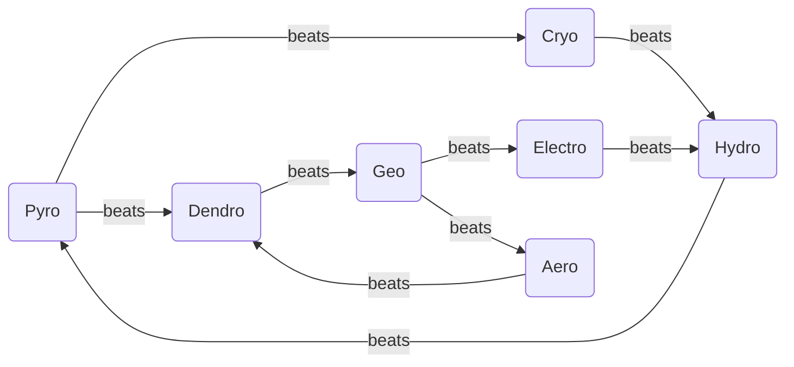
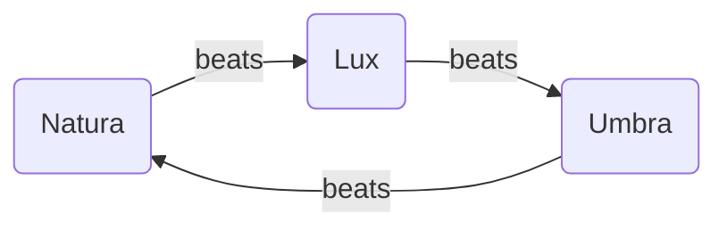

# Magic System

> **Verwandte Dateien:** [Magic Spells](../catalog/Magic-Spells.md) · [Combat Arts](Combat-Arts.md) · [Abilities](Abilities.md) · [Unit Classes](../catalog/Unit-Classes.md)

---

## Übersicht

Das Magiesystem von Tridera teilt sich in zwei parallele Systeme auf — Magier und Nicht-Magier — die über das Elementarsystem und Elementarreaktionen miteinander verbunden sind.

|              | Magic System                                                        |
| ------ | ---------------------------------- |
| Phase        | Player Phase & Enemy Phase                                          |
| Auslösung    | Magier: automatisch bei Angriff / Nicht-Magier: via Combat Arts     |
| Ressource    | MP (Magier: passiv regeneriert / Nicht-Magier: aktiv aufgebaut)     |
| Besonderheit | 9 Elemente, 2-Element- und 3-Element-Reaktionen, Geländeinteraktion |

---

## Voraussetzungen

| Bedingung | Regel |
| ------ | ----- |
| Magier | Applizieren Elemente bei jedem Angriff automatisch |
| Nicht-Magier | Benötigen Combat Arts um Elemente zu applizieren |
| Reaktion auslösen | Zweites Element auf einen Gegner mit bereits appliziertem Element anwenden |
| MP-Verfügbarkeit | Angriffe und Arts erfordern ausreichend MP |

---

## Kernregeln

### Duales MP-System

### Magier — Passiv

Magier verbrauchen MP bei **jedem Angriff**. Magie ist ihre primäre Ressource.

| Mechanic        | Regel                                      |
| --------- | --------------------- |
| Angriff         | Verbraucht MP — keine Uses                 |
| MP-Regeneration | Passiv, jede Runde — skaliert mit Mag-Stat |
| Combat Arts     | Verbrauchen zusätzliches MP                |

**Passive Regeneration pro Runde:**

| Mag-Wert | MP-Regen |
| ----- | ----- |
| 0–5      | +2 MP    |
| 6–12     | +4 MP    |
| 13–20    | +6 MP    |
| 21+      | +8 MP    |

Magier denken in Ressourcenhaushalten. Warten und Haushalten ist ein aktiver Teil ihrer Strategie.

### Nicht-Magier — Aktiv

Nicht-Magier verbrauchen keine MP für normale Angriffe. MP wird durch Kämpfen **aufgebaut** und nur für Combat Arts ausgegeben.

| Mechanic        | Regel                                       |
| --------- | ---------------------- |
| Angriff         | Verbraucht Uses der Waffe — keine MP-Kosten |
| MP-Regeneration | Aktiv — durch normale Angriffe              |
| Combat Arts     | Verbrauchen aufgebautes MP                  |

**Aktive Regeneration pro normalem Angriff:**

| Mag-Wert | MP pro Angriff |
| ----- | -------- |
| 0–5      | +1 MP          |
| 6–12     | +2 MP          |
| 13+      | +3 MP          |

Der Mag-Stat ist damit auch für Nicht-Magier relevant — er bestimmt wie schnell sie MP für Combat Arts aufbauen.

Nicht-Magier denken in Momentum. Sie kämpfen aktiv auf den richtigen Moment für eine Combat Art hin.

### Die 9 Elemente

### Natura-Magie (7 Elemente)

| Element     | Primäre Rolle              | Sekundäre Rolle       |
| -------- | -------------- | ------------ |
| **Pyro**    | Offensiv (Flächenschaden)  | Geländekontrolle      |
| **Cryo**    | Kontrolle (Freeze)         | Defensiv              |
| **Hydro**   | Support (Heilung)          | Geländemanipulation   |
| **Electro** | Burst Damage               | Paralyse              |
| **Aero**    | Verstärker / Verteiler     | Bewegungsmanipulation |
| **Geo**     | Defensiv (Schilde)         | Geländeblockade       |
| **Dendro**  | Kontrolle (Gift / Wurzeln) | Heilung über Zeit     |

### Magie-Dreieck (2 Elemente)

| Element   | Primäre Rolle               | Sekundäre Rolle   |
| ------ | --------------- | ----------- |
| **Lux**   | Support (Buffs / Heilung)   | Anti-Umbra        |
| **Umbra** | Saboteur (Debuffs / Flüche) | Schaden über Zeit |

---

## Erwerb / Zugang

| Quelle | Beschreibung | Verfügbarkeit |
| --- | ------ | ------- |
| Magier-Klassen | Erhalten Zugang zu Magie automatisch mit ihrer Klasse | Nur Magier-Klassen |
| Combat Arts | Ermöglichen Nicht-Magiern, Elemente zu applizieren | Alle Klassen mit entsprechenden Arts |
| Spells (Katalog) | Einzelne Zauber mit festgelegten Elementen | Magier-spezifisch, über Klasse oder Items |

---

## Strategische Tiefe

Das Magiesystem erzeugt taktische Tiefe auf drei Ebenen:

- **Ressourcenmanagement:** Magier haushalten passive MP und entscheiden wann sie Spells einsetzen. Nicht-Magier bauen MP auf und wählen den richtigen Moment für Arts.
- **Elementare Synergie:** Das Auslösen von Reaktionen erfordert Koordination — Magier und Nicht-Magier müssen zusammenarbeiten, um die stärksten Effekte zu erzielen.
- **Geländekontrolle:** Elemente verändern das Schlachtfeld dauerhaft. Pyro setzt Wälder in Brand, Hydro überflutet Felder, Geo errichtet Barrieren — die Karte ist ein aktives Kampfmittel.
- **3-Element-Reaktionen:** Die mächtigsten Effekte erfordern drei koordinierte Angriffe in der richtigen Reihenfolge, typischerweise im Kettenangriff gegen Bosse.

---

## Elementare Schwächen

### Natura-Zyklus

### Magie-Dreieck

### Schwächen-Tabelle

| Element     | Besiegt       | Begründung                                   |
| -------- | ------- | ----------------------- |
| **Pyro**    | Cryo, Dendro  | Feuer schmilzt Eis, verbrennt Pflanzen       |
| **Cryo**    | Hydro         | Eis friert Wasser ein                        |
| **Hydro**   | Pyro          | Wasser löscht Feuer                          |
| **Electro** | Hydro         | Elektrizität leitet sich durch Wasser        |
| **Aero**    | Dendro        | Stürme entwurzeln Bäume, verwehen Pflanzen   |
| **Geo**     | Electro, Aero | Erde absorbiert Elektrizität, blockiert Wind |
| **Dendro**  | Geo           | Wurzeln durchbrechen Felsen                  |
| **Lux**     | Umbra         | Licht vertreibt Schatten                     |
| **Umbra**   | Natura        | Dunkelheit korrumpiert die Natur             |

Lux und Umbra sind gegenseitige Konter — das stärkere Element gewinnt.

---

## Elementarreaktionen

### Wie Elemente appliziert werden

| Unit-Typ     | Appliziert durch |
| ------ | ---------- |
| Magier       | Jeden Angriff    |
| Nicht-Magier | Combat Arts      |

### Wie Reaktionen ausgelöst werden

| Aktion                                               | Ergebnis                                |
| ---------------------------- | --------------------- |
| Normaler Angriff (Nicht-Magier) auf Element          | Schaden — Element **bleibt** auf Gegner |
| Magier-Angriff auf Element                           | Elementarreaktion ausgelöst             |
| Combat Art (Nicht-Magier) auf Element                | Elementarreaktion ausgelöst             |
| Nicht-Magier A appliziert → Nicht-Magier B nutzt Art | Reaktion ausgelöst                      |

---

### 2-Element-Reaktionen

#### Klassische Reaktionen

| Elemente                           | Reaktion        | Effekt                                                       |
| ------------------- | --------- | ------------------------------ |
| **Pyro + Hydro**                   | Verdampfen      | Wasser wird verdampft → zusätzlicher Schaden                 |
| **Pyro + Cryo**                    | Schmelzen       | Eis schmilzt → massiver Bonusschaden                         |
| **Pyro + Dendro**                  | Verbrennen      | Pflanzen fangen Feuer → Flächenschaden über Zeit             |
| **Hydro + Electro**                | Schockladung    | Wasser wird elektrisch aufgeladen → Flächenschaden           |
| **Hydro + Cryo**                   | Gefrieren       | Wasser gefriert → Gegner werden eingefroren (Stun)           |
| **Electro + Cryo**                 | Schockfrost     | Blitz trifft Eis → schneller, zackiger Zusatzschaden         |
| **Electro + Dendro**               | Überwuchern     | Pflanzen werden elektrisch geladen → explodieren bei Kontakt |
| **Aero + Pyro/Hydro/Cryo/Electro** | Verwirbelung    | Element wird verbreitet → Flächeneffekt                      |
| **Geo + Pyro/Hydro/Cryo/Electro**  | Kristallisieren | Schild wird erzeugt basierend auf Element                    |

#### Taktische Reaktionen *(Grid-spezifisch)*

| Elemente           | Reaktion    | Effekt                                                       |
| --------- | -------- | ------------------------------ |
| **Aero + Cryo**    | Schneeschub | Gegner wird 2 Felder zurückgeworfen — bricht Formationen     |
| **Geo + Hydro**    | Schlammfeld | Feld wird zu schwerem Terrain — Bewegung kostet doppelt für 3 Runden |
| **Aero + Geo**     | Sandstorm   | Sichtlinie unterbrochen — Fernkampf auf diesem Feld unmöglich für 2 Runden |
| **Electro + Cryo** | Leitfrost   | Blitz springt auf alle gefrorenen Gegner in Reichweite       |
| **Hydro + Dendro** | Rankennetz  | Gegner wird immobilisiert — kann sich eine Runde nicht bewegen |

#### Lux-Reaktionen

| Elemente          | Reaktion        | Effekt                                                       |
| ----------- | --------- | ------------------------------ |
| **Lux + Pyro**    | Sonnenfeuer     | Licht verstärkt Feuer → massiver Flächenbrand                |
| **Lux + Hydro**   | Regenbogenlicht | Wasser und Licht → Gegner verlieren Genauigkeit (Blendung)   |
| **Lux + Cryo**    | Lichtkristalle  | Licht erstarrt im Eis → starker Schutzschild                 |
| **Lux + Electro** | Strahlenschock  | Blitze verschmelzen mit Licht → laserartige Durchschlagsattacke |
| **Lux + Aero**    | Blendwirbel     | Alle Gegner in einem Radius verlieren 30% Trefferchance für 2 Runden |
| **Lux + Geo**     | Lichtpfeiler    | Felsen von Licht durchdrungen → heilende Barrieren           |
| **Lux + Dendro**  | Heilige Blüte   | Pflanzen leuchten → heilen Verbündete im Umkreis             |

#### Umbra-Reaktionen

| Elemente            | Reaktion         | Effekt                                                       |
| ---------- | ---------- | ------------------------------ |
| **Umbra + Pyro**    | Schattenbrand    | Dunkles Feuer → schwächt und schädigt über Zeit              |
| **Umbra + Hydro**   | Finsternisflut   | Dunkles Wasser → Debuffs (langsamer, geschwächt)             |
| **Umbra + Cryo**    | Grabesfrost      | Dunkles Eis → friert tiefer, zusätzlicher Schaden über Zeit  |
| **Umbra + Electro** | Schattenladung   | Dunkle Elektrizität → Kettenblitz aus Dunkelheit             |
| **Umbra + Aero**    | Albtraumsturm    | Wind verteilt Finsternis → Gegner in Angst versetzt (Panik)  |
| **Umbra + Geo**     | Schattenmonolith | Dunkle Säulen → verfluchen Gegner in der Nähe (Schwächung)   |
| **Umbra + Dendro**  | Seelenfresser    | Gegner verliert bei jedem Angriff den er macht HP — Aggression wird bestraft |

#### Lux + Umbra

| Elemente        | Reaktion  | Effekt                                                       |
| --------- | ------ | ------------------------------ |
| **Lux + Umbra** | Auflösung | Beide Elemente heben sich auf → massiver Schadensburst, beide Effekte verschwinden sofort |

### 3-Element-Reaktionen

| Elemente                     | Reaktion              | Effekt                                                       |
| ---------------- | ------------ | ------------------------------ |
| **Pyro + Hydro + Aero**      | Feuersbrunst          | Wind facht verdampfendes Feuer an → gigantischer Flächenschaden + Verbrennung über Zeit |
| **Cryo + Electro + Aero**    | Eissturm              | Elektrisch aufgeladene Schneestürme → Gegner eingefroren + Kettenblitzschaden |
| **Geo + Dendro + Pyro**      | Vulkanischer Ausbruch | Erde wird durch Feuer entzündet → Lavaexplosionen + Flächenschaden |
| **Electro + Dendro + Hydro** | Biokontamination      | Pflanzen saugen Wasser auf, werden elektrisch geladen → explodieren bei Berührung |
| **Lux + Hydro + Cryo**       | Heiliges Eisfeld      | Gefrorenes Wasser von Licht durchzogen → schützt und heilt Verbündete |
| **Umbra + Pyro + Electro**   | Dunkelfeuersturm      | Schattenfeuer mit Elektrizität → verursacht Chaos, Angst + Flächenschaden |
| **Lux + Dendro + Aero**      | Lebenswirbel          | Heilender Wind voller Licht und Blüten → heilt und bufft alle Verbündeten |
| **Umbra + Geo + Cryo**       | Totenfrost            | Dunkle Erde gefriert → Gegner komplett immobilisiert         |

---

## Geländeeffekte

### Geländeveränderungen

| Element + Gelände        | Effekt                                                       | Dauer     |
| ------------ | ------------------------------ | ------ |
| **Pyro + Wald/Gras**     | Brennendes Feld → Schaden beim Betreten                      | 3 Runden  |
| **Hydro + Boden**        | Überflutetes Feld → Bewegung halbiert                        | 2 Runden  |
| **Cryo + Wasser**        | Gefrorenes Feld → begehbar, aber brüchig (bricht nach 1 Runde) | 1 Runde   |
| **Electro + Hydro-Feld** | Elektrifiziertes Feld → Schaden beim Durchlaufen             | 2 Runden  |
| **Aero + Elementfeld**   | Effekt breitet sich auf benachbarte Felder aus               | Sofort    |
| **Geo + Boden**          | Steinsäulen / Barrieren → neue Deckung                       | Permanent |
| **Dendro + Pyro**        | Waldbrand → große Gebietsangriffe                            | 4 Runden  |

### Spezialfelder

| Feld             | Erzeugt durch           | Effekt                                   |
| ---------- | -------------- | ---------------------- |
| **Schattenfeld** | Umbra-Magie             | Verbessert Dunkelmagier-Angriffe um +20% |
| **Lichtfeld**    | Lux-Magie               | Verbessert Heilung und Buffs um +20%     |
| **Sturmfeld**    | Aero-Effekt             | Fernangriffe -15% Genauigkeit            |
| **Kristallfeld** | Geo-Schilde explodieren | +10 Verteidigung für alle auf dem Feld   |
| **Blütenfeld**   | Dendro + Wasser         | Heilung +5 HP pro Runde                  |

---

## Balancing-Richtlinien

| Reaktionstyp       | Schadensbonus         |
| --------- | ------------ |
| Basis-Reaktion     | +50%                  |
| Schwäche-Reaktion  | +100%                 |
| 3-Element-Reaktion | +200% + Spezialeffekt |

---

**Version:** 1.0
**Erstellt:** 2026-06-09
**Zuletzt aktualisiert:** 2026-06-09
**Querverweise:** [Magic Spells](../catalog/Magic-Spells.md) · [Combat Arts](Combat-Arts.md) · [Abilities](Abilities.md) · [Chain Attack](Chain-Attack.md)