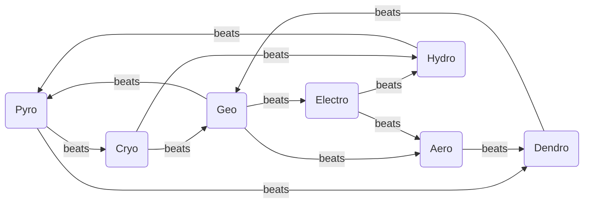
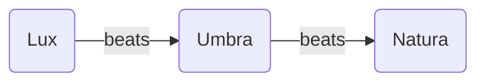

# Magic System

How elements enter combat in Vigilans Nexum: the two MP regimes of mages and non-mages, the nine elements, how an element is applied and how a reaction is triggered, the elemental weaknesses, the reactions themselves and what elements do to the terrain. This document holds the rules, and its values are in its own [Balancing](#balancing) section. The tomes are in the [catalog → Magic Tomes](../catalog/Magic-Tomes.md), the combat arts that let a non-mage reach the system in the [catalog → Combat Arts](../catalog/Combat-Arts.md).

> **Related files:** [Magic Tomes](../catalog/Magic-Tomes.md) · [Combat Arts](Combat-Arts.md) · [Abilities](Abilities.md) · [Chain Attack](Chain-Attack.md) · [Unit Classes](../catalog/Unit-Classes.md) · [Growth Modifiers](Growth-Modifiers.md) · [The Nexus](Nexus.md) *(Wavelength – the one exception to how a non-mage applies an element)* · [Balancing](#balancing) · [Levels → Ch 05](../levels/README.md#part-01-path-of-liberation)

---

## Overview

Magic in Tridera runs as **two parallel systems, mages and non-mages**, joined by one shared layer: the elements and their reactions. A **mage** fires a tome, pays MP for every attack, regenerates MP by waiting, and applies the tome's element with every attack. A **non-mage** fights with a weapon's uses, **builds** MP by attacking, and reaches the element system only by spending that MP on a [Combat Art](Combat-Arts.md). An element lying on an enemy is the setup; a second element arriving on it is the **reaction**, and the reaction is where the system's damage and control live. Elements also change the map: they burn forests, flood fields and raise stone.

The purpose in one sentence: **the player decides who sets an element and who sets it off – which unit spends its turn putting an element on an enemy so that another can turn it into a reaction, and which reaction, on which tile, is worth the MP and the turn.**

|              | Magic System |
| ------------ | ------------ |
| Phase        | Player Phase and Enemy Phase |
| Trigger      | Mages: automatically with every attack. Non-mages: through Combat Arts |
| Resource     | MP. Mages regenerate it passively; non-mages build it actively |
| Core feature | Nine elements, two-element and three-element reactions, terrain interaction |

---

## Prerequisites

| Condition | Rule |
| --------- | ---- |
| System active | From **Ch 05**, for both sides. Before Ch 05 no attack applies an element and no reaction triggers (conservative; *Open Decisions → 1*) |
| Mages | Apply their tome's element with every attack |
| Non-mages | Need a Combat Art to apply an element. **The one exception:** Dardan with an active [*Wavelength*](Nexus.md#8--wavelength) applies with ordinary attacks, but never triggers a reaction (*Core Rules → 3*) |
| Triggering a reaction | A second element reaches an enemy that already carries an applied element, through an attack that is allowed to trigger (*Core Rules → 4*) |
| MP | Every tome attack and every art needs enough MP. Without it the attack or art is not offered |

---

## Cost

| What | Value |
| ---- | ----- |
| Resource | **MP.** A mage pays the tome's MP cost on every attack ([Magic Tomes](../catalog/Magic-Tomes.md)) and regenerates by the round ([Balancing → MP regeneration – mages](#mp-regeneration--mages)). A non-mage pays an art's MP cost ([catalog → Combat Arts](../catalog/Combat-Arts.md)) out of MP built by earlier attacks ([Combat Arts → Balancing](Combat-Arts.md#balancing)) |
| Action | **The attack itself.** Applying and triggering are part of an attack or an art, not separate commands. A reaction therefore costs **two actions**, usually by two units, and a three-element reaction three |
| Further cost | **Coordination and tempo.** An element put on an enemy is a turn spent on a setup somebody else has to finish before the enemy acts or the element is used up. A mage's attack that does not trigger is a normal attack at its MP price. A siege tome costs more than a round's regeneration, so it is followed by a round of waiting ([Magic Tomes → Reading the tables](../catalog/Magic-Tomes.md#reading-the-tables)) |
| Visible before use | Every applied element is shown on the unit that carries it. The battle forecast shows the MP an attack or art will cost and, where it will trigger one, the reaction by name (*UI & Display*). A player decides on a reaction he has seen named, not on one he has to remember from a table |

---

## Core Rules

### 1 – Two MP regimes

A unit is either a **mage** or a **non-mage**, and the two regimes differ in what an attack costs and how MP comes back. The regeneration values are tuning values and live in [Balancing](#mp-regeneration--mages) and in [Combat Arts → Balancing](Combat-Arts.md#balancing).

#### Mages – passive

A mage spends MP on **every attack**. Magic is its primary resource.

| Mechanic | Rule |
| -------- | ---- |
| Attack | Costs the tome's MP. A tome has no Uses |
| MP regeneration | Passive, every round, scaling with Mag ([Balancing → MP regeneration – mages](#mp-regeneration--mages)) |
| Combat Arts | Cost additional MP |

Mages think in budgets. Waiting and saving are an active part of their strategy.

#### Non-mages – active

A non-mage spends **no MP on ordinary attacks**. MP is **built up** by fighting and spent only on Combat Arts.

| Mechanic | Rule |
| -------- | ---- |
| Attack | Costs the weapon's Uses, no MP |
| MP regeneration | Active: every ordinary attack builds MP, scaling with Mag. The values are the arts' economy and live in [Combat Arts → Balancing](Combat-Arts.md#balancing) |
| Combat Arts | Cost the MP built up |

Mag therefore matters to non-mages too: it sets how quickly they build MP for Combat Arts. Non-mages think in momentum. They fight toward the right moment for an art.

**Who is a mage.** A unit is a mage while its class makes it one – the Natura, Lux and Umbra lines of the [class tree](../catalog/Unit-Classes.md). The **Citizen** follows the regime of its **equipped weapon**: a tome gives the mage rules, a physical weapon or a staff the non-mage rules ([Growth Modifiers → Core Rules → 5](Growth-Modifiers.md#5--a-citizens-mp-mode-follows-the-equipped-weapon)). Which regime a **hybrid** class follows when it holds both a tome type and a physical type is not yet written (*Open Decisions → 2*).

### 2 – The nine elements

#### Natura magic (seven elements)

| Element | Primary role | Secondary role |
| ------- | ------------ | -------------- |
| **Pyro** | Offence (area damage) | Terrain control |
| **Cryo** | Control (freeze) | Defence |
| **Hydro** | Support (healing) | Terrain manipulation |
| **Electro** | Burst damage | Paralysis |
| **Aero** | Amplifier / spreader | Movement manipulation |
| **Geo** | Defence (shields) | Terrain blockade |
| **Dendro** | Control (poison / roots) | Healing over time |

#### The Magic Triangle (two elements)

| Element | Primary role | Secondary role |
| ------- | ------------ | -------------- |
| **Lux** | Support (buffs / healing) | Anti-Umbra |
| **Umbra** | Saboteur (debuffs / curses) | Damage over time |

The roles are what each element's tomes express ([Magic Tomes](../catalog/Magic-Tomes.md)) and what its bonus types are read from in [Affinity → Element mixes](Affinity.md#element-mixes). A unit's **elemental affinity** on its character sheet is one of these nine, and it is a trait of the person, not a weapon: it decides no tome and applies nothing by itself ([Affinity → Core Rules → 7](Affinity.md#7--elemental-affinity-and-who-has-none)).

### 3 – How elements are applied

| Unit type | Applies through |
| --------- | --------------- |
| Mage | Every attack that lands |
| Non-mage | Combat Arts only |
| Dardan with an active *Wavelength* | Every ordinary attack that lands – **the one exception**, see below |
| Dardan during the *Soulcairn* call (only with *Nexus Mastery*) | Every ordinary attack that lands – the same exception, see below |

An attack that misses applies nothing. That an element is applied by an attack that *lands* is written here for all three rows alike; for Wavelength it is the conservative rule of [The Nexus → Open decisions → 30](Nexus.md#open-decisions).

#### The one exception: *Wavelength*

Dardan's Nexus ability [*Wavelength*](Nexus.md#8--wavelength) borrows the **elemental affinity of a living ally** and lays it on his blade for a limited number of attacks that depends on their affinity rank. While it runs, he applies with an **ordinary attack**, without a Combat Art. This is the only place in the game where a non-mage can do that, and it is deliberately narrow: **one** unit, one command with a cooldown, one borrowed element, counted attacks, a living ally within reach of the band. The rules are in [The Nexus](Nexus.md#8--wavelength), the values in [The Nexus → Balancing](Nexus.md#wavelength).

**He applies – he never triggers.** Dardan stays a non-mage. When a *Wavelength* attack hits an enemy that already carries an element, the row *Ordinary attack (non-mage) on an element* in *Core Rules → 4* applies unchanged: damage, and the element **stays on the enemy**. Someone else sets the reaction off – a mage, an ally's Combat Art, or Dardan's own art under that art's rules. He is the setter, never the trigger. That is why the exception can be allowed exactly once without dissolving the two-regime model of *Core Rules → 1*.

**Under *Nexus Mastery* (Part 08) the exception stays Dardan's and widens in two places** ([The Nexus → Core Rules → 11](Nexus.md#11--nexus-mastery)). A *Wavelength* element also lands on every enemy adjacent to the target. And during the once-per-map *Soulcairn* call, his ordinary attacks apply the element of the heaviest fallen unit. Both apply, neither triggers, and he still carries only one element at a time: a *Wavelength* element replaces the fallen one until its attacks are spent. It stays one unit, and it stays an exception.

**What an art does while Wavelength runs** – in particular an art that carries no element of its own – is [The Nexus → Open decisions → 29](Nexus.md#open-decisions) and [Combat Arts → Open Decisions → 1](Combat-Arts.md#open-decisions). It is not decided here.

### 4 – How reactions are triggered

| Action | Result |
| ------ | ------ |
| Ordinary attack (non-mage) on an element | Damage – the element **stays** on the enemy |
| Mage attack on an element | Elemental reaction triggered |
| Combat Art (non-mage) on an element | Elemental reaction triggered |
| Non-mage A applies → non-mage B uses an art | Reaction triggered |
| *Wavelength* attack (Dardan) on an element | Damage – the element **stays** on the enemy |
| Attack during the *Soulcairn* call (Dardan) on an element | Damage – the element **stays** on the enemy |

The reaction is the one listed for the **pair of elements** in [Elemental Reactions](#elemental-reactions): the element already on the enemy and the element that arrives. A second attack **with the same element** triggers nothing (conservative; *Open Decisions → 4*).

**What a reaction leaves behind** is not yet written. Conservative reading: a two-element reaction **uses up** both elements, so the enemy carries nothing afterwards; the one written place where elements build up over several strikes into a three-element reaction is the [Chain Attack](Chain-Attack.md#5--elemental-build-up) (*Open Decisions → 3*).

### 5 – What a reaction does

A reaction adds a **damage bonus** to the attack that triggered it and carries the **effect** its row names. The size of the bonus depends on the kind of reaction – basic, weakness or three-element – and is a tuning value ([Balancing → Reaction damage bonus](#reaction-damage-bonus)). Which reactions count as *weakness reactions* is *Open Decisions → 5*. Effects that name a status – freeze, stun, paralysis, panic, fear, blindness – are the still-unwritten *Status Effects* mechanic's to define; until it exists, they are named here and not specified (*Open Decisions → 6*).

### 6 – Both sides

Everything in this document works **the same for enemies**. An enemy mage applies with every attack, an enemy non-mage through its arts, and an element an enemy applies to a player unit can be set off by another enemy. The effect values say so explicitly ([Magic Effect Values](#magic-effect-values)): the enemy uses the same tools, and a player who sees an effect on his unit can read what it costs him.

---

## Elemental Weaknesses

The seven Natura elements beat one another in a cycle – **the mages' weapon triangle** ([Magic Tomes](../catalog/Magic-Tomes.md#natura-magic)). Above it sits the **Magic Triangle** of Natura, Lux and Umbra. An advantage or disadvantage in either works like the weapon triangle: the *Triangle Bonus* term of the [combat formulas](../Balancing-Guide.md#weapon-triangle-bonuses). What the matchup is read between – the two units' equipped tomes, or also an applied element or a unit's affinity – is *Open Decisions → 7*.

### Natura cycle


```mermaid
flowchart LR
    pyro(Pyro)
    aero(Aero)
    electro(Electro)
    hydro(Hydro)
    cryo(Cryo)
    geo(Geo)
    dendro(Dendro)

    pyro--beats-->cryo
    pyro--beats-->dendro
    electro--beats-->hydro
    hydro--beats-->pyro
    cryo--beats-->hydro
    geo--beats-->electro
    geo--beats-->aero
    dendro--beats-->geo
    aero--beats-->dendro
    geo--beats-->pyro
    cryo--beats-->geo
    electro--beats-->aero
```

### Magic Triangle


```mermaid
flowchart LR
    natura(Natura)
    lux(Lux)
    umbra(Umbra)

    lux--beats-->umbra
    umbra--beats-->natura
```

Umbra beats Natura, Lux beats Umbra, **Lux and Natura are neutral**. Lux is the counter to Umbra and would carry too many weaknesses if it also lost to all seven Natura elements.

### Weakness table

| Element | Beats | Reason |
| ------- | ----- | ------ |
| **Pyro** | Cryo, Dendro | Fire melts ice and burns plants |
| **Cryo** | Hydro | Ice freezes water |
| **Cryo** | Geo | Frost wedging – ice in the cracks breaks the rock |
| **Hydro** | Pyro | Water puts out fire |
| **Electro** | Hydro | Electricity conducts through water |
| **Electro** | Aero | The lightning rules the storm |
| **Aero** | Dendro | Storms uproot trees and scatter plants |
| **Geo** | Electro, Aero | Earth grounds the lightning and blocks the wind |
| **Geo** | Pyro | Earth and sand smother the fire |
| **Dendro** | Geo | Roots break rock |
| **Lux** | Umbra | Light drives out shadow |
| **Umbra** | Natura | Darkness corrupts nature |

Lux and Natura have no weakness against each other. The Natura cycle is deliberately asymmetric (Geo 3/2, Pyro 2/2, Electro and Cryo 2/1, Aero, Hydro and Dendro 1/2). The reasoning and the compensation are in [Magic Tomes → Element profiles](../catalog/Magic-Tomes.md#element-profiles) and [Balancing → Natura Profile Compensation](#natura-profile-compensation).

---

## Elemental Reactions

What each pair of elements does when it meets on one enemy. **The reaction names are proper names** and stay as the game uses them across the catalog; whether they get English names is *Open Decisions → 8*. Flat values an effect names – distances, durations, penalties – are in [Balancing → Reaction effect values](#reaction-effect-values).

### Two-element reactions

#### Classic reactions

| Elements | Reaction | Effect |
| -------- | -------- | ------ |
| **Pyro + Hydro** | Verdampfen | The water boils off → additional damage |
| **Pyro + Cryo** | Schmelzen | The ice melts → heavy bonus damage |
| **Pyro + Dendro** | Verbrennen | The plants catch fire → area damage over time |
| **Hydro + Electro** | Schockladung | The water is charged → area damage |
| **Hydro + Cryo** | Gefrieren | The water freezes → the enemy is frozen (stun) |
| **Electro + Cryo** | Schockfrost | Lightning strikes ice → fast, jagged extra damage |
| **Electro + Dendro** | Überwuchern | The plants are charged → they explode on contact |
| **Aero + Pyro / Hydro / Cryo / Electro** | Verwirbelung | The element is spread → area effect |
| **Geo + Pyro / Hydro / Cryo / Electro** | Kristallisieren | A shield is created, based on the element |

#### Tactical reactions *(grid-specific)*

| Elements | Reaction | Effect |
| -------- | -------- | ------ |
| **Aero + Cryo** | Schneeschub | The enemy is knocked back – breaks formations |
| **Geo + Hydro** | Schlammfeld | The tile becomes heavy terrain – movement across it costs double |
| **Aero + Geo** | Sandstorm | Line of sight is broken – no ranged attacks on this tile |
| **Electro + Cryo** | Leitfrost | Lightning jumps to every frozen enemy in range |
| **Hydro + Dendro** | Rankennetz | The enemy is immobilised – it cannot move |

**Three pairs appear twice.** Electro + Cryo is both *Schockfrost* and *Leitfrost*, Aero + Cryo both *Verwirbelung* and *Schneeschub*, Geo + Hydro both *Kristallisieren* and *Schlammfeld*. Which one fires is not decided, and neither reading is written in as the rule (*Open Decisions → 9*).

#### Lux reactions

| Elements | Reaction | Effect |
| -------- | -------- | ------ |
| **Lux + Pyro** | Sonnenfeuer | Light amplifies fire → a massive area blaze |
| **Lux + Hydro** | Regenbogenlicht | Water and light → enemies lose accuracy (blinding) |
| **Lux + Cryo** | Lichtkristalle | Light sets in the ice → a strong protective shield |
| **Lux + Electro** | Strahlenschock | Lightning fuses with light → a laser-like piercing strike |
| **Lux + Aero** | Blendwirbel | Every enemy within a radius loses hit chance |
| **Lux + Geo** | Lichtpfeiler | Rock shot through with light → healing barriers |
| **Lux + Dendro** | Heilige Blüte | The plants glow → they heal allies around them |

#### Umbra reactions

| Elements | Reaction | Effect |
| -------- | -------- | ------ |
| **Umbra + Pyro** | Schattenbrand | Dark fire → weakens and damages over time |
| **Umbra + Hydro** | Finsternisflut | Dark water → debuffs (slowed, weakened) |
| **Umbra + Cryo** | Grabesfrost | Dark ice → freezes deeper, extra damage over time |
| **Umbra + Electro** | Schattenladung | Dark electricity → a chain lightning out of darkness |
| **Umbra + Aero** | Albtraumsturm | Wind spreads the darkness → enemies are put in fear (panic) |
| **Umbra + Geo** | Schattenmonolith | Dark pillars → curse enemies nearby (weakening) |
| **Umbra + Dendro** | Seelenfresser | The enemy loses HP with every attack it makes – aggression is punished |

#### Lux + Umbra

| Elements | Reaction | Effect |
| -------- | -------- | ------ |
| **Lux + Umbra** | Auflösung | The two elements cancel out → a massive damage burst; both effects vanish at once |

### Three-element reactions

| Elements | Reaction | Effect |
| -------- | -------- | ------ |
| **Pyro + Hydro + Aero** | Feuersbrunst | Wind fans the boiling fire → huge area damage plus burning over time |
| **Cryo + Electro + Aero** | Eissturm | Charged snowstorms → enemies frozen plus chain lightning damage |
| **Geo + Dendro + Pyro** | Vulkanischer Ausbruch | Fire ignites the earth → lava explosions plus area damage |
| **Electro + Dendro + Hydro** | Biokontamination | Plants soak up water and are charged → they explode on contact |
| **Lux + Hydro + Cryo** | Heiliges Eisfeld | Frozen water shot through with light → protects and heals allies |
| **Umbra + Pyro + Electro** | Dunkelfeuersturm | Shadow fire with electricity → chaos, fear and area damage |
| **Lux + Dendro + Aero** | Lebenswirbel | A healing wind full of light and blossoms → heals and buffs every ally |
| **Umbra + Geo + Cryo** | Totenfrost | Dark earth freezes → enemies fully immobilised |

The most powerful effects need three coordinated attacks in the right order, typically in the [Chain Attack](Chain-Attack.md) against a boss.

---

## Terrain Effects

Elements change the battlefield, not only the enemy. Durations and magnitudes are tuning values and live in [Balancing → Terrain and field values](#terrain-and-field-values); *half* and *double* are rules and stay here.

### Terrain changes

| Element + terrain | Effect | Duration |
| ----------------- | ------ | -------- |
| **Pyro + forest / grass** | Burning Field → damage on entering | [Balancing](#terrain-and-field-values) |
| **Hydro + ground** | Flooded Field → movement halved | [Balancing](#terrain-and-field-values) |
| **Cryo + water** | Frozen Field → walkable, but brittle (it breaks when its duration ends) | [Balancing](#terrain-and-field-values) |
| **Electro + Hydro field** | Electrified Field → damage on crossing | [Balancing](#terrain-and-field-values) |
| **Aero + element field** | The effect spreads to adjacent tiles | Instant |
| **Geo + ground** | Stone pillars / barriers → new cover | Permanent |
| **Dendro + Pyro** | Wildfire → large area attacks | [Balancing](#terrain-and-field-values) |

### Special fields

| Field | Created by | Effect |
| ----- | ---------- | ------ |
| **Shadow Field** | Umbra magic | Strengthens dark-mage attacks ([value](#terrain-and-field-values)) |
| **Light Field** | Lux magic | Strengthens healing and buffs ([value](#terrain-and-field-values)) |
| **Storm Field** | Aero effect | Ranged attacks lose accuracy ([value](#terrain-and-field-values)) |
| **Crystal Field** | Geo shields exploding | Defence bonus for every unit on the field ([value](#terrain-and-field-values)) |
| **Bloom Field** | Dendro + water | Healing per round – value in [Balancing → Regeneration](#6--regeneration) |

How long a special field lasts is not written anywhere (*Open Decisions → 10*).

---

## Acquisition / Access

| Source | Description | Availability |
| ------ | ----------- | ------------ |
| Mage classes | Access to magic comes with the class | Mage classes only – with one exception: the **Citizen** holds rank F in all nine elements from Ch 05 (one found tome per element), see [Growth Modifiers → Core Rules → 4](Growth-Modifiers.md#4--citizen-weapon-access) |
| Combat Arts | Let non-mages apply elements | Every class with the corresponding arts ([Combat Arts](Combat-Arts.md)) |
| [Magic Tomes](../catalog/Magic-Tomes.md) | Equippable tomes with a fixed element – the mages' weapons | Mage-specific, through class or items; rank-F tomes only for the Citizen |
| *Wavelength* (Dardan only) | Ordinary attacks apply a borrowed element, never trigger | From the chapter that introduces Wavelength, which is not decided ([The Nexus → Open decisions → 31](Nexus.md#open-decisions)) |

---

## Strategic Depth

The system creates tactical depth on three levels:

- **Resource management.** Mages budget their passive MP and decide when to fire the expensive tome. Non-mages build MP and choose the moment for an art.
- **Elemental synergy.** A reaction needs coordination: mages and non-mages have to work together to reach the strongest effects. Who sets, who triggers and in which order is a turn plan, not a single move.
- **Terrain control.** Elements change the battlefield for rounds or for good. Pyro sets forests alight, Hydro floods fields, Geo raises barriers – the map becomes a weapon.
- **Three-element reactions.** The most powerful effects need three coordinated strikes in the right order, typically in the Chain Attack against bosses.
- **The enemy uses it too.** An element an enemy mage puts on a player unit is a reaction waiting for the next enemy. Clearing it, or moving the unit out of the second enemy's reach, is a decision the forecast makes visible.

---

## Design Pillars

*Proposed by Rulewright, pending Dardan's review (2026-09-29).*

| Pillar | Question | Answer |
| ------ | -------- | ------ |
| **Bonds** | Does it strengthen the connections between units? | **Yes, through cooperation – not through the bond itself.** A reaction almost always needs two units: one sets, one triggers. A non-mage who cannot set an element without an art, and a mage whose element does little on its own, need each other. The system reads no affinity rank; the connection it creates is tactical. The one place it touches the band directly is *Wavelength*, where Dardan carries a friend's element and can never finish the sentence himself |
| **Depth** | Easy to learn, hard to master? | **Yes, with a caution.** "Fire on water makes steam" is understood in seconds, and every applied element is on screen. Mastery is nine elements, some thirty reactions, three-element chains and terrain that outlasts the turn. The caution is the size of the reaction table: it only stays learnable if the forecast names the reaction before the attack, so the player never has to memorise it |
| **Weight** | Do the decisions have long-term consequences? | **Yes, at the class forks.** A mage class is element-bound, the Base fork at Ch 06 fixes a Knight's element for the campaign, and the Elementalist's second element must close a weakness ([Magic Tomes](../catalog/Magic-Tomes.md)). Within a battle, terrain changes last for rounds and a Geo barrier for good. A single reaction is a turn's decision |
| **Integration** | Does the mechanic tell a story? | **Yes.** Magic arrives in Ch 05 with the nine tomes the Knights find, which Lina recognises because Elena explained them in the orphanage. Every person carries an element as part of who they are, and the one non-mage who can lay an element on his blade does it by borrowing a friend's |
| **Fairness** | Is the challenge respectful of the player's time? | **Yes, once the open edges are closed.** Applied elements, MP costs and the reaction to come are all visible before the attack; poison keeps a 1 HP floor so a tick never kills. What is not yet fair is what is not yet written: whether a reaction consumes its elements, which of two reactions a doubled pair triggers, and how long a special field lasts (*Open Decisions → 3, 9, 10*). Until then a player could lose to a rule he could not read |

**Anti-pillar check:** **No grinding:** nothing is earned by repetition; MP comes back by rounds or by attacks within a battle. **No power without a price:** every element costs MP, every reaction costs a second action, the siege tome a round of waiting. **Nothing that works only with over-trained units:** reactions need two units in the right places, not high stats. **Nothing generic:** the reaction grid is borrowed from Genshin Impact and says so; what is this game's own is the grid-specific tactical reactions, the asymmetric Natura cycle and the setter/trigger split between mages and non-mages.

**Is there a combination that trivialises a fight?** The candidates are the three-element reactions in a Chain Attack, bounded by a boss's shield and the three-unit formation ([Chain Attack](Chain-Attack.md)); the Crystal Field, whose flat Defence bonus is larger than the whole [passive bonus budget](../Balancing-Guide.md#passive-bonus-budget) allows for Defence and is not counted there yet (*Interaction*); and hybrid classes that set and trigger alone ([catalog → Weapon Combat Arts](../catalog/Combat-Arts.md#weapon-combat-arts)), which pay for it by capping one rank lower in their second type.

---

## Introduction

**First chapter:** **Ch 05**, *A Heart Of Gold*. The [Progression System](../Progression-System.md#part-01-path-of-liberation-chapters-1-8) and the [level index](../levels/README.md#part-01-path-of-liberation) both carry *Magic* at Ch 05.

**How it is introduced:** by the tomes, not by a text box. In the treasure chamber Lina finds the nine tomes before the Guardian wakes, and recognises them because Elena explained them to her and Leona in the orphanage. From that moment every Knight holds rank F in all nine elements ([Growth Modifiers](Growth-Modifiers.md#4--citizen-weapon-access)), and the Level 05 map is the first on which an element is applied and a reaction can be triggered. What the map needs to teach it – two tome-holders who can reach the same enemy – is `levelcraft`'s to place in the Level 05 document.

**What the player must already know:** movement, attacks, the weapon triangle and terrain (Ch 01), Combat Arts and MP (Ch 01, [Combat Arts](Combat-Arts.md#introduction)), the battle forecast.

---

## Catalog

All entries: [Magic Tomes](../catalog/Magic-Tomes.md). The arts through which non-mages reach the system are in [Combat Arts](../catalog/Combat-Arts.md).

---

## Balancing

This section holds the Magic System's values. The file was converted to the current template on 2026-09-29. It holds the mages' MP regeneration (moved out of the core rules), the reaction damage bonus, the reaction effect values and the terrain and field values (moved out of the reaction and terrain tables), the terrain duration bands and spell MP cost bands (moved here from the catalog page [Elemental Reactions](../catalog/Elemental-Reactions.md) on 2026-09-29, decided by Dardan), and the magic effect values and Natura profile compensation (moved here from the Balancing Guide on 2026-09-28). A non-mage's MP gain per attack is the arts' economy and lives in [Combat Arts → Balancing](Combat-Arts.md#balancing). Weapon values – tiers, ranks, variants, costs – stay in the [Balancing Guide](../Balancing-Guide.md#-weapon-balancing), because tomes are priced and tiered on the same scale as every weapon.

### MP regeneration – mages

Passive regeneration per round, by Mag.

| Mag | MP per round |
| --- | ------------ |
| 0–5 | +2 |
| 6–12 | +4 |
| 13–20 | +6 |
| 21+ | +8 |

The tome MP costs in [Magic Tomes](../catalog/Magic-Tomes.md#reading-the-tables) are built against this table: an E-rank tome is sustainable from the first promotion, a siege tome costs more than two rounds of regeneration at any realistic Mag.

### Reaction damage bonus

| Reaction type | Damage bonus |
| ------------- | ------------ |
| Basic reaction | +50% |
| Weakness reaction | +100% |
| 3-element reaction | +200% + special effect |

These three values were also on the catalog page [Elemental Reactions](../catalog/Elemental-Reactions.md) under *Reaktionsstärke*; the copy there was removed on 2026-09-29. What makes a reaction a *weakness reaction* is not defined (*Open Decisions → 5*).

### Reaction effect values

The flat values the reaction tables name. Moved out of the tables on 2026-09-29 without change.

| Reaction | Parameter | Value |
| -------- | --------- | ----- |
| Schneeschub (Aero + Cryo) | Knockback distance | 2 tiles |
| Schlammfeld (Geo + Hydro) | Duration of the heavy terrain | 3 rounds |
| Sandstorm (Aero + Geo) | Duration of the broken line of sight | 2 rounds |
| Rankennetz (Hydro + Dendro) | Duration of the immobilisation | 1 round |
| Blendwirbel (Lux + Aero) | Hit chance lost by every enemy in the radius | 30% |
| Blendwirbel (Lux + Aero) | Duration | 2 rounds |

*Not yet set:* the radius of Blendwirbel, the range of Leitfrost, and every other effect that names no number – for instance whether Verdampfen's or Schmelzen's "extra damage" is anything beyond the reaction damage bonus. The shields of Kristallisieren and Lichtkristalle are set: they are reaction shields under [Shields](#2--shields). Blendwirbel's "30%" was written as *Trefferchance*; whether it means 30 points of Hit or 30 % of the displayed hit is not stated.

### Terrain and field values

| Terrain change | Duration |
| -------------- | -------- |
| Burning Field (Pyro + forest / grass) | 3 rounds |
| Flooded Field (Hydro + ground) | 2 rounds |
| Frozen Field (Cryo + water) | 1 round |
| Electrified Field (Electro + Hydro field) | 2 rounds |
| Wildfire (Dendro + Pyro) | 4 rounds |

| Special field | Parameter | Value |
| ------------- | --------- | ----- |
| Shadow Field | Dark-mage attacks | +20% |
| Light Field | Healing and buffs | +20% |
| Storm Field | Accuracy of ranged attacks | −15% |
| Crystal Field | Defence for every unit on the field | +10 |
| Bloom Field | Healing per round | [Regeneration](#6--regeneration) |

The damage a Burning or Electrified Field deals is not set.

### Terrain duration bands

*Guideline, moved from the catalog on 2026-09-29.* The bands the individual durations above are set in:

| Strength of the effect | Duration |
| ---------------------- | -------- |
| Weak | 1–2 rounds |
| Medium | 3–4 rounds |
| Strong | 5+ rounds, or permanent (Geo) |

Every duration in [Terrain and field values](#terrain-and-field-values) sits inside a band: the Frozen, Flooded and Electrified Fields are weak, the Burning Field and Wildfire medium, Geo's barriers permanent.

### Spell MP cost bands

*Guideline, moved from the catalog on 2026-09-29 – and in contradiction with the tome catalog.*

The stronger the reaction a spell can lead to, the higher its MP cost:

| Spell | MP cost |
| ----- | ------- |
| Single-element spell | 5–15 |
| Reaction-capable spell | 10–25 |
| Special three-element setup spell | 30+ |

**These bands do not match the tomes.** Every tome in [Magic Tomes](../catalog/Magic-Tomes.md) costs 3 to 14 MP, set against the mages' regeneration table above; no tome sits in the upper bands, and the E- and F-rank tomes sit below the lowest. The bands also predate the tome model: every tome applies its element and is therefore "reaction-capable", and no "three-element setup spell" exists as an entry. Until Dardan decides, **the tome catalog's costs stand** and the bands are recorded here as the older guideline, not applied (*Open Decisions → 11*).

### Magic Effect Values

*Proposal – every value here is a first draft for tuning.*

Everything a staff or a tome does **other than damage** takes its value from this section: healing, shields, buffs, debuffs, poison, regeneration and drain. Damage itself follows the [damage formula](../Balancing-Guide.md#-damage-calculation-formula). The entries that carry these effects are listed in [Weapons → Staves](../catalog/Weapons.md#staves) and [Magic Tomes](../catalog/Magic-Tomes.md). The rules behind them belong to this document and to the still-unwritten *Status Effects* mechanic.

#### Rank Bonus

The scale all rank-gated effects read from. A weapon's rank, not its tier, sets the size of its effect.

| Rank | F | E | D | C | B | A | S |
|------|---|---|---|---|---|---|---|
| **Rank Bonus** | +3 | +6 | +9 | +12 | +15 | +18 | +21 |

Rank F is one step of the same +3 progression below E. It is held only in the Citizen class, with the F-rank staff from Ch 01 and the F-rank tomes from Ch 05 – a Citizen with a staff heals `Mag + 3`, which at a Citizen's Mag is a scratch closed, not a wound.

#### 1 – Healing

```
Heal (single target, adjacent)        = Mag + Rank Bonus
Heal (ranged or multi-target)         = Mag + (Rank Bonus ÷ 2, rounded down)
```

Healing cannot exceed the target's missing HP; overheal is lost.

**Why rank and not the individual staff:** a staff has no Might, so the Rank column is the only thing that separates an Acolyte's Heal from an Arch Bishop's. Making the rank carry the number means every promotion a healer takes is visible the next time it heals, without a second table of per-entry values.

**Why +3 per rank:** the scale is set so that one heal stays worth roughly half a unit's maximum HP for the whole campaign. A Lv 15 Cleric (Mag ≈ 12) restores 21 with a D staff against ≈ 26 max HP; a Lv 45 Bishop (Mag ≈ 25) restores 43 with an A staff against ≈ 50. That ratio is the balance point: one heal undoes one bad exchange, never two. A flat number would make healers irrelevant by Part 04; scaling on Mag alone would make them irrelevant in Part 01, when Mag is 3.

**Why ranged and multi-target heal for half the bonus:** the healer's real cost is standing next to the wounded unit, inside the enemy's reach. A staff that removes that cost pays for it in restored HP.

#### 2 – Shields

```
Shield (tome or staff)   = (Mag + Rank Bonus) ÷ 2, rounded down
Shield (magic reaction)  = Mag of the unit that completed the reaction
Duration                 = 2 rounds, or until the shield is depleted
```

A shield absorbs incoming damage before Defense or Resistance is applied and does not stack – a second shield replaces the first.

**Why half a heal:** prevented damage is worth more than restored damage, because it can stop a blow that would have killed. Pricing the shield at half the heal of the same rank keeps the two tools trading evenly. The reaction shield reads off Mag alone because a magic reaction has no rank – its cost is the two-element setup, paid in actions rather than in weapon rank.

#### 3 – Buffs

```
Buff     = +2 to one stat (rank C and below) · +4 (rank B and above)
Stats    = Str, Mag, Def
Duration = 3 rounds
```

**Why at most +4:** one point below the +5 Str/Mag a Master class grants. A buff may be strong; it may never be worth more than the last promotion of the game. Three rounds is long enough to build an assault around and short enough that it has to be recast, which keeps the caster spending actions rather than front-loading a battle.

#### 4 – Debuffs

```
Debuff   = -2 to one stat (rank C and below) · -4 (rank B and above)
Stats    = Def, Res
Duration = 3 rounds
```

Symmetric to buffs on purpose: the enemy uses the same tools, and a player who sees -4 Def on a unit can read exactly what it costs him.

#### 5 – Poison

```
Poison tick  = 10% of the target's maximum HP per round, minimum 3
Duration     = 3 rounds
Floor        = cannot reduce a unit below 1 HP
```

**Why a percentage:** a flat tick either does nothing at Lv 60 or kills at Lv 5. **Why the 1 HP floor:** under permadeath, a unit lost to a tick that happened on the enemy phase, three turns after the decision that caused it, is a death the player could not see coming – Pillar 5 forbids it. Poison softens; the killing blow stays an attack.

#### 6 – Regeneration

```
Regeneration tick = +5 HP per round
Field duration    = 3 rounds
```

Applies while the unit stands in the effect. The Bloom Field under [Terrain Effects](#terrain-effects) above links to this value rather than repeating it.

#### 7 – Drain

```
Drain share = 50% of the damage actually dealt, returned to the caster as HP
Cap         = the caster's missing HP
```

**Why half:** a full return makes an Umbra caster unkillable in an even trade – it wins every attrition fight it survives the first round of. At half, drain only wins the attrition fight the caster was already winning on damage, and it stays a reason to pick Umbra without being a reason to pick nothing else.

### Natura Profile Compensation

*Proposal.*

```
Aero, Hydro and Dendro tomes (1 win / 2 losses): +5 Hit over the tier baseline
Pyro, Electro, Cryo, Geo tomes: tier baseline
```

**Why +5 Hit:** The Natura cycle is deliberately asymmetric (see [Magic Tomes](../catalog/Magic-Tomes.md#element-profiles)); Aero, Hydro and Dendro meet one more disadvantaged matchup (-15 Hit, -1 Damage) than they win. A flat +5 Hit on every tome recovers a third of that on every attack without turning a support element into a better duelist – the point of the compensation is that none of the three is a trap pick at the Base fork, not that the matchup table stops mattering.

### What each value tunes

| Parameter | What it tunes |
| --------- | ------------- |
| MP regeneration – mages | How often a mage can fire each tome rank; the cadence of the siege tome |
| Reaction damage bonus | What a reaction is worth over two separate attacks – the reward for coordinating |
| Reaction effect values | The strength of the tactical and Lux reactions' control effects |
| Terrain and field values, duration bands | How long the map remembers an element, and how much a special field shifts a fight |
| Spell MP cost bands | The older guideline for pricing spells against the reactions they lead to – not applied (see above) |
| Magic effect values | What a heal, shield, buff, debuff, poison, regeneration or drain is worth, per rank |
| Natura profile compensation | Whether the 1-win elements are a fair pick at the Base fork |

**Rules, not tuning values**, and therefore in the rules above:

- Mages pay MP per attack and regenerate passively; non-mages pay Uses and build MP by attacking.
- A mage applies with every attack that lands; a non-mage only through an art; Dardan's *Wavelength* and Mastery *Soulcairn* call apply and never trigger.
- A reaction needs a second element on an enemy that already carries one, delivered by an attack that may trigger.
- The nine elements, the Natura cycle and the Magic Triangle.
- *Half* and *double* in the terrain and reaction effects.
- Geo's barriers are permanent, Aero's spread is instant.
- The system works the same for enemies.
- The system starts in Ch 05.

---

## Interaction with Other Mechanics

| Mechanic | Interaction |
| -------- | ----------- |
| **[Combat Arts](Combat-Arts.md)** | The non-mages' only door into this system (Wavelength aside). An art applies its element or triggers a reaction; a non-mage's MP is built by its ordinary attacks at the rate in [Combat Arts → Balancing](Combat-Arts.md#balancing) |
| **[Chain Attack](Chain-Attack.md)** | Reactions are the fastest way to break a boss's shield, and the chain is where three elements build up into a three-element reaction. Before Ch 05 the shield breaks without reactions ([Chain Attack → Introduction](Chain-Attack.md#introduction)) |
| **[The Nexus](Nexus.md)** | *Wavelength* and, under Mastery, the *Soulcairn* call are the written exception in *Core Rules → 3*. *Earthbound* seals a unit's magic with its abilities, arts and auras ([The Nexus → 5](Nexus.md#5--earthbound)). *Dawnbreak* applies no element and triggers nothing. Lifeline leaves applied elements on the ally ([The Nexus → Open decisions → 10](Nexus.md#open-decisions)) |
| **[Affinity](Affinity.md)** | The nine elements are Affinity's element pool. A unit's elemental affinity is not a tome and applies nothing; it sets the pair's bonus types ([Affinity → Element mixes](Affinity.md#element-mixes)) and is what Wavelength borrows |
| **[Biorhythm](Biorythm.md)** | A tome attack reads the Biorhythm term like any attack. Elements, reactions and weaknesses are untouched by it |
| **[Growth Modifiers](Growth-Modifiers.md)** | The Citizen follows the MP regime of its equipped weapon; Mag feeds MP income for every unit, which is why Str and Mag stay separate growths |
| **[Beast Summon](Beast-Summon.md)** | The Bestiarius is a non-mage; its summon cost comes out of MP built by attacking, the same pool as its arts |
| **[Abilities](Abilities.md)** | Several class abilities fire *on triggering a reaction* or change terrain and fields (Resonance, Undertow, Crystallize, Cascade, Trinity, Stonewright …); they read this system's reactions and fields and are listed in the [catalog](../catalog/Abilities.md). *Resonance* shares its name with the Biorhythm state ([Biorhythm → Open decisions → 14](Biorythm.md#open-decisions)) |
| **Passive bonus budget** | The special fields and the Natura compensation add to formula terms without an action in the combat itself. They are not yet counted in the [passive bonus budget](../Balancing-Guide.md#passive-bonus-budget) – the guide lists both as open. The Crystal Field's +10 Defence alone exceeds the budget's Defence cap |
| **Status Effects** (backlog) | Freeze, stun, paralysis, panic, fear, blindness, curses and the terrain holds are named by the reactions and defined there. Cleansing Palm and Cleansing Light remove applied elements and statuses and keep the two apart |
| **Weapon Triangles** (backlog) | The Natura cycle and the Magic Triangle are the mages' weapon triangle and use its bonus; the backlog specification owns all three triangles |

---

## UI & Display

- **Applied elements** are shown on the unit that carries them, player or enemy, as the element's symbol, for as long as they lie there.
- **The battle forecast** shows the MP an attack or art costs and the MP left afterwards, and – when the attack will trigger – the reaction by name and its damage bonus. A reaction the player has to look up in a table is a reaction he cannot plan.
- **Terrain changes and special fields** are marked on their tiles with their remaining duration.
- **A mage's MP bar** shows the next round's regeneration; a non-mage's shows the MP its next ordinary attack will build.

---

## Open Decisions

Everything below is written into the rules above in its **cautious form**, so that the document is playable where it can be. Each is Dardan's to confirm or change.

**Decided by Dardan and therefore not listed:** the two MP regimes; the nine elements, the Natura cycle and the Magic Triangle (Umbra > Natura, Lux > Umbra, Lux and Natura neutral); *Wavelength* as the one exception, which applies and never triggers (2026-09-22), and its Mastery widening; the Citizen's regime by equipped weapon; magic introduced in Ch 05; the catalog's reaction and terrain values moved into this section (2026-09-29).

1. **Elements before Ch 05.** Conservative: **no attack applies an element and no reaction triggers before Ch 05.** The Ch 01 prologue arts carry no element at all ([catalog → Prologue Combat Arts](../catalog/Combat-Arts.md#prologue-combat-arts-ch-01-only)), so the question is only live for Ch 02–04, if a unit gains an elemental art there. The alternative is that such an art applies its element and the element simply has nothing to react with until magic arrives.
2. **Hybrid classes that hold a tome and a physical weapon.** Which regime a Priest, Tenebrae, Luminary or Shadow Monarch follows is not written. The only written precedent is the Citizen's: by equipped weapon. The alternative is that the class decides once, whatever it holds.
3. **What a reaction leaves behind.** Conservative: a two-element reaction **uses up** both elements; the three-element build-up is written only for the [Chain Attack](Chain-Attack.md#5--elemental-build-up). The alternatives: the triggering element stays (so a third can follow on the next turn), or both stay. How many elements an enemy can carry at once follows from the answer.
4. **The same element twice.** Conservative: a second attack with the element already on the enemy triggers nothing and does not stack. Nothing written says otherwise.
5. **What a weakness reaction is.** The +100 % row has no definition. The likeliest reading is a reaction whose triggering element beats the element already applied in the cycle or the triangle; it is not written in, because it would make the weakness table part of the reaction rule, which is Dardan's call.
6. **Status effects named by reactions** – freeze, stun, paralysis, panic, fear, blindness, curses, immobilisation – are defined nowhere yet. The *Status Effects* mechanic (backlog) owns them.
7. **What an elemental matchup reads.** Conservative: the two units' **equipped tomes**, as the tome catalog calls the cycle "the mages' weapon triangle". The alternatives read an applied element or a unit's elemental affinity as well. The catalog page [Elemental Reactions](../catalog/Elemental-Reactions.md) still says "a Cryo mage takes +50 % damage from Pyro", which matches neither this reading nor the triangle bonus.
8. **Reaction names.** They are German proper names used across the catalog (*Schockladung*, *Kristallisieren*, *Seelenfresser* …). Whether they get English names is Dardan's; renaming them touches the Combat Arts and Abilities catalogs.
9. **Three pairs have two reactions.** Electro + Cryo (*Schockfrost* / *Leitfrost*), Aero + Cryo (*Verwirbelung* / *Schneeschub*), Geo + Hydro (*Kristallisieren* / *Schlammfeld*). Neither reading is written in: favouring the classic row would switch off three tactical reactions the catalog already relies on (the Gladiator's Geo + Hydro is named *Schlammfeld* in [Weapon Combat Arts](../catalog/Combat-Arts.md#weapon-combat-arts)); favouring the tactical row would switch off three classic ones. **Also diverging:** the catalog page [Elemental Reactions](../catalog/Elemental-Reactions.md) names Lux + Aero *Lichtsturm* and Umbra + Dendro *Verdorbene Wurzeln*, where this document has *Blendwirbel* and *Seelenfresser*. The catalog of Combat Arts uses this document's names.
10. **How long a special field lasts** – Shadow, Light, Storm, Crystal and Bloom – is not set (only the Bloom Field's regeneration has a field duration, in [Regeneration](#6--regeneration)). Also open: what *Dendro + water* means for the Bloom Field – a Dendro element on a water tile, or the Hydro + Dendro reaction, which is *Rankennetz*.
11. **Spell MP cost bands against the tome catalog.** The bands moved here from the catalog (5–15 / 10–25 / 30+) contradict every tome's MP cost (3–14). Conservative: the tome catalog's costs stand and the bands are not applied. The alternative is to reprice the tomes against the bands, which would also change the regeneration cadence the catalog is built on.

---

**Version:** 2.0
**Created:** 2026-06-09
**Last updated:** 2026-09-29 – converted to English on the mechanic template. Cost, Design Pillars (proposal), Introduction and Open Decisions added; the MP regeneration, reaction effect values and terrain durations moved from the rules into [Balancing](#balancing); the catalog's *Balancing-Richtlinien* (terrain duration bands, spell MP cost bands; the reaction bonus was already here) moved in from [Elemental Reactions](../catalog/Elemental-Reactions.md) (decided by Dardan). Earlier: 2026-09-28, the magic effect values and Natura compensation moved here from the Balancing Guide; 2026-09-22, *Wavelength* written in as the one exception.
**Cross-references:** [Magic Tomes](../catalog/Magic-Tomes.md) · [Combat Arts](Combat-Arts.md) · [Abilities](Abilities.md) · [Chain Attack](Chain-Attack.md) · [Growth Modifiers](Growth-Modifiers.md) · [The Nexus](Nexus.md) · [Affinity](Affinity.md) · [Balancing Guide](../Balancing-Guide.md)
