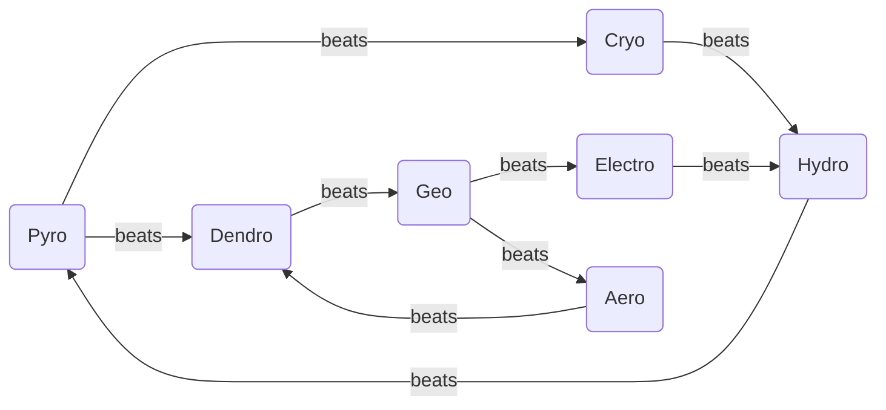
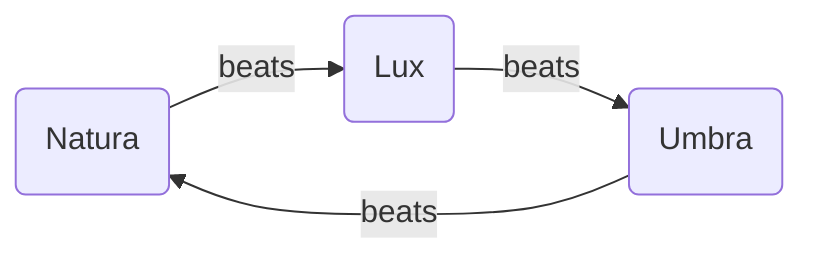

# Elementarreaktionssystem

## Übersicht

Das Elementarreaktionssystem von **Vigilans Nexum** erweitert das klassische Fire Emblem-Magiesystem um ein tiefgreifendes, taktisches Reaktionssystem inspiriert von Genshin Impact. Statt nur drei Magietypen (Wind, Feuer, Donner) gibt es **9 vollständige Elemente**, die miteinander interagieren können.

### Die 9 Elemente

**Natura-Magie (7 Elemente):**

- **Pyro** (Feuer) – Offensiv, Flächenschaden, verbrennt Hindernisse
- **Cryo** (Eis) – Kontrolle, verlangsamt, friert ein
- **Hydro** (Wasser) – Heilung, Status-Entfernung, Wasserschaden über Zeit
- **Electro** (Blitz) – Schneller Einzelschaden, Paralyse
- **Aero **(Wind) – Bewegungsmanipulation, Verstärkung anderer Elemente
- **Geo** (Erde) – Defensiv, Schilde, Geländeveränderung
- **Dendro** (Natur) – Gift, Heilung über Zeit, Pflanzenbarrieren

**Magie-Dreieck (3 Elemente):**

- **Lux** (Licht) – Buffs, Heilung, Anti-Dunkelheit
- **Umbra** (Finsternis) – Debuffs, Flüche, Schaden über Zeit

---

## Elementare Schwächen

Das System folgt einem erweiterten "Stein-Schere-Papier"-Prinzip, bei dem bestimmte Elemente gegen andere besonders effektiv sind.

### Natura-Zyklus

### Magie-Dreieck

### Schwächen-Tabelle

| Element     | Besiegt       | Begründung                                   |
| ----------- | ------------- | -------------------------------------------- |
| **Pyro**    | Cryo, Dendro  | Feuer schmilzt Eis, verbrennt Pflanzen       |
| **Cryo**    | Hydro         | Eis friert Wasser ein                        |
| **Hydro**   | Pyro          | Wasser löscht Feuer                          |
| **Electro** | Hydro         | Elektrizität leitet sich durch Wasser        |
| **Aero**    | Dendro        | Stürme entwurzeln Bäume, verwehen Pflanzen   |
| **Geo**     | Electro, Aero | Erde absorbiert Elektrizität, blockiert Wind |
| **Dendro**  | Geo           | Wurzeln durchbrechen Felsen                  |
| **Lux**     | Umbra         | Licht vertreibt Schatten                     |
| **Umbra**   | Lux           | Dunkelheit verschlingt schwaches Licht       |

Lux und Umbra sind gegenseitige Konter – das stärkere Element gewinnt.

---

## 2-Element-Reaktionen

Wenn zwei verschiedene Elemente aufeinandertreffen, entstehen besondere Reaktionen mit zusätzlichen Effekten.

### Klassische Reaktionen

| Elemente                           | Reaktion        | Effekt                                                       |
| ---------------------------------- | --------------- | ------------------------------------------------------------ |
| **Pyro + Hydro**                   | Verdampfen      | Wasser wird verdampft → zusätzlicher Schaden                 |
| **Pyro + Cryo**                    | Schmelzen       | Eis schmilzt → massiver Bonusschaden                         |
| **Pyro + Dendro**                  | Verbrennen      | Pflanzen fangen Feuer → Flächenschaden über Zeit             |
| **Hydro + Electro**                | Schockladung    | Wasser wird elektrisch aufgeladen → Flächenschaden           |
| **Hydro + Cryo**                   | Gefrieren       | Wasser gefriert → Gegner werden eingefroren (Stun)           |
| **Electro + Cryo**                 | Schockfrost     | Blitz trifft Eis → schneller, zackiger Zusatzschaden         |
| **Electro + Dendro**               | Überwuchern     | Pflanzen werden elektrisch geladen → explodieren bei Kontakt |
| **Aero + Pyro/Hydro/Cryo/Electro** | Verwirbelung    | Element wird verbreitet → Flächeneffekt                      |
| **Geo + Pyro/Hydro/Cryo/Electro**  | Kristallisieren | Schild wird erzeugt basierend auf Element                    |

### Lux-Reaktionen

| Elemente          | Reaktion        | Effekt                                                          |
| ----------------- | --------------- | --------------------------------------------------------------- |
| **Lux + Pyro**    | Sonnenfeuer     | Licht verstärkt Feuer → massiver Flächenbrand                   |
| **Lux + Hydro**   | Regenbogenlicht | Wasser und Licht → Gegner verlieren Genauigkeit (Blendung)      |
| **Lux + Cryo**    | Lichtkristalle  | Licht erstarrt im Eis → starker Schutzschild                    |
| **Lux + Electro** | Strahlenschock  | Blitze verschmelzen mit Licht → laserartige Durchschlagsattacke |
| **Lux + Aero**    | Lichtsturm      | Licht wird verstreut → flächendeckende kleine Lichtschläge      |
| **Lux + Geo**     | Lichtpfeiler    | Felsen von Licht durchdrungen → heilende Barrieren              |
| **Lux + Dendro**  | Heilige Blüte   | Pflanzen leuchten → heilen Verbündete im Umkreis                |

### Umbra-Reaktionen

| Elemente            | Reaktion           | Effekt                                                      |
| ------------------- | ------------------ | ----------------------------------------------------------- |
| **Umbra + Pyro**    | Schattenbrand      | Dunkles Feuer → schwächt und schädigt über Zeit             |
| **Umbra + Hydro**   | Finsternisflut     | Dunkles Wasser → Debuffs (langsamer, geschwächt)            |
| **Umbra + Cryo**    | Grabesfrost        | Dunkles Eis → friert tiefer, zusätzlicher Schaden über Zeit |
| **Umbra + Electro** | Schattenladung     | Dunkle Elektrizität → Kettenblitz aus Dunkelheit            |
| **Umbra + Aero**    | Albtraumsturm      | Wind verteilt Finsternis → Gegner in Angst versetzt (Panik) |
| **Umbra + Geo**     | Schattenmonolith   | Dunkle Säulen → verfluchen Gegner in der Nähe (Schwächung)  |
| **Umbra + Dendro**  | Verdorbene Wurzeln | Finstere Pflanzen → greifen Gegner eigenständig an          |

---

## 3-Element-Reaktionen

Besonders mächtige Reaktionen entstehen, wenn **drei verschiedene Elemente** gleichzeitig aufeinandertreffen. Diese sind schwieriger auszulösen, aber haben verheerende Effekte.

| Elemente                     | Reaktion              | Effekt                                                                                  |
| ---------------------------- | --------------------- | --------------------------------------------------------------------------------------- |
| **Pyro + Hydro + Aero**      | Feuersbrunst          | Wind facht verdampfendes Feuer an → gigantischer Flächenschaden + Verbrennung über Zeit |
| **Cryo + Electro + Aero**    | Eissturm              | Elektrisch aufgeladene Schneestürme → Gegner eingefroren + Kettenblitzschaden           |
| **Geo + Dendro + Pyro**      | Vulkanischer Ausbruch | Erde wird durch Feuer entzündet → Lavaexplosionen + Flächenschaden                      |
| **Electro + Dendro + Hydro** | Biokontamination      | Pflanzen saugen Wasser auf, werden elektrisch geladen → explodieren bei Berührung       |
| **Lux + Hydro + Cryo**       | Heiliges Eisfeld      | Gefrorenes Wasser von Licht durchzogen → schützt und heilt Verbündete                   |
| **Umbra + Pyro + Electro**   | Dunkelfeuersturm      | Schattenfeuer mit Elektrizität → verursacht Chaos, Angst + Flächenschaden               |
| **Lux + Dendro + Aero**      | Lebenswirbel          | Heilender Wind voller Licht und Blüten → heilt und bufft alle Verbündeten               |
| **Umbra + Geo + Cryo**       | Totenfrost            | Dunkle Erde gefriert → Gegner komplett immobilisiert                                    |

---

## Geländeeffekte

Elementarmagie verändert nicht nur Gegner, sondern auch das Schlachtfeld selbst.

### Geländeveränderungen

| Element + Gelände        | Effekt                                                         | Dauer     |
| ------------------------ | -------------------------------------------------------------- | --------- |
| **Pyro + Wald/Gras**     | Brennendes Feld → Schaden beim Betreten                        | 3 Runden  |
| **Hydro + Boden**        | Überflutetes Feld → Bewegung halbiert                          | 2 Runden  |
| **Cryo + Wasser**        | Gefrorenes Feld → begehbar, aber brüchig (bricht nach 1 Runde) | 1 Runde   |
| **Electro + Hydro-Feld** | Elektrifiziertes Feld → Schaden beim Durchlaufen               | 2 Runden  |
| **Aero + Elementfeld**   | Effekt breitet sich auf benachbarte Felder aus                 | Sofort    |
| **Geo + Boden**          | Steinsäulen/Barrieren → neue Deckung                           | Permanent |
| **Dendro + Pyro**        | Waldbrand → große Gebietsangriffe                              | 4 Runden  |

### Spezialfelder

| Feld             | Erzeugt durch           | Effekt                                   |
| ---------------- | ----------------------- | ---------------------------------------- |
| **Schattenfeld** | Umbra-Magie             | Verbessert Dunkelmagier-Angriffe um +20% |
| **Lichtfeld**    | Lux-Magie               | Verbessert Heilung und Buffs um +20%     |
| **Sturmfeld**    | Aero-Effekt             | Fernangriffe -15% Genauigkeit            |
| **Kristallfeld** | Geo-Schilde explodieren | +10 Verteidigung für alle auf dem Feld   |
| **Blütenfeld**   | Dendro + Wasser         | Heilung +5 HP pro Runde                  |

---

## Gameplay-Implikationen

### Taktische Tiefe

**Teamzusammenstellung:**

- Einheiten mit komplementären Elementen können mächtige Reaktionen auslösen
- Beispiel: Hydro-Magier + Cryo-Magier = Freeze-Kombo

**Geländekontrolle:**

- Magier können Bereiche blockieren, kontrollieren oder zu gefährlichen Zonen machen
- Beispiel: Pyro-Magier zündet Wald an → zwingt Gegner zu Umwegen

**Elementare Affinitäten:**

- Einheiten haben Schwächen und Resistenzen basierend auf ihren Elementen
- Beispiel: Cryo-Magier nehmen +50% Schaden von Pyro-Angriffen

### Rollen der Elemente

| Element     | Primäre Rolle             | Sekundäre Rolle       |
| ----------- | ------------------------- | --------------------- |
| **Pyro**    | Offensiv (Flächenschaden) | Geländekontrolle      |
| **Cryo**    | Kontrolle (Freeze)        | Defensiv              |
| **Hydro**   | Support (Heilung)         | Geländemanipulation   |
| **Electro** | Burst Damage              | Paralyse              |
| **Aero**    | Verstärker/Verteiler      | Bewegungsmanipulation |
| **Geo**     | Defensiv (Schilde)        | Geländeblockade       |
| **Dendro**  | Kontrolle (Gift/Wurzeln)  | Heilung über Zeit     |
| **Lux**     | Support (Buffs/Heilung)   | Anti-Umbra            |
| **Umbra**   | Saboteur (Debuffs/Flüche) | Schaden über Zeit     |

### Kombinations-Archetypen

**Offensiv-Kombos:**

- Pyro + Cryo = Schmelzen (massiver Schaden)
- Lux + Pyro = Sonnenfeuer (Flächenvernichtung)
- Electro + Hydro = Schockladung (Multi-Target)

**Defensiv-Kombos:**

- Geo + Lux = Lichtpfeiler (heilende Barrieren)
- Cryo + Hydro = Gefrieren (Gegner immobilisieren)
- Lux + Cryo = Lichtkristalle (starke Schilde)

**Kontroll-Kombos:**

- Aero + beliebig = Verwirbelung (Flächenkontrolle)
- Umbra + Aero = Albtraumsturm (Panik)
- Dendro + Electro = Überwuchern (Gebietssicherung)

---

## Strategische Überlegungen

### Für Spieler

1. **Elementare Vielfalt:** Teams sollten mehrere Elemente abdecken, um flexibel reagieren zu können
2. **Geländebewusstsein:** Wasserflächen, Wälder und offene Ebenen bieten unterschiedliche Reaktionsmöglichkeiten
3. **Timing:** 3-Element-Reaktionen erfordern präzise Koordination zwischen Einheiten
4. **Konter-Strategie:** Gegnerische Elemente identifizieren und entsprechende Konter einsetzen

### Für Level-Design

1. **Geländevielfalt:** Maps sollten verschiedene Geländetypen bieten (Wasser, Wald, Fels)
2. **Elementare Gegner:** Feinde mit spezifischen Elementschwächen
3. **Umwelt-Hazards:** Vorhandene Elementarfelder als Teil des Map-Designs
4. **Bonus-Ziele:** Sekundäre Objectives, die clevere Elementnutzung belohnen

---

## Balancing-Richtlinien

### Reaktionsstärke

- **Basis-Reaktionen:** +50% Schaden
- **Schwäche-Reaktionen:** +100% Schaden
- **3-Element-Reaktionen:** +200% Schaden + Spezialeffekt

### Geländedauer

- Schwache Effekte: 1-2 Runden
- Mittlere Effekte: 3-4 Runden
- Starke Effekte: 5+ Runden oder permanent (Geo)

### MP-Kosten

Je stärker die potenzielle Reaktion, desto höher die MP-Kosten:

- Einzelelement-Zauber: 5-15 MP
- Reaktions-fähige Zauber: 10-25 MP
- Spezielle 3-Element-Setup-Zauber: 30+ MP