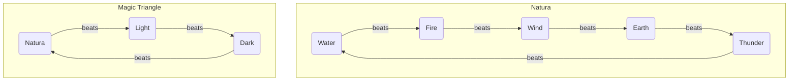

## Fire

| Name | Might | Hit  | Critical | Range | Weight | MP Cost | Description |
| ---- | ----- | ---- | -------- | ----- | ------ | ------- | ----------- |
|      |       |      |          |       |        |         |             |
|      |       |      |          |       |        |         |             |
|      |       |      |          |       |        |         |             |
|      |       |      |          |       |        |         |             |

## Wind

| Name | Might | Hit  | Critical | Range | Weight | MP Cost | Description |
| ---- | ----- | ---- | -------- | ----- | ------ | ------- | ----------- |
|      |       |      |          |       |        |         |             |
|      |       |      |          |       |        |         |             |
|      |       |      |          |       |        |         |             |
|      |       |      |          |       |        |         |             |

## Earth

| Name | Might | Hit  | Critical | Range | Weight | MP Cost | Description |
| ---- | ----- | ---- | -------- | ----- | ------ | ------- | ----------- |
|      |       |      |          |       |        |         |             |
|      |       |      |          |       |        |         |             |
|      |       |      |          |       |        |         |             |
|      |       |      |          |       |        |         |             |

## Thunder

| Name | Might | Hit  | Critical | Range | Weight | MP Cost | Description |
| ---- | ----- | ---- | -------- | ----- | ------ | ------- | ----------- |
|      |       |      |          |       |        |         |             |
|      |       |      |          |       |        |         |             |
|      |       |      |          |       |        |         |             |
|      |       |      |          |       |        |         |             |

## Water

| Name | Might | Hit  | Critical | Range | Weight | MP Cost | Description |
| ---- | ----- | ---- | -------- | ----- | ------ | ------- | ----------- |
|      |       |      |          |       |        |         |             |
|      |       |      |          |       |        |         |             |
|      |       |      |          |       |        |         |             |
|      |       |      |          |       |        |         |             |

## Light

| Name | Might | Hit  | Critical | Range | Weight | MP Cost | Description |
| ---- | ----- | ---- | -------- | ----- | ------ | ------- | ----------- |
|      |       |      |          |       |        |         |             |
|      |       |      |          |       |        |         |             |
|      |       |      |          |       |        |         |             |
|      |       |      |          |       |        |         |             |

## Dark

| Name | Might | Hit  | Critical | Range | Weight | MP Cost | Description |
| ---- | ----- | ---- | -------- | ----- | ------ | ------- | ----------- |
|      |       |      |          |       |        |         |             |
|      |       |      |          |       |        |         |             |
|      |       |      |          |       |        |         |             |
|      |       |      |          |       |        |         |             |