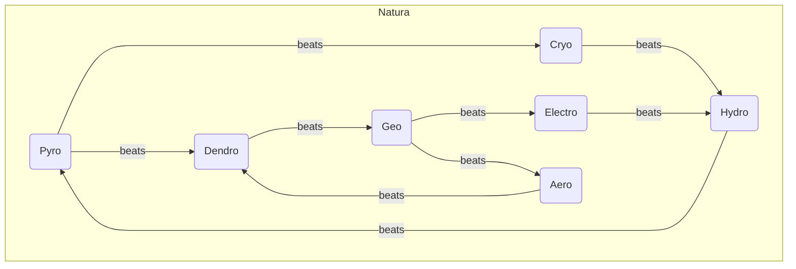
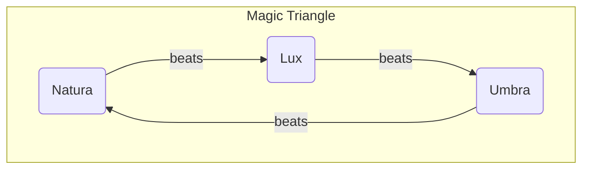

## Pyro

| Name | Might | Hit  | Critical | Range | Weight | MP Cost | Description |
| ---- | ----- | ---- | -------- | ----- | ------ | ------- | ----------- |
|      |       |      |          |       |        |         |             |
|      |       |      |          |       |        |         |             |
|      |       |      |          |       |        |         |             |
|      |       |      |          |       |        |         |             |

## Aero

| Name | Might | Hit  | Critical | Range | Weight | MP Cost | Description |
| ---- | ----- | ---- | -------- | ----- | ------ | ------- | ----------- |
|      |       |      |          |       |        |         |             |
|      |       |      |          |       |        |         |             |
|      |       |      |          |       |        |         |             |
|      |       |      |          |       |        |         |             |

## Electro

| Name | Might | Hit  | Critical | Range | Weight | MP Cost | Description |
| ---- | ----- | ---- | -------- | ----- | ------ | ------- | ----------- |
|      |       |      |          |       |        |         |             |
|      |       |      |          |       |        |         |             |
|      |       |      |          |       |        |         |             |
|      |       |      |          |       |        |         |             |

## Hydro

| Name | Might | Hit  | Critical | Range | Weight | MP Cost | Description |
| ---- | ----- | ---- | -------- | ----- | ------ | ------- | ----------- |
|      |       |      |          |       |        |         |             |
|      |       |      |          |       |        |         |             |
|      |       |      |          |       |        |         |             |
|      |       |      |          |       |        |         |             |

## Cryo

| Name | Might | Hit  | Critical | Range | Weight | MP Cost | Description |
| ---- | ----- | ---- | -------- | ----- | ------ | ------- | ----------- |
|      |       |      |          |       |        |         |             |
|      |       |      |          |       |        |         |             |
|      |       |      |          |       |        |         |             |
|      |       |      |          |       |        |         |             |

## Geo

| Name | Might | Hit  | Critical | Range | Weight | MP Cost | Description |
| ---- | ----- | ---- | -------- | ----- | ------ | ------- | ----------- |
|      |       |      |          |       |        |         |             |
|      |       |      |          |       |        |         |             |
|      |       |      |          |       |        |         |             |
|      |       |      |          |       |        |         |             |

## Dendro

| Name | Might | Hit  | Critical | Range | Weight | MP Cost | Description |
| ---- | ----- | ---- | -------- | ----- | ------ | ------- | ----------- |
|      |       |      |          |       |        |         |             |
|      |       |      |          |       |        |         |             |
|      |       |      |          |       |        |         |             |
|      |       |      |          |       |        |         |             |

## Lux

| Name | Might | Hit  | Critical | Range | Weight | MP Cost | Description |
| ---- | ----- | ---- | -------- | ----- | ------ | ------- | ----------- |
|      |       |      |          |       |        |         |             |
|      |       |      |          |       |        |         |             |
|      |       |      |          |       |        |         |             |
|      |       |      |          |       |        |         |             |

## Umbra

| Name | Might | Hit  | Critical | Range | Weight | MP Cost | Description |
| ---- | ----- | ---- | -------- | ----- | ------ | ------- | ----------- |
|      |       |      |          |       |        |         |             |
|      |       |      |          |       |        |         |             |
|      |       |      |          |       |        |         |             |
|      |       |      |          |       |        |         |             |