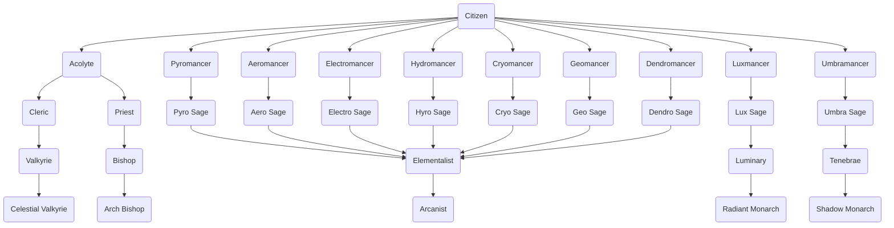

## Class Hierarchy

```mermaid
flowchart TB
    %% Base Classes
    citizen(Citizen)
    swordsman(Swordsman)
    lancer(Lancer)
    axe-fighter(Axe Fighter)
    archer(Archer)
    thief(Thief)
    martial-artist(Martial Artist)
    artillerist(Artillerist)

    citizen-->swordsman
    citizen-->lancer
    citizen-->axe-fighter
    citizen-->archer
    citizen-->thief
    citizen-->martial-artist
    citizen-->artillerist

    %% Intermediate Classes
    myrmidon(Myrmidon)
    sword-cavalier(Sword Cavalier)
    soldier(Soldier)
    lance-cavalier(Lance Cavalier)
    warrior(Warrior)
    axe-cavalier(Axe Cavalier)
    sniper(Sniper)
    bow-cavalier(Bow Cavalier)
    rogue(Rogue)
    brawler(Brawler)
    martial-monk(Martial Monk)
    gunner(Gunner)
    bombardier(Bombardier)
    
    swordsman-->myrmidon
    swordsman-->sword-cavalier
    lancer-->soldier
    lancer-->lance-cavalier
    axe-fighter-->warrior
    axe-fighter-->axe-cavalier
    archer-->sniper
    archer-->bow-cavalier
    thief-->rogue
    martial-artist-->brawler
    martial-artist-->martial-monk
    artillerist-->gunner
    artillerist-->bombardier
    
    %% Advanced Classes
    sword-master(Sword Master)
    sword-paladin(Sword Paladin)
    halberdier(Halberdier)
    lance-paladin(Lance Paladin)
    berserker(Berserker)
    axe-paladin(Axe Paladin)
    marksman(Marksman)
    bow-paladin(Bow Paladin)
    assassin(Assassin)
    trickster(Trickster)
    bruiser(Bruiser)
    martial-saint(Martial Saint)
    cannoneer(Cannoneer)
    grenadier(Grenadier)
    
    myrmidon-->sword-master
    sword-cavalier-->sword-paladin
    soldier-->halberdier
    lance-cavalier-->lance-paladin
    warrior-->berserker
    axe-cavalier-->axe-paladin
    sniper-->marksman
    bow-cavalier-->bow-paladin
    rogue-->assassin
    rogue-->trickster
    brawler-->bruiser
    martial-monk-->martial-saint
    gunner-->cannoneer
    bombardier-->grenadier
    
    %% Master Classes
    sword-saint(Sword Saint)
    astra-knight(Astra Knight)
    sentinel(Sentinel)
    aegis-knight(Aegis Knight)
    warmonger(Warmonger)
    colossus-knight(Colossus Knight)
    deadeye(Deadeye)
    pavise-warden(Pavise Warden)
    nightveil(Nightveil)
    saboteur(Saboteur)
    enforcer(Enforcer)
    enlighten-one(Enlighten One)
    warfire-vanguard(Warfire Vanguard)
    siege-breaker(Siege Breaker)
    
    sword-master-->sword-saint
    sword-paladin-->astra-knight
    halberdier-->sentinel
    lance-paladin-->aegis-knight
    berserker-->warmonger
    axe-paladin-->colossus-knight
    marksman-->deadeye
    bow-paladin-->pavise-warden
    assassin-->nightveil
    trickster-->saboteur
    bruiser-->enforcer
    martial-saint-->enlighten-one
    cannoneer-->warfire-vanguard
    grenadier-->siege-breaker
```

## Base Classes

| Name           | Weapon Types | Class Abilities                | Mastery Ability | Promotes to              |
| -------------- | ------------ | ------------------------------ | --------------- | ------------------------ |
| Swordsman      | Sword        | Speed +2                       | Swap            | Myrmidon, Sword Cavalier |
| Lancer         | Lance        | Defense +2                     | Shove           | Soldier, Lance Cavalier  |
| Axe Fighter    | Axe          | Strength +2                    | Shove           | Warrior, Axe Cavalier    |
| Archer         | Bow          | Hit Rate +10                   | Reposition      | Sniper, Bow Cavalier     |
| Thief          | Knife        | Dexterity +2, Steal, Lock Pick | Swap            | Rogue                    |
| Martial Artist | Gauntlet     | Avoid +10                      | Reposition      | Brawler, Martial Monk    |
| Artillerist    | Artillery    | Hit Rate +10                   | Knockback       | Cannoneer, Bombardier    |
| Acolyte        | -            | MP +10, Magic Staff            | Draw Back       | Cleric, Priest           |
| Pyromancer     | Pyro         | MP +10                         | Mystic Pull     | Pyro Sage                |
| Aeromancer     | Aero         | MP +10                         | Mystic Pull     | Aero Sage                |
| Electromancer  | Electro      | MP +10                         | Mystic Pull     | Electro Sage             |
| Hydromancer    | Hydro        | MP +10                         | Mystic Pull     | Hydro Sage               |
| Cryomancer     | Cryo         | MP +10                         | Mystic Pull     | Cryo Sage                |
| Geomancer      | Geo          | MP +10                         | Mystic Pull     | Geo Sage                 |
| Dendromancer   | Dendro       | MP +10                         | Mystic Pull     | Dendro Sage              |
| Luxmancer      | Lux          | MP +10                         | Mystic Pull     | Lux Sage                 |
| Umbramancer    | Umbra        | MP +10                         | Mystic Pull     | Umbra Sage               |

## Intermediate Classes

| Name           | Weapon Types           | Class Abilities | Mastery Ability | Promotes to                                |
| -------------- | ---------------------- | --------------- | --------------- | ------------------------------------------ |
| Myrmidon       | Sword                  |                 |                 | Sword Master, Duelist, Griffon Knight      |
| Sword Cavalier | Sword                  |                 |                 | Sword Paladin                              |
| Soldier        | Lance                  |                 |                 | Halberdier, Armored Knight, Pegasus Knight |
| Lance Cavalier | Lance                  |                 |                 | Lance Paladin                              |
| Warrior        | Axe                    |                 |                 | Berserker, Gladiator, Wyvern Knight        |
| Axe Cavalier   | Axe                    |                 |                 | Axe Paladin                                |
| Sniper         | Bow                    |                 |                 | Marksman, Ranger, Kinshi Knight            |
| Bow Cavalier   | Bow                    |                 |                 | Bow Paladin                                |
| Rogue          | Knife                  |                 |                 | Assassin, Trickster                        |
| Brawler        | Gauntlet, Chain        |                 |                 | Bruiser                                    |
| Martial Monk   | Gauntlet, Battle Staff |                 |                 | Martial Saint                              |
| Gunner         | Artillery              |                 |                 | Cannoneer                                  |
| Bombardier     | Artillery              |                 |                 | Grenadier                                  |
| Cleric         | Sword                  | Magic Staff     |                 | Valkyrie                                   |
| Priest         | Lux                    | Magic Staff     |                 | Bishop                                     |
| Pyro Sage      | Pyro                   |                 |                 | Elementalist                               |
| Aero Sage      | Aero                   |                 |                 | Elementalist                               |
| Electro Sage   | Electro                |                 |                 | Elementalist                               |
| Hydro Sage     | Hydro                  |                 |                 | Elementalist                               |
| Cryo Sage      | Cryo                   |                 |                 | Elementalist                               |
| Geo Sage       | Geo                    |                 |                 | Elementalist                               |
| Dendro Sage    | Dendro                 |                 |                 | Elementalist                               |
| Lux Sage       | Lux                    |                 |                 | Luminary                                   |
| Umbra Sage     | Umbra                  |                 |                 | Tenebrae                                   |

## Advanced Classes

| Name           | Weapon Types           | Class Abilities | Mastery Ability | Promotes to        |
| -------------- | ---------------------- | --------------- | --------------- | ------------------ |
| Sword Master   | Sword                  |                 |                 | Sword Saint        |
| Duelist        | Sword, Knife           |                 |                 | Blade Dancer       |
| Sword Paladin  | Sword                  |                 |                 | Astra Knight       |
| Griffon Knight | Sword                  |                 |                 | Griffon Lord       |
| Halberdier     | Lance                  |                 |                 | Sentinel           |
| Armored Knight | Lance, Axe             |                 |                 | Armored General    |
| Lance Paladin  | Lance                  |                 |                 | Aegis Knight       |
| Pegasus Knight | Lance                  |                 |                 | Pegasus Lord       |
| Berserker      | Axe                    |                 |                 | Warmonger          |
| Gladiator      | Axe, Chain             |                 |                 | Spartan            |
| Axe Paladin    | Axe                    |                 |                 | Colossus Knight    |
| Wyvern Knight  | Axe                    |                 |                 | Wyvern Lord        |
| Marksman       | Bow                    |                 |                 | Deadeye            |
| Ranger         | Bow, Knife             |                 |                 | Hunterblade        |
| Bow Paladin    | Bow                    |                 |                 | Pavise Warden      |
| Kinshi Knight  | Bow                    |                 |                 | Kinshi Lord        |
| Assassin       | Knife                  |                 |                 | Nightveil          |
| Trickster      | Knife, Chain           |                 |                 | Saboteur           |
| Bruiser        | Gauntlet, Chain        |                 |                 | Enforcer           |
| Martial Saint  | Gauntlet, Battle Staff | Magic Staff     |                 | Enlightened One    |
| Cannoneer      | Artillery              |                 |                 | Warfire Vanguard   |
| Grenadier      | Artillery              |                 |                 | Siege Breaker      |
| Valkyrie       | Sword                  | Magic Staff     |                 | Celestial Valkyrie |
| Bishop         | Lux                    | Magic Staff     |                 | Arch Bishop        |
| Elementalist   | Natura Magic (2 Types) |                 |                 | Arcanist           |
| Luminary       | Lux                    | Magic Staff     |                 | Radiant Monarch    |
| Tenebrae       | Umbra, Sword           |                 |                 | Shadow Monarch     |

## Master Classes

| Name               | Weapon Types           | Class Abilities | Mastery Ability | Promotes to |
| ------------------ | ---------------------- | --------------- | --------------- | ----------- |
| Sword Saint        | Sword                  |                 |                 |             |
| Blade Dancer       | Sword, Knife           |                 |                 |             |
| Astra Knight       | Sword                  |                 |                 |             |
| Griffon Lord       | Sword                  |                 |                 |             |
| Sentinel           | Lance                  |                 |                 |             |
| Armored General    | Lance, Axe             |                 |                 |             |
| Aegis Knight       | Lance                  |                 |                 |             |
| Pegasus Lord       | Lance                  |                 |                 |             |
| Warmonger          | Axe                    |                 |                 |             |
| Spartan            | Axe, Chain             |                 |                 |             |
| Colossus Knight    | Axe                    |                 |                 |             |
| Wyvern Lord        | Axe                    |                 |                 |             |
| Deadeye            | Bow                    |                 |                 |             |
| Hunterblade        | Bow, Sword             |                 |                 |             |
| Pavise Warden      | Bow                    |                 |                 |             |
| Kinshi Lord        | Bow                    |                 |                 |             |
| Nightveil          | Knife                  |                 |                 |             |
| Saboteur           | Knife, Chain           |                 |                 |             |
| Enforcer           | Gauntlet, Chain        |                 |                 |             |
| Enlightened One    | Gauntlet, Battle Staff | Magical Staff   |                 |             |
| Warfire Vanguard   | Artillery              |                 |                 |             |
| Siege Breaker      | Artillery              |                 |                 |             |
| Celestial Valkyrie | Sword                  | Magical Staff   |                 |             |
| Arch Bishop        | Lux                    | Magical Staff   |                 |             |
| Arcanist           | Natura Magic (3 Types) |                 |                 |             |
| Radiant Monarch    | Lux                    | Magical Staff   |                 |             |
| Shadow Monarch     | Umbra, Sword           |                 |                 |             |

## Special Classes

| Name     | Weapon Types           | Class Abilities                    | Mastery Ability | Promotes to    |
| -------- | ---------------------- | ---------------------------------- | --------------- | -------------- |
| Citizen  | All                    | Adaptability, Discipline, Aptitude | Bellum's Will   | Any base class |
| Avatar   | Pyro, Aero, Hydro, Geo |                                    |                 |                |
| Aurelius | Lux                    | Magical Staff                      |                 |                |
| Ashborn  | Umbra, Sword           |                                    |                 |                |