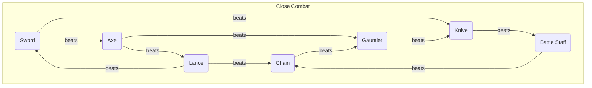

## Swords

| Name | Might | Hit  | Critical | Range | Weight | Uses | Cost | Description |
| ---- | ----- | ---- | -------- | ----- | ------ | ---- | ---- | ----------- |
|      |       |      |          |       |        |      |      |             |
|      |       |      |          |       |        |      |      |             |
|      |       |      |          |       |        |      |      |             |
|      |       |      |          |       |        |      |      |             |

## Lances

| Name | Might | Hit  | Critical | Range | Weight | Uses | Cost | Description |
| ---- | ----- | ---- | -------- | ----- | ------ | ---- | ---- | ----------- |
|      |       |      |          |       |        |      |      |             |
|      |       |      |          |       |        |      |      |             |
|      |       |      |          |       |        |      |      |             |
|      |       |      |          |       |        |      |      |             |

## Axes

| Name | Might | Hit  | Critical | Range | Weight | Uses | Cost | Description |
| ---- | ----- | ---- | -------- | ----- | ------ | ---- | ---- | ----------- |
|      |       |      |          |       |        |      |      |             |
|      |       |      |          |       |        |      |      |             |
|      |       |      |          |       |        |      |      |             |
|      |       |      |          |       |        |      |      |             |

## Knives

| Name | Might | Hit  | Critical | Range | Weight | Uses | Cost | Description |
| ---- | ----- | ---- | -------- | ----- | ------ | ---- | ---- | ----------- |
|      |       |      |          |       |        |      |      |             |
|      |       |      |          |       |        |      |      |             |
|      |       |      |          |       |        |      |      |             |
|      |       |      |          |       |        |      |      |             |

## Gauntlets

| Name | Might | Hit  | Critical | Range | Weight | Uses | Cost | Description |
| ---- | ----- | ---- | -------- | ----- | ------ | ---- | ---- | ----------- |
|      |       |      |          |       |        |      |      |             |
|      |       |      |          |       |        |      |      |             |
|      |       |      |          |       |        |      |      |             |
|      |       |      |          |       |        |      |      |             |

## Battle Staves

| Name | Might | Hit  | Critical | Range | Weight | Uses | Cost | Description |
| ---- | ----- | ---- | -------- | ----- | ------ | ---- | ---- | ----------- |
|      |       |      |          |       |        |      |      |             |
|      |       |      |          |       |        |      |      |             |
|      |       |      |          |       |        |      |      |             |
|      |       |      |          |       |        |      |      |             |

## Chains

| Name | Might | Hit  | Critical | Range | Weight | Uses | Cost | Description |
| ---- | ----- | ---- | -------- | ----- | ------ | ---- | ---- | ----------- |
|      |       |      |          |       |        |      |      |             |
|      |       |      |          |       |        |      |      |             |
|      |       |      |          |       |        |      |      |             |
|      |       |      |          |       |        |      |      |             |

## Bows

| Name | Might | Hit  | Critical | Range | Weight | Uses | Cost | Description |
| ---- | ----- | ---- | -------- | ----- | ------ | ---- | ---- | ----------- |
|      |       |      |          |       |        |      |      |             |
|      |       |      |          |       |        |      |      |             |
|      |       |      |          |       |        |      |      |             |
|      |       |      |          |       |        |      |      |             |

## Artillery

| Name | Might | Hit  | Critical | Range | Weight | Uses | Cost | Description |
| ---- | ----- | ---- | -------- | ----- | ------ | ---- | ---- | ----------- |
|      |       |      |          |       |        |      |      |             |
|      |       |      |          |       |        |      |      |             |
|      |       |      |          |       |        |      |      |             |
|      |       |      |          |       |        |      |      |             |