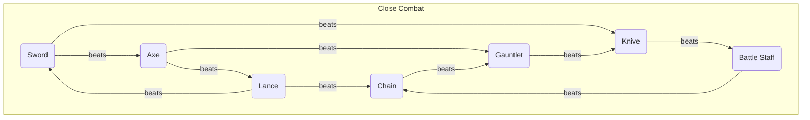
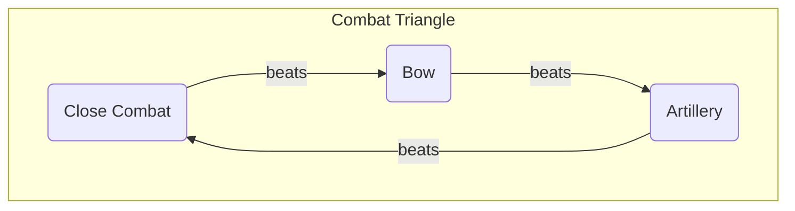

## Sword

| Name | Might | Hit  | Critical | Range | Weight | Uses | Cost | Description |
| ---- | ----- | ---- | -------- | ----- | ------ | ---- | ---- | ----------- |
|      |       |      |          |       |        |      |      |             |
|      |       |      |          |       |        |      |      |             |
|      |       |      |          |       |        |      |      |             |
|      |       |      |          |       |        |      |      |             |

## Lance

| Name | Might | Hit  | Critical | Range | Weight | Uses | Cost | Description |
| ---- | ----- | ---- | -------- | ----- | ------ | ---- | ---- | ----------- |
|      |       |      |          |       |        |      |      |             |
|      |       |      |          |       |        |      |      |             |
|      |       |      |          |       |        |      |      |             |
|      |       |      |          |       |        |      |      |             |

## Axe

| Name | Might | Hit  | Critical | Range | Weight | Uses | Cost | Description |
| ---- | ----- | ---- | -------- | ----- | ------ | ---- | ---- | ----------- |
|      |       |      |          |       |        |      |      |             |
|      |       |      |          |       |        |      |      |             |
|      |       |      |          |       |        |      |      |             |
|      |       |      |          |       |        |      |      |             |

## Knive

| Name | Might | Hit  | Critical | Range | Weight | Uses | Cost | Description |
| ---- | ----- | ---- | -------- | ----- | ------ | ---- | ---- | ----------- |
|      |       |      |          |       |        |      |      |             |
|      |       |      |          |       |        |      |      |             |
|      |       |      |          |       |        |      |      |             |
|      |       |      |          |       |        |      |      |             |

## Gauntlet

| Name | Might | Hit  | Critical | Range | Weight | Uses | Cost | Description |
| ---- | ----- | ---- | -------- | ----- | ------ | ---- | ---- | ----------- |
|      |       |      |          |       |        |      |      |             |
|      |       |      |          |       |        |      |      |             |
|      |       |      |          |       |        |      |      |             |
|      |       |      |          |       |        |      |      |             |

## Battle Staff

| Name | Might | Hit  | Critical | Range | Weight | Uses | Cost | Description |
| ---- | ----- | ---- | -------- | ----- | ------ | ---- | ---- | ----------- |
|      |       |      |          |       |        |      |      |             |
|      |       |      |          |       |        |      |      |             |
|      |       |      |          |       |        |      |      |             |
|      |       |      |          |       |        |      |      |             |

## Chain

| Name | Might | Hit  | Critical | Range | Weight | Uses | Cost | Description |
| ---- | ----- | ---- | -------- | ----- | ------ | ---- | ---- | ----------- |
|      |       |      |          |       |        |      |      |             |
|      |       |      |          |       |        |      |      |             |
|      |       |      |          |       |        |      |      |             |
|      |       |      |          |       |        |      |      |             |

## Bow

| Name | Might | Hit  | Critical | Range | Weight | Uses | Cost | Description |
| ---- | ----- | ---- | -------- | ----- | ------ | ---- | ---- | ----------- |
|      |       |      |          |       |        |      |      |             |
|      |       |      |          |       |        |      |      |             |
|      |       |      |          |       |        |      |      |             |
|      |       |      |          |       |        |      |      |             |

## Artillery

| Name | Might | Hit  | Critical | Range | Weight | Uses | Cost | Description |
| ---- | ----- | ---- | -------- | ----- | ------ | ---- | ---- | ----------- |
|      |       |      |          |       |        |      |      |             |
|      |       |      |          |       |        |      |      |             |
|      |       |      |          |       |        |      |      |             |
|      |       |      |          |       |        |      |      |             |