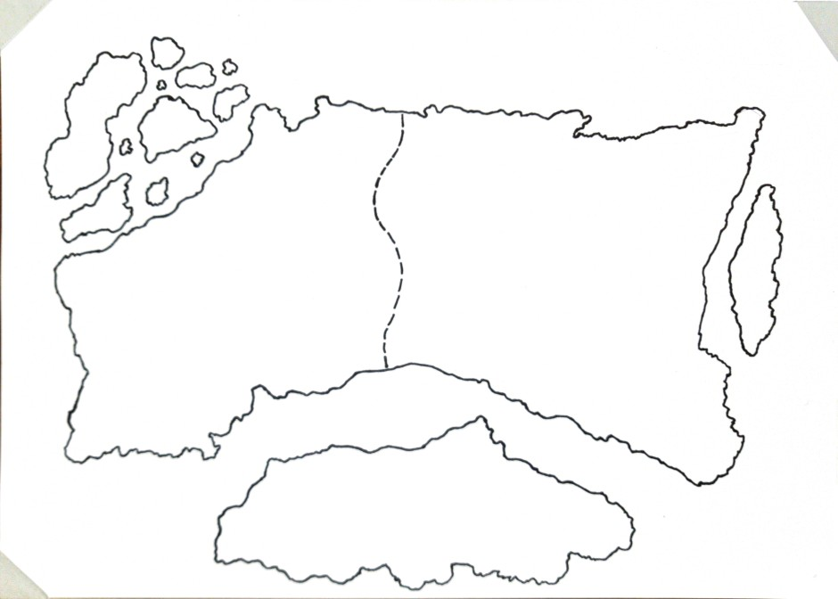

# Tridera

## Basic Information

**Name:** Tridera
**Type:** Continent
**Region:** –
**Primary Language:** Common
**Religion:** Aurelys (vorherrschend)

---

## Übersicht

Tridera ist der einzige bekannte Kontinent in der Welt von *Vigilans Nexum*. Im **Kaiserlichen Jahr 1357** herrscht nach einem langen, verheerenden Krieg ein fragiler Waffenstillstand. Ein mächtiges Gebirge durchzieht den Kontinent von Nord nach Süd und trennt die verfeindeten Armeen voneinander. An seinem südlichsten Ausläufer liegt **Bellum** – eine Metropole, deren Zugehörigkeit seit ihrer Gründung ungeklärt ist und die als strategischer Grenzpunkt aller drei Nationen gilt.

## Nationen

| Nation | Typ | Region | Link |
|---|---|---|---|
| Königreich Adolla | Monarchie | West/Zentral | [Adolla.md](countries/Adolla.md) |
| Allianz von Thysia | Stadtbund | Südwesten | [Thysia.md](countries/Thysia.md) |
| Kaiserreich Vaestrall | Kaiserreich | Osten | [Vaestrall.md](countries/Vaestrall.md) |

## Geografie

Das Kontinent-trennende Gebirge bildet eine natürliche Nord-Süd-Barriere. Westlich davon erstrecken sich die bewaldeten Hügel Adollas. Östlich breiten sich die weitläufigen, streng geplanten Ebenen Vaestralls aus. Im Südwesten öffnet sich der Kontinent zur Küste hin – das Territorium der Allianz von Thysia, mit ihrem mediterranen Klima und ihren freien Hafenstädten. Im Nordwesten liegen Inselketten vor der Küste.

## Geschichte

### Der Große Krieg (vor IJ 1357)

Ein verheerender Krieg hat Tridera erschüttert. Die drei Großmächte kämpften gegeneinander ohne klaren Sieger. Städte wurden besetzt, Bevölkerungen vertrieben, und eine Generation wuchs im Schatten des Konflikts auf – darunter die Waisenkinder Bellums, die später zu den **Vigilant Knights** werden sollten.

### Kaiserliches Jahr 1357 – Status Quo

Ein Waffenstillstand hält die Armeen voneinander fern. Die Gebirgslinie ist die Trennlinie. Bellum liegt im Spannungsfeld aller Parteien. Der Kult von Varnel arbeitet im Verborgenen, um den fragilen Frieden zu sabotieren und die Mächte gegeneinander auszuspielen.

## Kalender

Das Jahr wird nach dem Imperialen Kalender gezählt. Das aktuelle Jahr ist **IJ 1357**.
→ [Calendar.md](../Calendar.md)

---

**Version:** 1.0
**Created:** 2026-05-13
**Last Updated:** 2026-05-13